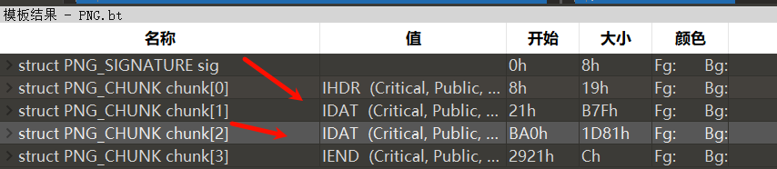
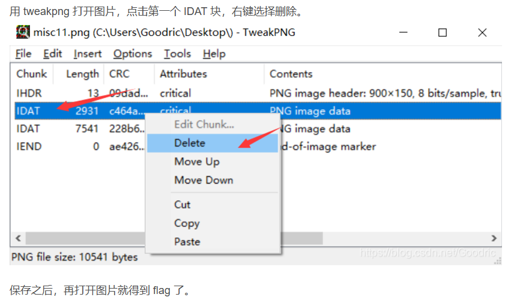

png用010 editor打开，运行模板png.bit，发现图片有多个IDAT块。
使用tweakpng工具：<https://github.com/jsummers/tweakpng> 
一般就是从第一个开始依次去除IDAT块，ctrl+s保存，同时显示新图片是否存在信息。

^
## **PNG数据块**
IHDR、IDAT和IEND是PNG图片文件格式中的几种重要的数据块类型。它们的含义如下：
1. **IHDR**：图像头数据块（Image Header），它包含了PNG图像的基本信息，如图像的宽度、高度、位深、颜色类型等。在PNG文件中，IHDR是第一个数据块，且必须存在。
2. **IDAT**：图像数据块（Image Data），它存储了图像的实际数据。在PNG文件中，可以有多个IDAT数据块连续出现，它们共同存储图像的压缩数据。这些数据块按顺序存放，并且必须在IEND数据块之前。
3. **IEND**：图像结束数据块（Image Trailer），它用来标记PNG文件或数据流已经结束，并且必须要放在文件的尾部。IEND数据块的长度总是0，其CRC校验码固定为AE 42 60 82。

