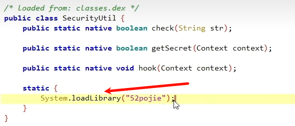
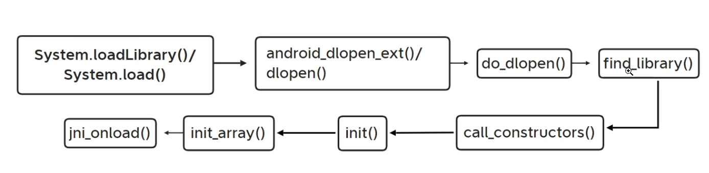
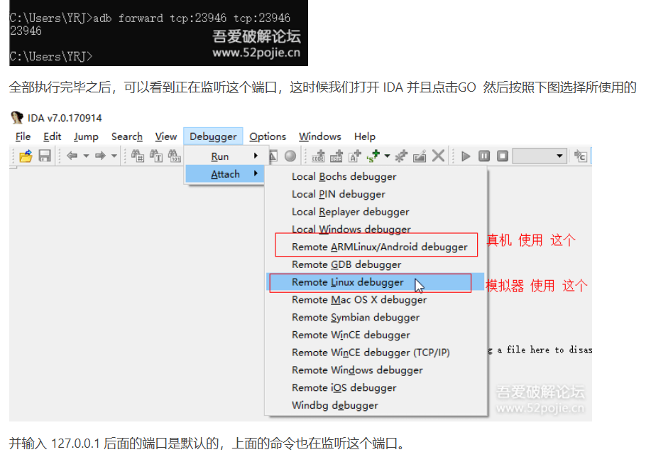
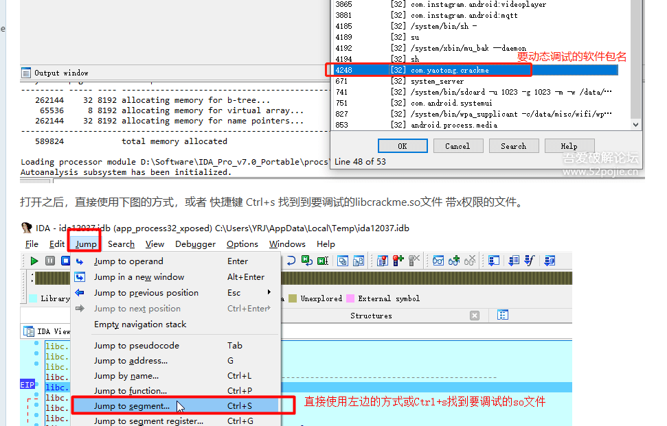
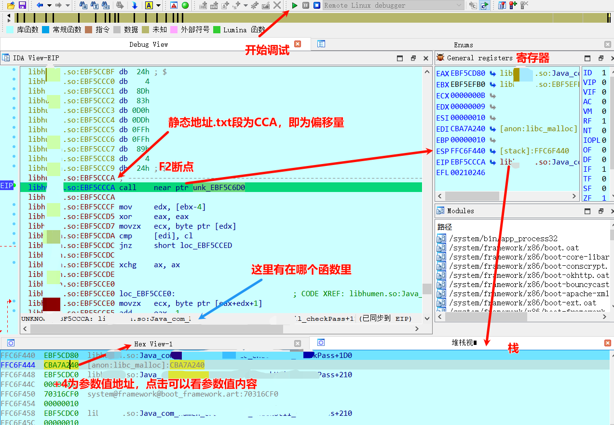

so使用ida动态调试。最终实现在ida中调试apk运行时中的so中变量。
案例：
<https://www.52pojie.cn/thread-1315444-1-7.html>
<https://bbs.kanxue.com/thread-260783.htm>
## **1.so加载流程**

so加载：so 一次性映射，但内核“用多少搬多少”，一次搬 4 KB（FFF）；看到 0xFFF 只是第一页尾巴。

了解流程作用：反调试、脱壳、注入等
流程图：



相关函数的基本介绍：
(汇编时可以看到关键词)


linker
```
启动任何动态链接的可执行文件（`app_process`、`dex2oat`、你自己的 ELF、so）时，内核把 入口先交给 linker，linker 做完重定位再把控制权交给 `.init` → `main`。

逆向/CTF 利用点
 **PLT/GOT hook**：改 `.rel.plt` 或 `.got.plt` 让函数跳到自己的 `shellcode`；linker 解析时会帮你填地址。
 **init/fini 劫持**：把自定义函数指针写进 `.init_array` / `.fini_array`，linker 会替你执行。
 **dlopen 重定向**：通过 `LD_LIBRARY_PATH`（root）或 `android_dlopen_ext` 参数让 linker 加载伪造 so。
```

| 函数名       | 描述                                                                                                                                                                                                                                                                                                                |
| ------------ | ------------------------------------------------------------------------------------------------------------------------------------------------------------------------------------------------------------------------------------------------------------------------------------------------------------------- |
| `android_dlopen_ext()` 、`dlopen()`、`do_dlopen()` | 这三个函数主要用于加载库文件。`android_dlopen_ext` 是系统的一个函数，用于在运行时动态加载共享库。与标准的 `dlopen()` 函数相比，`android_dlopen_ext` 提供了更多的参数选项和扩展功能，例如支持命名空间、符号版本等特性。|
| `find_library()` | `find_library()` 函数用于查找库，基本的用途是给定一个库的名字，然后查找并返回这个库的路径。|
| `call_constructors()` | `call_constructors()` 是用于调用动态加载库中的构造函数的函数。|
| `init`       | 库的构造函数，用于初始化库中的静态变量或执行其他需要在库被加载时完成的任务。如果没有定义`init`函数，系统将不会执行任何动作。需要注意的是，`init`函数不应该有任何参数，并且也没有返回值。                                                                           |
| `init_array` | `init_array`是ELF（Executable and Linkable Format，可执行和可链接格式）二进制格式中的一个特殊段（section），这个段包含了一些函数的指针，这些函数将在`main()`函数执行前被调用，用于初始化静态局部变量和全局变量。                                                                                         |
| `jni_onload` | 这是Android JNI(Java Native Interface)中的一个函数。当一个native库被系统加载时，该函数会被自动调用。`JNI_OnLoad`可以做一些初始化工作，例如注册你的native方法或者初始化一些数据结构。如果你的native库没有定义这个函数，那么JNI会使用默认的行为。`JNI_OnLoad`的返回值应该是需要的JNI版本，一般返回`JNI_VERSION_1_6`。 |

下断点时机：
应用级别的：java_com_XXX；
外壳级别的：JNI_Onload，.init，.init_array(反调试);
系统级别的：fopen，fget，dvmdexfileopen(脱壳)；

安卓在线源码查看
[AOSPXRef](http://aospxref.com/)

## **2.IDA动态调试**
### 1.前置操作：
```
1.在IDA目录下的dbgsrv/，选择跟手机架构一致的server
adb shell getprop ro.product.cpu.abi
查看架构。x86_64
说明 emulator-5554 这台模拟器是 64 位 x86 架构。

2. adb push android_server64 /data/local/tmp/
或
雷电 adb push android_x86_server /data/local/tmp/

3.进入手机端命令：adb shell

4.切换获取手机的root权限：su

5.跳到对应路径：cd /data/local/tmp/

6.提权：chmod 777 android_server64
```


### 2.调试步骤
1、adb shell中运行IDA服务端 
```
./android_server64
默认端口是23946。
如果app崩溃，猜测可能存在名称或端口检测，更改端口为31928，命令：./android_server64 -p 31928
```

2、启动APP分为两种模式，一种是以debug模式启动，第二种则以普通模式启动。
普通模式启动
```
adb forward tcp:23946 tcp:23946 (端口转发)
此时打开APP运行。
IDA附加载入。点击绿色三角运行。
(如果打开报错闪退，一般就是有反调试，可以看看so中的检测函数或者APP运行报错日志)
找到想要指令，F2断点。返回APP运行，触发断点。
```
^
DEBUG模式启动
有时候要动态调试的参数在app一启动的时候就产生了，时机较早，所以需要以debug模式去挂起app。
有时普通模式一IDA进入调试就FFF报错无法进行，so有反调试机制，需要用DEBUG模式启动分析so中反调试代码出现位置，绕过反调试后可以普通模式启动。
```
1、XappDebug hook 重启设备开启apk的debug模式(可选)。
2、端口转发：adb forward tcp:23946 tcp:23946
以Debug模式启动app指定界面：
adb shell am start -D -n com.zj.wuaipojie/.ui.ChallengeEight （去掉-D 则表示不以debug模式启动app）
此时页面卡住，等待debug命令

3、ida中进行附加载入，勾选三个选项，然后点绿色运行按钮载入lib.so，多点几次直到为灰色。

4、转发到jdb。
adb forward tcp:8700 jdwp:PID (调试启动的pid：adb -s emulator-5554 shell ps)
jdb -connect com.sun.jdi.SocketAttach:hostname=127.0.0.1,port=8700 (jdb挂起。显示初始化成功，如果没显示，ida中继续点绿色运行按钮)
```

其他的步骤
[超级详细]实战分析一个Crackme的过程](https://www.52pojie.cn/thread-1315444-1-7.html)
有DEBUG模式更好绕过反调试：<https://bbs.kanxue.com/thread-260783.htm>



调试so参考图:



^
### 常用快捷键

| 快捷键        | 功能                                                                                                                                                                                                                                                                 |
| ------------- | -------------------------------------------------------------------------------------------------------------------------------------------------------------------------------------------------------------------------------------------------------------------- |
| `F2`          | 在所在行下断点                                                                                                                                                                                                                                                       |
| `F5`          | 可以将ARM指令转化为可读的C代码，同时可以使用Y键，对JNIEnv指针做一个类型转换，从而对JNI里经常使用的JNIEnv方法能够识别                                                                                                                                                 |
| `F7`          | 单步进入调试                                                                                                                                                                                                                                                         |
| `F8`          | 按照顺序一行一行，单步调试                                                                                                                                                                                                                                           |
| `F9`          | 直接跳到下一个断点处                                                                                                                                                                                                                                                 |
| `Shift + F12` | 快速查看so文件中的字符串信息，分析过程中通过一些关键字符串能够迅速定位到关键函数                                                                                                                                                                                     |
| `Ctrl + s`    | 有两个用途，在IDA View页面中可以查看文件so文件的所有段信息，在调试页面可以查看程序中所有so文件映射到内存的基地址。tips:在进行so调试过程中，很有用的一个小技巧就是IDA双开，一个用于进行静态分析；一个用于动态调试。比如说调试过程中要找到一个函数的加载到内存中的位置 |
| `Esc`         | 回退键，能够倒回上一部操作的视图（只有在反汇编窗口才是这个作用，如果是在其他窗口按下esc，会关闭该窗口）                                                                                                                                                              |
| `g`           | 直接跳到某个地址                                                                                                                                                                                                                                                     |
| `y`           | 更改变量的类型                                                                                                                                                                                                                                                       |
| `x`           | 对着某个函数、变量按该快捷键，可以查看它的交叉引用                                                                                                                                                                                                                   |
| `n`           | 更改变量的名称                                                                                                                                                                                                                                                       |
| `p`           | 创建函数                                                                                                                                                                                                                                                             |


^
## **动态调试注意事项**

### 可能遇到的问题

```
1.'jdb' 不是内部或外部命令，也不是可运行的程序或批处理文件。
```
<http://t.csdn.cn/paKAt>
```
2.java.io.IOException: handshake failed - connection prematurally closed
        at com.sun.tools.jdi.SocketTransportService.handshake(SocketTransportService.java:136)
        at com.sun.tools.jdi.SocketTransportService.attach(SocketTransportService.java:232)
        at com.sun.tools.jdi.GenericAttachingConnector.attach(GenericAttachingConnector.java:116)
        at com.sun.tools.jdi.SocketAttachingConnector.attach(SocketAttachingConnector.java:90)
        at com.sun.tools.example.debug.tty.VMConnection.attachTarget(VMConnection.java:519)
        at com.sun.tools.example.debug.tty.VMConnection.open(VMConnection.java:328)
        at com.sun.tools.example.debug.tty.Env.init(Env.java:63)
        at com.sun.tools.example.debug.tty.TTY.main(TTY.java:1066)
致命错误:
无法附加到目标 VM。
解决方法：有可能是手机问题，建议低版本真机，不要用模拟器！切命令顺序不要乱！另外也有可能软件有反调试！
```
```
3.动态调试中找不到so文件
解决方法：可以尝试手动复制一份对应的so文件放到data/app/包名/lib目录下
```
```
4.device offline
解决方法：重新插拔usb，再不行就重启机子
```
```
5.0.0.0.0:23946: bind: Address already in use
解决方案：
adb shell "su -c 'lsof | grep 23946'" //获取pid
adb shell "su -c 'kill -9 PID'" //这里的pid要根据上一步获取的填写
```


### 要有 X 字段
在 IDA 动态调试 SO 时，**“要有 X 字段”** 并不是指源码里的符号，而是指 **内存映射必须带“可执行”权限（Unix 的 PROT\_EXEC）**。
IDA 的 Modules 窗口用 **X** 字母标记这段映射，所以口头说“要有 X 字段”就是：

> **必须选一段带 X 权限的 libxxx.so 映射，才能下断、单步、F5 反编译，否则只能看数据。**
>  so加载：so 一次性映射，但内核“用多少搬多少”，一次搬 4 KB（FFF）；看到 0xFFF 只是第一页尾巴。


### 为什么会出现“没有 X”

1. **so 尚未加载**\
   你 attach 得太早，linker 还没 `mmap` 代码段，Modules 里只有 **R** 或 **RW** 的“数据视图”，自然看不到 X。
2. **被调试进程一启动就崩溃 / 闪退**\
   反调试在 `.init_array` / `JNI_OnLoad` 里自杀，so 映射刚建好就卸载，X 权限瞬间消失。
3. **你选错了 mapping**\
   一个 so 常有 **2\~3 条映射**（代码、只读数据、可写数据），**只有第一条带 X**；选到后两条就只剩 R/RW。

***

### 标准做法（100% 能出 X）

1. **先让 so 被装进内存**

   * 如果 apk 可调：

     复制

     ```
     adb shell am start -D -n 包名/Activityjdb -connect ...          # 唤醒进程
     ```

   * 如果不可调：frida-attach 或 ptrace 占坑后 **手动调用** `System.loadLibrary()`，再让 linker 走完。

2. **在 IDA 里 Ctrl-S（Modules）**\
   找到 **libxxx.so** → **选第一条带 X 的 start 地址**（通常是 **r-xp** 或 **r-x**）。\
   双击它，代码窗口就能 **按 G 下断、F5 反编译**。

3. **计算绝对地址**

   `绝对地址 = 这条 X-mapping 的 start + 函数在 so 内的偏移`

   以后每次重启进程，**只要重新 Ctrl-S 拿新的 start** 即可，偏移不变。

***

### 一句话总结

> **“X 字段” = 可执行权限；IDA 必须 attach 到一段带 X 的 libxxx.so 映射才能调试； attach 后 Ctrl-S 选第一条 r-xp 映射即可，没有就继续跑或手动 loadLibrary 直到它出现。**


**多次映射**
```
EBF6C000-EBF6E000  RXD  libhun.so
EBF6E000-EBF6F000  RD   libhun.so
EBF6F000-EBF70000  RD   libhun.so
```

只是 **同一个物理文件（libhun.so）被内核以三个不同权限映射了三次**，完全正常，不是“三个 so”。原因如下：

***

1. 第一段 `EBF6C000-EBF6E000 RXD`

   * 权限 **R+X**（读+执行）
   * 对应 ELF 的 **`.text`、`.init_array`、`.plt` 等可执行 segment**。
   * 偏移量（maps 第 4 列）通常是 **0x00000000**，也就是文件头之后第一个 PT\_LOAD。

2. 第二段 `EBF6E000-EBF6F000 RD`

   * 权限 **R**（只读）
   * 对应 **`.rodata`、`.eh_frame`、`.dynstr`、`.dynsym`** 等只读数据。
   * 页粒度对齐后单独映射，防止被改写。

3. 第三段 `EBF6F000-EBF70000 RW`（你写成 RD，实际是 RW）

   * 权限 **R+W**（读写）
   * 对应 **`.data`、`.bss`、`.got`** 等可写全局变量。
   * 文件里通常只有 `.data` 有内容，`.bss` 是匿名零页，大小由 ELF 的 `p_memsz` 决定。

***

验证方法

`cat /proc/self/maps | grep libc.so`

随便一个进程都能看到 libc 被拆成 3\~4 段，权限分别是 **RX、R、RW**，原理一模一样。

***

对调试的影响

* **下断点只在 RX 段里下**（`.text`），其他段不可执行，断不上去。

* 计算 **文件偏移** 时一定用 **RX 段的起始地址** 做基址：

  复制

  ```
  虚拟地址 0x790 对应的文件偏移= 0x790 - 0xEBF6C000 + 第一个 PT_LOAD 的 p_offset
  ```

  后面两段映射与代码段无关，别混淆。

