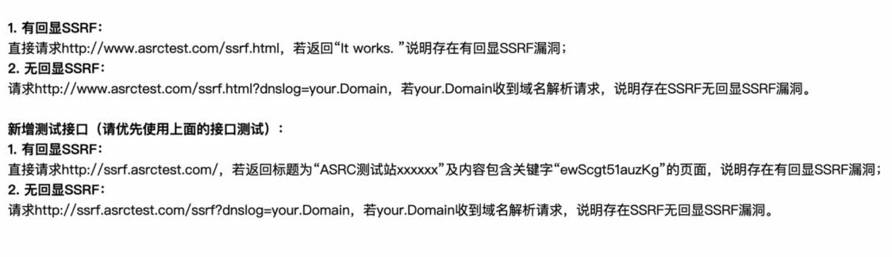
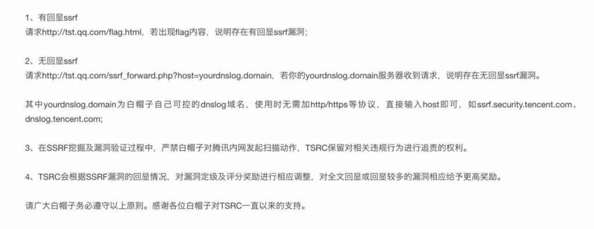
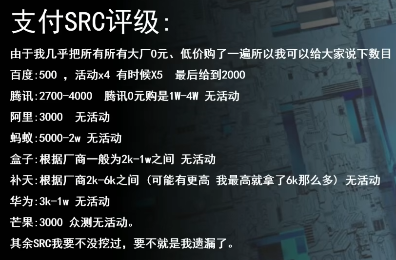

src：应急响应中心
信息收集：<https://lovebear.top/info/cn/index.html>

cve查询：<https://cve.mitre.org/cgi-bin/cvekey.cgi?keyword=TpMeCMS>
cve：小白申请cve
<https://www.freebuf.com/articles/web/342909.html>
<https://cloud.tencent.com/developer/article/2233051>

## **漏洞提交**
资产确认。
复现过程。
危害。
脱敏：消除身份敏感信息。
企业SRC的报告不可不脱密传播。

^
教育交edu
国企类交cnvd
权重交补天：(以爱站www.aizhan.com百度权重或移动权重大于等于1才可以收录，谷歌PR大于3也收录)，补天打钱快。
啥也没有交漏洞盒子
国外：hackerone和bugcrowd
参加众测，360、雷神众测。

^
## **技巧**

注册两个账号，多个手机号准备。

逻辑漏洞：验证码漏洞，刷金币，不扣血。

XSS：往往结合一些用户cookie凭据打出高危，如（百度bduss）。

csrf：借助两个账号的cookie。
如果网站的登录后请求包没有authorized,refer,orgin,token字段，则极可能存在csrf。

ssrf：字节给的高

数据泄露：大量泄露上中高危

^
阿里ssrf

^
腾讯ssrf

http://tst.qq.com/ssrf.png

^
支付

百度src新号*3，没活动时，推荐新号提交。