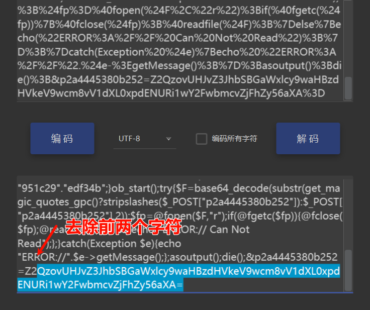
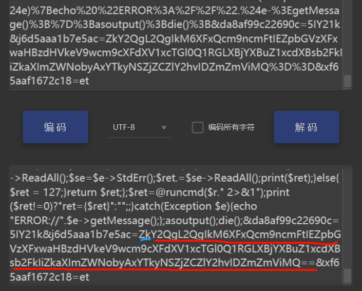

## **webshell流量特征**
webshell木马（文件马，内存马）连接时通讯的流量特征。
```
使用哥斯拉,冰蝎，一般waf如:宝塔waf，安全狗识别不了webshell通讯流量。

冰蝎：基于 Java 编写，有跨平台特性，流量动态加密（AES128 + 随机密钥）  
哥斯拉：基于C#编写，流量加密能过大部分静态查杀和WAF（查杀和WAF也在更新，随时就可能不行了），自带的各种插件功能异常强大
```

## **webshell流量识别防御**

宝塔防火墙手动添加冰蝎，哥斯拉的流量包特征。
^
使用专门的流量识别产品：
360天眼威胁感知系统
奇安信天眼
观成ENS系统 是观成科技将机器学习与安全检测技术相结合，自主研发、具有完全自主知识产权的一款对恶意加密威胁进行有效检测与防御的创新型安全检测产品，目前已支持对冰蝎、哥斯拉、CobaltStrike产生的恶意加密流量进行有效检测。

^
## **查看修改webshell流量**
webshell管理里配置代理到bp可以查看和修改加密的数据包。
使用Proxifier转发到bp可以查看和修改加密的数据包。
使用wireshark监听网卡，可以查看加密的数据包。

^
## **中国菜刀**
POST请求体中：ua头为百度爬虫
```
Mozilla/5.0 (compatible; Baiduspider/2.0; +http://www.baidu.com/search/spider.html)
```
payload在请求体中，采用url编码+base64编码，payload可能是明文传输，也可能base64。
payload中有eval或assert、base64_decode这样的字符。
payload中有默认固定的&z0=QGluaV9zZXQ...这样base64加密的攻击载荷，参数z0对应$_POST[z0]接收到的数据，且固定为QGluaV9zZXQ开头。

进行base64解码后可看到代码：
@ini_set("display_errors","0");@set_time_limit(0);@set_magic_quotes_runtime(0);
这段意思是首先关闭报错和magic_quotes，接下来去获取主机的信息。

^
## **蚁剑**
User-Agent: antSword/1.1

php类常见每个请求体都存在以密码=@ini_set("display_errors","0");@set_time_limit(0)开头。
```
%40ini_set(%22display_errors%22%2C%20%220%22)%3B%40set_time_limit(0)

base就是
QGluaV9zZXQ开头
```
默认编码器为url编码加密，也可能16进制。
base64请求参数解密：去除前两个字符后base64。



并且响应体的返回结果是base64编码发混淆字符，格式为：随机数 结果 随机数。
.asp类常见execute，但是会被打断拼接，混淆加密后常见0x....这种形式。


文件：
蚁剑中php使用assert、eval执行；
asp只有eval执行；
在jsp使用的是Java类加载（ClassLoader），同时会带有base64编码解码等字符特征。

^
## **冰蝎**
冰蝎请求包的请求体url会加上一串长的url编码参数/%73%68%65%6c%6c%62%2e%70%68
在建立链接之前会有一个AES密钥交互过程，body 体中都是AES 加密后密文。
请求体中AES加密的base64字符串中有很多'+/'字符。
AES加密的密钥为webshell连接密码的MD5的前16位，默认连接密码是"rebeyond"(即密钥是md5('rebeyond')[0:16]=e45e329feb5d925b)。
知道密钥在线解密AES数据包内容：
<http://tools.bugscaner.com/cryptoaes/>

代码：
webshell 固定代码，不同开发语言的 webshell 代码不同。
如php: $post=Decrypt(file_get_contents("php://input")); eval($post) 
默认连接密码 rebeyond，冰蝎 4.0 有一串固定密钥 e45e329feb5d925b ，是默认连接密码的 32 位 MD5 值的前 16 位。

特征：
0、User-agent：代码中内置定义
1、Pragma: no-cache
2、Content-Type: application/x-www-form-urlencoded
3、Accept: text/html,application/xhtml+xml,application/xml;q=0.9,image/webp,image/apng,**;q=0.8,application/signed-exchange;v=b3;q=0.9
4、Accept-Encoding: gzip,deflate,br
5、Accept-Language: zh-CN,zh;q=0.9.en-US:q=0.8,en;q=0.7
6、Connection: Keep-Alive  冰蝎为了减少开销，默认使用长链接，响应头中会带有。

###  冰蝎2.0


> 使用```AES加密 + base64编码```，AES使用动态密钥对通信进行加密，进行请求时内置了十几个User-Agent头，每次请求时会随机选择其中的一个。因此当发现一个ip的请求头中的user-agent在频繁变换，就可能是冰蝎。 


###  冰蝎3.0

> 使用`AES加密 + base64编码`,取消了2.0的动态获取密钥，使用固定的连接密钥。
> AES加密的密钥为webshell连接密码的MD5的前16位，默认连接密码是"rebeyond"(即密钥是md5('rebeyond')[0:16]=e45e329feb5d925b)。
> 进行请求时内置了十几个User-Agent头，每次请求时会随机选择其中的一个。因此当发现一个ip的请求头中的user-agent在频繁变换，就可能是冰蝎。
> 3.0连接jsp的webshell的请求数据包中的content-type字段常见为application/octet-stream。

### 冰蝎4.0

> * 提供了传输协议自定义的功能，让用户对流量的加密和解密进行自定义，实现流量加解密协议的去中心化。v4.0版本不再有连接密码的概念，自定义传输协议的算法就是连接密码。
> * Accept字段（弱特征），通常是Accept: application/json, text/javascript, */*; q=0.01 意思是浏览器可接受任何文件，但最倾向application/json 和 text/javascript。
> * Content-Type字段（弱特征），通常是Content-type: Application/x-www-form-urlencoded
> * 与冰蝎的前述版本相似，进行请求时内置了十几个User-Agent头，每次请求时会随机选择其中的一个。
> * 连接的端口有一定的特征，冰蝎与webshell建立连接的同时，java也与目的主机建立tcp连接，每次连接使用本地端口在49700左右(就是比较大的端口)，每连接一次，每建立一次新的连接，端口就依次增加。
> * 使用长连接，避免了频繁的握手造成的资源开销。默认情况下，请求头和响应头里会带有 Connection：Keep-Alive
> * 有固定的请求体头和响应体头，请求字节头：dFAXQV1LORcHRQtLRlwMAhwFTAg/M ，响应字节头：TxcWR1NNExZAD0ZaAWMIPAZjH1BFBFtHThcJSlUXWEd
> * 默认时，冰蝎 webshell都有“e45e329feb5d925b” 一串密钥，与冰蝎3.0相同。


^
## **哥斯拉**
哥斯拉支持多种加密方式，采用了和冰蝎 2.0 类似的密钥交换方式。它的webshell需要动态生成，可以根据需求选择不同的加密方式。

哥斯拉静态特征
```
在默认脚本编码的情况下，
jsp会出现xc、pass字符和Java反射(ClassLoader，getClass().getClassLoader())，base64加解码等特征。
```
哥斯拉动态特征
> * 发起连接时请求包的长度比较长53700，服务器返回的响应体内容是0。
> * User-Agent字段（弱特征），如果采用默认的情况，会暴露使用的jdk信息。不过哥斯拉支持自定义HTTP头部，这个默认特征是可以很容易去除的。
> * Accept字段（弱特征），默认是`Accept:text/html, image/gif, image/jpeg, *; q=.2, /; q=.2。`同上，这个也可修改，只能作为辅助检测的特征。
> * Cookie中有一个非常关键的特征，Cookie: PHPSESSID=erqjms95fqav97qa99euqiu1t6; 最后会有个分号。估计后续的版本会修复。
> * 响应体的数据有一定特征，哥斯拉会把一个32位的md5字符串按照一半拆分，分别放在base64编码的数据的前后两部分。整个响应包的结构体征为：md5前十六位+base64+md5后十六位。
> * Connection: Keep-Alive


^
## **冰蝎、菜刀、蚁剑、哥斯拉的流量特征**

<https://www.cnblogs.com/-andrea/p/17473499.html>
 <https://www.cnblogs.com/-andrea/p/17473499.html>


