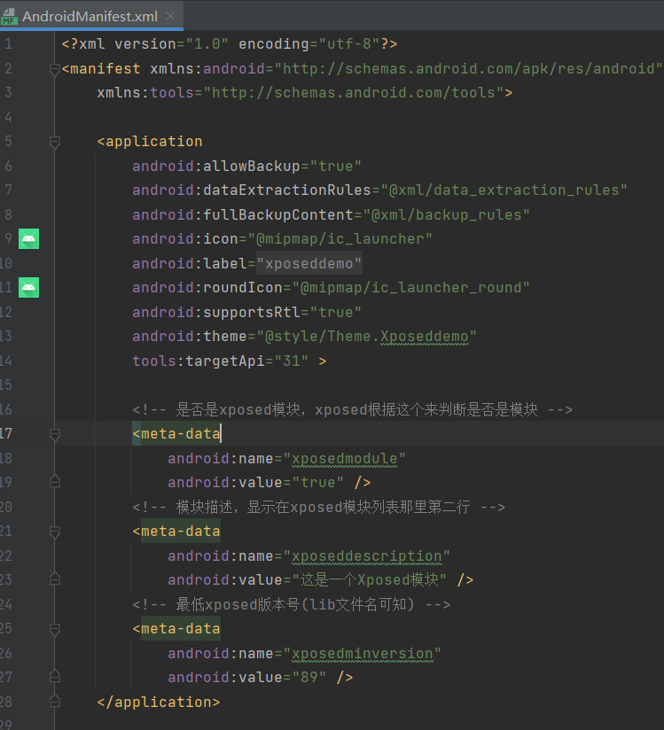
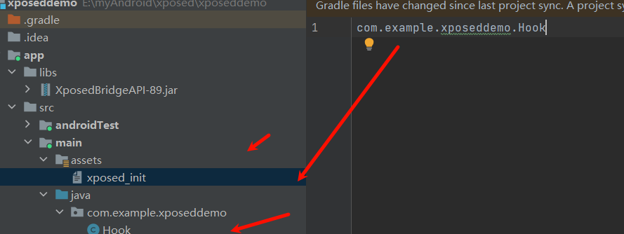
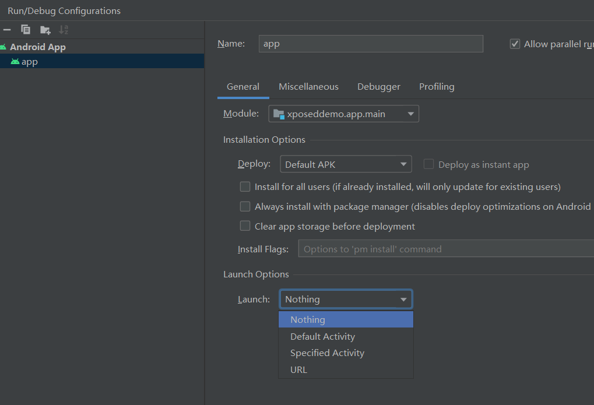

## 1.什么是Xposed？

Xposed是一款可以在不修改APK的情况下影响程序运行的框架，基于它可以制作出许多功能强大的模块，且在功能不冲突的情况下同时运作。在这个框架下，我们可以编写并加载自己编写的插件APP，实现对目标apk的注入拦截等。

## 2.Xposed原理

用自己实现的app_process替换掉了系统原本提供的app_process，加载一个额外的jar包，入口从原来的：  com.android.internal.osZygoteInit.main()被替换成了：de.robv.android.xposed.XposedBridge.main()，  
创建的Zygote进程就变成Hook的Zygote进程了，从而完成对zygote进程及其创建的Dalvik/ART虚拟机的劫持(zytoge注入)


## 3.Xposed的发展及免root框架


| 名称          | 地址                                            | 支持版本 | 是否免root |
| ------------- | ----------------------------------------------- | -------- | ---------- |
| xposed        | https://github.com/rovo89/Xposed                | 2.3-8.1  | 否         |
| EDXposed      | https://github.com/ElderDrivers/EdXposed        | 8.0-10   | 否         |
| LSPosed       | https://github.com/LSPosed/LSPosed              | 8.1-13   | 否         |
| VirtualXposed | https://github.com/android-hacker/VirtualXposed | 5.0-10.0 | 是         |
| 太极          | https://www.coolapk.com/apk/me.weishu.exp       | 5.0-10.0 | 是         |
| 两仪          | https://www.coolapk.com/apk/io.twoyi            | 8.1-12   | 是         |
| 天鉴              | https://github.com/Katana-Official/SPatch-Update                                                | 6-10         |  是          |


## 4.Xposed可以做什么？

1.修改app布局:[上帝模式](https://github.com/kaisar945/Xposed-GodMode)
2.劫持数据，修改参数值、返回值、主动调用等。例:微信防撤回、步数修改、一键新机
[应用变量](https://github.com/kingsollyu/AppEnv)
3.自动化操作，例:微信抢红包

学习项目:
[2022 最好的Xposed模块: GravityBox, Pixelify, XPrivacyLua](https://www.xda-developers.com/best-xposed-modules/)

[基于Xposed的抖音爬虫，抖音风控后自动一键新机，模拟一个全新的运行环境](https://github.com/Lstaynight/xposed-dy)

[基于xposed的frida持久化方案](https://github.com/svengong/xcubebase)

[A Xposed Module for Android Penetration Test, with NanoHttpd.](https://github.com/monkeylord/XServer)

[GravityBox](https://github.com/GravityBox/GravityBox)

[Xposed-Modules-Repo](https://github.com/Xposed-Modules-Repo)]

[一个旨在使QQ变得更好用的开源Xposed模块](https://github.com/ferredoxin/QNotified)

[杜比大喇叭](https://github.com/nining377/dolby_beta)

[知乎去广告Xposed模块](https://github.com/shatyuka/Zhiliao)

[哔哩漫游](https://github.com/yujincheng08/BiliRoaming)

[曲境](https://github.com/Mocha-L/QuJing)

[自动化创建Xposed模块及钩子，让Xposed模块编写时只需关注钩子实现](https://github.com/monkeylord/XposedTemplateForAS)

## 5.Xposed开发环境配置

开发工具：android-studio

1.Android Studio创建新项目
2.将下载的xposedBridgeApi.jar包拖进libs文件夹
<https://github.com/bywhat/XposedBridgeApi/tree/main>

3.右击jar包，选择add as library
4.修改xml文件配置
```xml
<!-- 是否是xposed模块，xposed根据这个来判断是否是模块 -->
<meta-data
    android:name="xposedmodule"
    android:value="true" />
<!-- 模块描述，显示在xposed模块列表那里第二行 -->
<meta-data
    android:name="xposeddescription"
    android:value="这是一个Xposed模块" />
<!-- 最低xposed版本号(lib文件名可知) -->
<meta-data
    android:name="xposedminversion"
    android:value="89" />
```

5.修改build.gradle,将此处修改为compileOnly 默认的是implementation
```
implementation 使用该方式依赖的库将会参与编译和打包
compileOnly 只在编译时有效，不会参与打包
```
6.新建src/main/assets目录，创建xposed_init(不要后缀名):只有一行代码，就是说明入口类
类似com.example.xposeddemo.Hook



7.新建Hook类，实现IXposedHookLoadPackage接口，然后在handleLoadPackage函数内编写Hook逻辑
```java
import de.robv.android.xposed.IXposedHookLoadPackage; 
import de.robv.android.xposed.callbacks.XC_LoadPackage;

public class Hook implements IXposedHookLoadPackage {
    @Override
    public void handleLoadPackage(XC_LoadPackage.LoadPackageParam loadPackageParam) throws Throwable {
        
    }
}
```
继承了IXposedHookLoadPackag便拥有了hook的能力



运行配置launch为Nothing，如此打包生成lsp模块的apk，lsp中可以启动模块。


## 6.Xpoosed常用API

[An efficient Hook API and Xposed Module solution built in Kotlin](https://github.com/fankes/YukiHookAPI)

### 1.Hook普通方法
修改返回值
```java
XposedHelpers.findAndHookMethod("com.zj.wuaipojie.Demo", classLoader, "getPublicInt", new XC_MethodHook() {
    @Override
    protected void beforeHookedMethod(MethodHookParam param) throws Throwable {
        super.beforeHookedMethod(param);
    }
    @Override
    protected void afterHookedMethod(MethodHookParam param) throws Throwable {
        super.afterHookedMethod(param);
        param.setResult(999);
    }
});

```
修改参数
```java
XposedHelpers.findAndHookMethod("com.zj.wuaipojie.Demo", classLoader, "setPublicInt", int.class, new XC_MethodHook() {
    @Override
    protected void beforeHookedMethod(MethodHookParam param) throws Throwable {
        super.beforeHookedMethod(param);
        param.args[0] = 999；
    }
    @Override
    protected void afterHookedMethod(MethodHookParam param) throws Throwable {
        super.afterHookedMethod(param);
    }
});

```

### 2.Hook复杂&自定义参数

```java
Class a = loadPackageParam.classLoader.loadClass("com.zj.wuaipojie.Demo");
XposedBridge.hookAllMethods(a, "Inner", new XC_MethodHook() {
    @Override
    protected void beforeHookedMethod(MethodHookParam param) throws Throwable {
        super.beforeHookedMethod(param);
        
        }
});

```


### 3.Hook替换函数
```java
Class a = classLoader.loadClass("类名")
XposedBridge.hookAllMethods(a,"getId",new XC_MethodReplacement() {  
    @Override  
    protected Object replaceHookedMethod(MethodHookParam methodHookParam) throws Throwable {  
        return "";  
    }  
});

```


### 4.Hook加固通杀
```java
XposedHelpers.findAndHookMethod(Application.class, "attach", Context.class, new XC_MethodHook() {  
    @Override  
    protected void afterHookedMethod(MethodHookParam param) throws Throwable {  
        Context context = (Context) param.args[0];  
        ClassLoader classLoader = context.getClassLoader();  
    }  
});

```


### 1.Hook变量
静态变量与实例变量：
-   静态变量（static）：类被初始化，同步进行初始化
-   非静态变量：类被实例化（产生一个对象的时候），进行初始化

静态变量
```java
final Class clazz = XposedHelpers.findClass("类名", classLoader);  
XposedHelpers.setStaticIntField(clazz, "变量名", 999);

```
实例变量
```java
final Class clazz = XposedHelpers.findClass("类名", classLoader);  
XposedBridge.hookAllConstructors(clazz, new XC_MethodHook() {  
    @Override  
    protected void afterHookedMethod(MethodHookParam param) throws Throwable {  
        super.afterHookedMethod(param);  
        //param.thisObject获取当前所属的对象
        Object ob = param.thisObject;  
        XposedHelpers.setIntField(ob,"变量名",9999);  
    }  
});

```

### 2.Hook构造函数


无参构造函数
```java
XposedHelpers.findAndHookConstructor("com.zj.wuaipojie.Demo", classLoader, new XC_MethodHook() {
    @Override
    protected void beforeHookedMethod(MethodHookParam param) throws Throwable {
        super.beforeHookedMethod(param);
    }
    @Override
    protected void afterHookedMethod(MethodHookParam param) throws Throwable {
        super.afterHookedMethod(param);
    }
});
```
有参构造函数
```java
XposedHelpers.findAndHookConstructor("com.zj.wuaipojie.Demo", classLoader, String.class, new XC_MethodHook() {
    @Override
    protected void beforeHookedMethod(MethodHookParam param) throws Throwable {
        super.beforeHookedMethod(param);
    }
    @Override
    protected void afterHookedMethod(MethodHookParam param) throws Throwable {
        super.afterHookedMethod(param);
    }
});

```

### 3.Hook multiDex方法
```java
XposedHelpers.findAndHookMethod(Application.class, "attach", Context.class, new XC_MethodHook() {  
    @Override  
    protected void afterHookedMethod(MethodHookParam param) throws Throwable {  
        ClassLoader cl= ((Context)param.args[0]).getClassLoader();  
        Class<?> hookclass=null;  
        try {  
            hookclass=cl.loadClass("类名");  
        }catch (Exception e){  
            Log.e("zj2595","未找到类",e);  
            return;        
        }  
        XposedHelpers.findAndHookMethod(hookclass, "方法名", new XC_MethodHook() {  
            @Override  
            protected void afterHookedMethod(MethodHookParam param) throws Throwable {  
            }        
        });  
    }  
});

```

### 4.主动调用
静态方法:
```java
Class clazz = XposedHelpers.findClass("类名",lpparam.classLoader);
XposedHelpers.callStaticMethod(clazz,"方法名",参数(非必须));
```
实例方法:
```java
Class clazz = XposedHelpers.findClass("类名",lpparam.classLoader);
XposedHelpers.callMethod(clazz.newInstance(),"方法名",参数(非必须));

```

### 5.Hook内部类
内部类:类里还有一个类class
```java
XposedHelpers.findAndHookMethod("com.zj.wuaipojie.Demo$InnerClass", lpparam.classLoader, "innerFunc",String.class,  new XC_MethodHook() {  
    @Override  
    protected void beforeHookedMethod(MethodHookParam param) throws Throwable {  
        super.beforeHookedMethod(param);  

    }  
});

```

### 6.反射大法
```java
Class clazz = XposedHelpers.findClass("com.zj.wuaipojie.Demo", lpparam.classLoader);
XposedHelpers.findAndHookMethod("com.zj.wuaipojie.Demo$InnerClass", lpparam.classLoader, "innerFunc",String.class,  new XC_MethodHook() {  
    @Override  
    protected void beforeHookedMethod(MethodHookParam param) throws Throwable {  
        super.beforeHookedMethod(param);  
        //第一步找到类
        //找到方法，如果是私有方法就要setAccessible设置访问权限
        //invoke主动调用或者set修改值(变量)
        Class democlass = Class.forName("com.zj.wuaipojie.Demo",false,lpparam.classLoader);  
        Method demomethod = democlass.getDeclaredMethod("refl");  
        demomethod.setAccessible(true);  
        demomethod.invoke(clazz.newInstance());  
    }  
});

```

### 7.遍历所有类下的所有方法

```java
XposedHelpers.findAndHookMethod(ClassLoader.class, "loadClass", String.class, new XC_MethodHook() {  
    @Override  
    protected void afterHookedMethod(MethodHookParam param) throws Throwable {  
        super.afterHookedMethod(param);  
        Class clazz = (Class) param.getResult();  
        String clazzName = clazz.getName();  
        //排除非包名的类  
        if(clazzName.contains("com.zj.wuaipojie")){  
            Method[] mds = clazz.getDeclaredMethods();  
            for(int i =0;i<mds.length;i++){  
                final Method md = mds[i];  
                int mod = mds[i].getModifiers();  
                //去除抽象、native、接口方法  
                if(!Modifier.isAbstract(mod)  
                    && !Modifier.isNative(mod)  
                    &&!Modifier.isAbstract(mod)){  
                    XposedBridge.hookMethod(mds[i], new XC_MethodHook() {  
                        @Override  
                        protected void beforeHookedMethod(MethodHookParam param) throws Throwable {  
                            super.beforeHookedMethod(param);  
                            Log.d("zj2595",md.toString());  
                        }  
                    });  
                }  
  
           }  
        }  
  
    }  
});

```

### 8.Xposed妙用
字符串赋值定位:
```java
XposedHelpers.findAndHookMethod("android.widget.TextView", lpparam.classLoader, "setText", CharSequence.class, new XC_MethodHook() {  
    @Override  
    protected void beforeHookedMethod(MethodHookParam param) throws Throwable {  
        super.beforeHookedMethod(param);  
        Log.d("zj2595",param.args[0].toString());  
		if(param.args[0].equals("已过期")){  
		    printStackTrace();  
		}
    }  
});
private static void printStackTrace() {  
    Throwable ex = new Throwable();  
    StackTraceElement[] stackElements = ex.getStackTrace();  
    for (int i = 0; i < stackElements.length; i++) {  
        StackTraceElement element = stackElements[i];  
        Log.d("zj2595","at " + element.getClassName() + "." + element.getMethodName() + "(" + element.getFileName() + ":" + element.getLineNumber() + ")");  
    }  
}
```

点击事件监听:
```java
Class clazz = XposedHelpers.findClass("android.view.View", lpparam.classLoader);
XposedBridge.hookAllMethods(clazz, "performClick", new XC_MethodHook() {  
    @Override  
    protected void afterHookedMethod(MethodHookParam param) throws Throwable {  
        super.afterHookedMethod(param);  
        Object listenerInfoObject = XposedHelpers.getObjectField(param.thisObject, "mListenerInfo");  
        Object mOnClickListenerObject = XposedHelpers.getObjectField(listenerInfoObject, "mOnClickListener");  
        String callbackType = mOnClickListenerObject.getClass().getName();  
        Log.d("zj2595",callbackType);  
    }  
});

```

改写布局:
```java
XposedHelpers.findAndHookMethod("com.zj.wuaipojie.ui.ChallengeSixth", lpparam.classLoader,  
        "onCreate", Bundle.class, new XC_MethodHook() {  
    @Override  
    protected void afterHookedMethod(MethodHookParam param) throws Throwable {  
        super.afterHookedMethod(param);  
        View img = (View)XposedHelpers.callMethod(param.thisObject,  
                "findViewById", 0x7f0800de);  
        img.setVisibility(View.GONE);  
  
    }  
});

```

