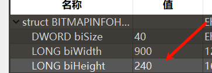
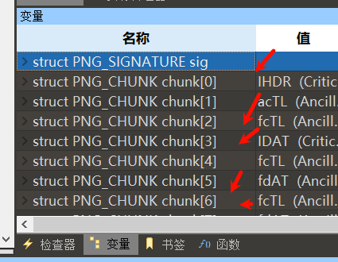

计算机能以位图和矢量图格式显示图像。
1、位图(Bitmap):
图像又称点阵图或光栅图，它使用我们称为像素(像素，Pixel)的一格一格的小点来描述图像。计算机屏幕其实就是一张包含大量像素点的网格。当我们把位图放大时，每一个像素小点看上去就像是一个个马赛克色块。2、矢量图(Vector)
使用直线和曲线来描述图形，这些图形的元素是一些点、线、矩形、多边形、圆和弧线等等，它们都是通过数学公式计算获得的。
^
## **位图和矢量图区别**
1、最简单的区别就是：矢量图可以无限放大，而且不会失真。而位图则不能。
2、像Photoshop(PS)这样主要用于处理位图的软件，我们称之为图像处理软件。
专门处理矢量图的软件，我们称之为图形设计软件，例如Adobe Illustrator, CorelDRAW, Flash MX等。

^
## **常见位图**
1. **BMP（Bitmap）**：是一种无压缩的图像文件格式，通常体积较大，因为它保存了图像的每个像素的信息。
2. **JPG/JPEG（Joint Photographic Experts Group）**：是一种常用的图像文件格式，使用有损压缩技术来减小文件大小，适合存储照片和复杂的图像。
3. **GIF（Graphics Interchange Format）**：是一种支持动画和透明背景的图像文件格式，使用无损压缩技术，但仅限于256色。
4. **PNG（Portable Network Graphics）**：是一种支持无损压缩的图像文件格式，支持透明度（alpha通道），并且提供比GIF更好的压缩率和图像质量。


^
## **BMP图片**
BMP图像文件(Bitmap-File)格式是Windows采用的图像文件存储格式，在Windows环境下运行的所有图像处理软件都支持这种格式。
Windows 3.0以后的BMP文件都是指设备无关位图(DIB，device-independent bitmap)。
BMP位图文件默认的文件扩展名是.BMP，有时它也会以.DIB或.RLE作扩展名。

**BMP文件由4部分组成：**
```
1、位图文件头(bitmap-fileheader)
2、位图信息头(bitmap-informationheader)
3、颜色表(color table)
4、颜色点阵数据(bits data)

如果位深度是24位的真彩色位图，则没有颜色表3，所以只有1、2、4这三部分。
```

**1、位图文件头**
| **名称**        | **占用空间** | **内容**                    | **实际数据**                              |
| ------------- | -------- | ------------------------- | ------------------------------------- |
| bfType        | 2字节      | 标识，就是“BM”二字               | BM                                    |
| bfSize        | 4字节      | 整个BMP文件的大小                | 0x000C0036(786486)【与右键查看图片属性里面的大小值一样】 |
| bfReserved1/2 | 4字节      | 保留字，没用                    | 0                                     |
| bfOffBits     | 4字节      | 偏移数，即 位图文件头+位图信息头+调色板 的大小 | 0x36(54)                              |

**2、位图信息头**


| **名称**          | **占用空间** | **内容**                           | **实际数据**   |
| --------------- | -------- | -------------------------------- | ---------- |
| **biSize**      | 4字节      | 位图信息头的大小，为40                     | 0x28(40)   |
| **biWidth**     | 4字节      | 位图的宽度，单位是像素                      | 0x200(512) |
| **biHeight**    | 4字节      | 位图的高度，单位是像素                      | 0x200(512) |
| **biPlanes**    | 2字节      | 固定值1                             | 1          |
| **biBitCount**  | 2字节      | 每个像素的位数1-黑白图，4-16色，8-256色，24-真彩色 | 0x18(24)   |
| biCompression   | 4字节      | 压缩方式，BI\_RGB(0)为不压缩              | 0          |
| biSizeImage     | 4字节      | 位图全部像素占用的字节数，BI\_RGB时可设为0        | 0x0C       |
| biXPelsPerMeter | 4字节      | 水平分辨率(像素/米)                      | 0          |
| biYPelsPerMeter | 4字节      | 垂直分辨率(像素/米)                      | 0          |
| biClrUsed       | 4字节      | 位图使用的颜色数如果为0，则颜色数为2的biBitCount次方 | 0          |
| biClrImportant  | 4字节      | 重要的颜色数，0代表所有颜色都重要                | 0          |

一般010的bmp模板改位图高度，就是将biHeight慢慢改大，就能看到隐藏信息。

可以慢慢试，也可以标准算：
如果文件头的字节数53，尾部在675053字节(不包括00)，每一个字节控制3种颜色的一种颜色
(675053-53 )/3=225000字节，已知高900字节，所以宽225000/900=250去掉小数，当然试的240也可能成功显示图片。


^
## **apng图片**
png：APNG是一个基于PNG的位图Q动画格式，扩展方法类似主要用于网页的GIF 89a，仍对传统PNG保留向下兼容。第1帧是标准的单幅PNG图像，因此只支持原版PNG的软件能正常显示第1帧。

查看所有帧：
我们使用火狐打开图片，发现可以动。这是我们再使用stegsolve的frame browser就没有用了，因为这个apng只是显示第一帧。
这时我们就需要一个可以分解apng文件的工具了：APNG Disassembler
使用APNG Disassembler，选择图片进行分解即可。