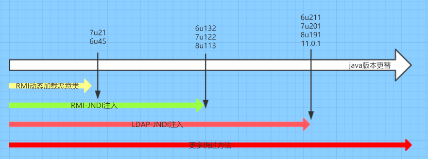

部分标准反序列化可以直接使用CC、CB链入口类的payload进行代码命令执行。如：原生、shrio、jdbc反序列化。

部分非标准反序列化的利用链则可以通过某些类触发JNDI注入去加载恶意类代码执行。如：fastjson反序列化、log4j2注入。
当然也可能结合利用链打。

还有一种是提供exp.jar的SPI服务，直接执行jar代码。如：SnakeYaml反序列化。

文章：
<https://xz.aliyun.com/t/7079?u_atoken=231b22c69b3851aa5f0b64523a08a351&u_asig=1a0c384917270659190644227e003c>

<https://xz.aliyun.com/t/7264?time__1311=n4%2BxnD0Dy7G%3DBxGqGNnmADRAi%3Di%3DrrkrDgCoD>

<https://azraelxuemo.github.io/2023/11/26/jndi/>

## **RMI**
RMI（Remote Method Invocation）为远程方法调用，是允许运行在一个Java虚拟机的对象调用运行在另一个Java虚拟机上的对象的方法。 这两个虚拟机可以是运行在相同计算机上的不同进程中，也可以是运行在网络上的不同计算机中,它的底层是由socket和java序列化和反序列化支撑起来的。  ​
它使客户机上运行的程序可以调用远程服务器上的对象。远程方法调用特性使Java编程人员能够在网络环境中分布操作。RMI全部的宗旨就是尽可能简化远程接口对象的使用。​
我们知道远程过程调用（Remote Procedure Call, RPC）可以用于一个进程调用另一个进程（很可能在另一个远程主机上）中的过程，从而提供了过程的分布能力。Java 的 RMI 则在 RPC 的基础上向前又迈进了一步，即提供分布式对象间的通讯。​
RMI依赖的通信协议为JRMP(Java Remote Message Protocol ，Java 远程消息交换协议)，该协议为Java定制，要求服务端与客户端都为Java编写。这个协议就像HTTP协议一样，规定了客户端和服务端通信要满足的规范。在RMI中对象是通过序列化方式进行编码传输的。​
Client-客户端：客户端调用服务端的方法​
Server-服务端：远程调用方法对象的提供者，也是代码真正执行的地方，执行结束会返回给客户端一个方法执行的结果​
Registry-注册中心：其实本质就是一个map，相当于是字典一样，用于客户端查询要调用的方法的引用（在低版本的JDK中，Server与Registry是可以不在一台服务器上的，而在高版本的JDK中，Server与Registry只能在一台服务器上，否则无法注册成功）

## **JRMP**
JRMP全称为Java Remote Method Protocol，也就是Java远程方法协议，通俗点解释，它就是一个协议，一个在TCP/IP之上的线路层协议，一个RMI的过程，是用到JRMP这个协议去组织数据格式然后通过TCP进行传输，从而达到RMI，也就是远程方法调用。

还是前面所说的例子，我们在使用浏览器进行访问一个网络上的接口时，它和服务器之间的数据传输以及数据格式的组织，是用到基于TCP/IP之上的HTTP协议，只有通过这个HTTP协议，浏览器和服务端约定好的一个协议，它们之间才能正常的交流通讯。而JRMP也是一个与之相似的协议，只不过JRMP这个协议仅用于Java RMI中。

总结的来说：JRMP是一个协议，是用于Java RMI过程中的协议，只有使用这个协议，方法调用双方才能正常的进行数据交流。

## **LDAP**
类似RMI的目录注册服务。

## **JNDI**
JNDI可以加载RMI注册服务 或 LDAP目录服务 指定的类执行代码。
