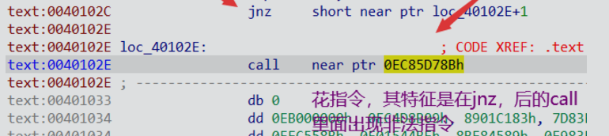

## **反调试**
反调试：阻止用户对我们所设计的程序进行调试，尽量使用户很难甚至不能进行动态调试程序，如果用户无法动态调试被保护的程序，那么篡改程序的执行流程也会变得非常的困难。

函数检测，检测调试相关的函数判断是否处于调试状态。
数据检测，通过测试一些与调试相关的关键位置的数据来判断是否处于调试状态。CRC校验
符号检测
窗口检测
特征码检测
行为检测
断点检测
行为占用
SEH
未处理异常
干扰程序正常执行流
Hook MmAccessFault

## **反虚拟机**
反虚拟机：检测并且禁止当前程序在虚拟机中运行。反虚拟机技术在病毒分析中是经常可以碰见的，当病毒程序检测到自身处于虚拟机环境中的时候就会隐藏恶意行为，睡眠或者自杀，让病毒分析人员难以察觉到相关的恶意行为。

硬件检查（CPU核心数、输入输出设备、内存）
进程名
注册表
系统服务
开机时长

## **反汇编**
反汇编：在程序中使用一些特殊构造的代码或者数据，让反汇编工具反汇编出不正确的程序代码序列。

反汇编两种方式：
线性反汇编
基于代码流的反汇编

对抗反汇编主要就是利用反汇编器选择算法和假设算法的漏洞，使反汇编器产生错误的反汇编代码。
相同目标的跳转指令
固定条件的跳转指令
无效的反汇编指令

## **代码混淆**
代码加密混淆
保护程序可以利用强大的处理器运算能力来膨胀被保护的代码，将一条原本非常简单的指令膨胀为成千上万条指令的组合，从而尽可能地提高分析和破解代码的成本。代码加密的最终目的都是将原始的代码转换为等价的，极其复杂的，更多的代码，这要求加密后的代码与加密前的代码在执行结果上尽可能等价。
代码加密的分类：
·代码变形

·花指令 ： 花指令是代码加密中一种很简单的技术，原理就是在原始的代码中插入一段无用的或者能够干扰调试器反汇编引擎的代码，这段代码本身没有任何功能性的作用，只是作为扰乱代码分析的手段。

·代码乱序
·多分支
·Call链
·SMC

^
花指令：导致无法F5反编译

去花之令的方法
1、是选中call，然后点左上edit、patch program、编辑字节、把call标识前缀的E8改成90（nop标识前缀）。
      按U取消定义函数，按P重新分析函数，此时就可以F5反编译了。

2、直接右键，有插件的选择nop即可。
