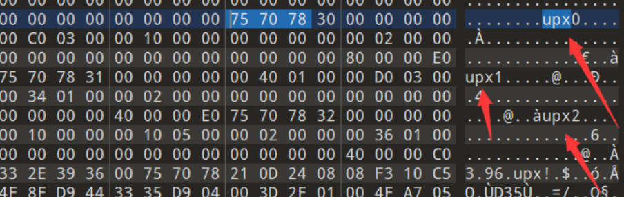
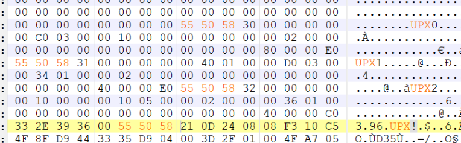

## **壳分类**
1、压缩壳，侧重缩小程序体积，则被称为压缩壳，经典的压缩壳为UPX、ASPack等。
2、加密壳，侧重程序代码及数据加密，则被称为加密壳，经典的加密壳软件VMProtect，ASProtect,Themida，其中VMP、Themida的特色是指令虚拟化，保护强度极高。
3、混淆壳。
4、虚拟机壳（加壳成中间代码，在虚拟机中运行）。
5、组合壳，如压缩壳组合加密壳。
## **壳原理**
一般情况，壳是会在程序代码之前获得控制权，他会修改原始程序的PE文件结构，加入自身代码，但不会影响到原始程序的正常功能。
1、入口现场保存
2、获取壳自身解密程序所需API的地址
3、解密原始程序的各个区块的数据
4、初始化IAT，导入原始程序所需要的系统API地址
5、修复重定位
6、HookAPI实现一些保护功能
7、恢复入口线程，跳转到OEP，将控制权交换给原始程序

## **加壳/脱壳软件**
可以使用ExeinfoPE程序查看加壳脱壳情况。

加壳软件：
所有的加壳软件都是将一个可执行文件作为输入，输出一个新的可执行文件，被加壳的可执行文件经过压缩、加密或者其他的转换，目的是使他们难以被识别，难以被逆向分析，比如加壳软件在加密原始可执行文件的时候加入了反汇编，反调试，反虚拟机等技术手段，加壳软件即可以打包整个可执行文件，包括所有的数据和资源节，也可以仅仅打包代码和数据节。
脱壳分类：
1、脱壳软件：这种方法只是针对特定的一种或者一类壳开发出来的脱壳软件，他们往往是由经验丰富的逆向分析人员在熟悉了相关的原理之后编写的一类自动化工具。
2、手动脱壳：通过动态调试分析程序的加壳原理，手动还原原始程序的过程，通过手动脱壳，我们不仅可以了解到加壳的原理，并且我们也能加深PE文件格式的印象。


## **脱壳软件**
对于一些简单、常见的壳，可以使用ExeinfoPE识别壳的类型名称。然后用对应的脱壳工具直接进行脱壳。

UPX压缩加壳 常用的脱壳工具：Free UPX、UPX Unpacker等
kali中命令

UPX壳没有被检测到。用010将小写的upx改成大写的UPX 55 50 58 在进行upx脱壳。



^
## **手动脱壳**
**1、寻找OEP**
在脱壳中，很重要的环节就是寻找程序的入口，当我们找到程序的OEP，也就是壳的任务已经结束要执行原始程序代码的地方。
方法：
跨段指令寻找OEP
堆栈平衡寻找OEP
内存访问寻找OEP
语言的特点寻找OEP

**2、dump出真正程序**
当我们到达程序的真正入口之后，接下来就是将内存dump下载，得到没有加壳后的程序。那么所谓的dump内存就是指将一个进程的内存镜像通过某种方式抓取下来，保存到本地，这个时候dump下来的程序虽然有时候不能执行，但是已经可以用IDA来进行分析。

Dump出来的程序的一般是无法直接运行的，因为缺少了必要的信息，PE加载器不能正确填充IAT，导致所有的动态链接库API调用都不能正确寻址。
解决办法：重建IAT(工具重建、手动重建)

^
**实例：**
已知exe用分析ExeinfoPE有加壳nsp1。

使用OD进行单步跟踪法获取OEP脱壳：
```
exe载入后一直F8步入，遇到循环F4跳出。直到找到一个指令是大型跳转的地址。
跳转，这里都是单字节的汇编，没有汇编指令。此时右键单击 分析，从模块中删除分析。
此时到达了OEP。
一键脱壳：右键，选择 用ollyDump脱壳调试进程，脱壳保存为exe。

此时ExeinfoPE显示加壳nsp0。
```

使用OD进行ESP堆栈平衡法获取OEP脱壳：
```
exe载入后看到右边寄存器很多红色的，F8单步一次，寄存器变白。但是ESP寄存器还是红色。
右键ESP寄存器，选择 数据窗口中跟随。
点击左下窗口的第一行地址，右键-短点-硬件访问-Dword。
此时下完断点，再点击>运行。此时到了一个指令是大型跳转的地址。
跳转，这里都是单字节的汇编，没有汇编指令。此时右键单击 分析，从模块中删除分析。
此时到达了OEP。
一键脱壳：右键，选择 用ollyDump脱壳调试进程，脱壳保存为exe。

此时ExeinfoPE显示加壳nsp0。
```