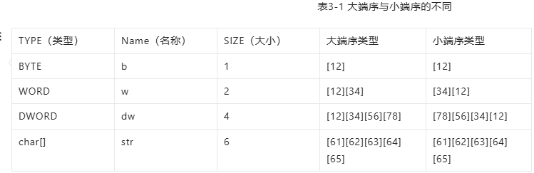
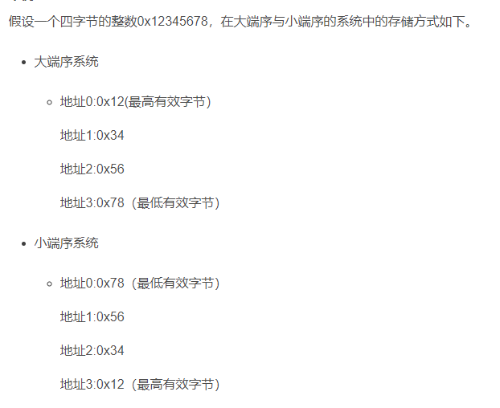

## **大端小端存储**
大端/小端 决定 多字节数据内部 谁放在低地址：
小端：最低有效字节 放在低地址
大端：最高有效字节 放在低地址


一般x86都是小端序，但是IDA将之转换为了大端序显示。
ELF文件通常使用小端序存储，IDA会把内存中的数据自动转化为大端序存储
```
例如，`0x776F646168LL` 表示的是一个十六进制的数值，转换为十进制大约是 100000000000000000，这个数值超出了32位 `int` 类型能表示的范围，因此需要使用 `long long int` 类型来存储。
`LL` 是一个后缀，表示这是一个长长整型（long long int）的字面量。
又大小端倒序，IDA伪代码显示的0x776F646168LL
而真实值是 68 61 64 6F 77
```

```
在反编译的伪代码中：
int v18; // [sp+30h][bp-10h]@3
int v19; // [sp+34h][bp-ch]@3
char v20; // [sp+38h][bp-8h]@3
v18='1010';
v19='0#11';
v20='1';
点进去查看汇编是
0101
11#0
1
所以如果v18地址一直往后读是0101 11#0 1


__int64 v4
v4[0] = 0x707541504072684Ci64;
实际 4C 68 72 ... 70
```

