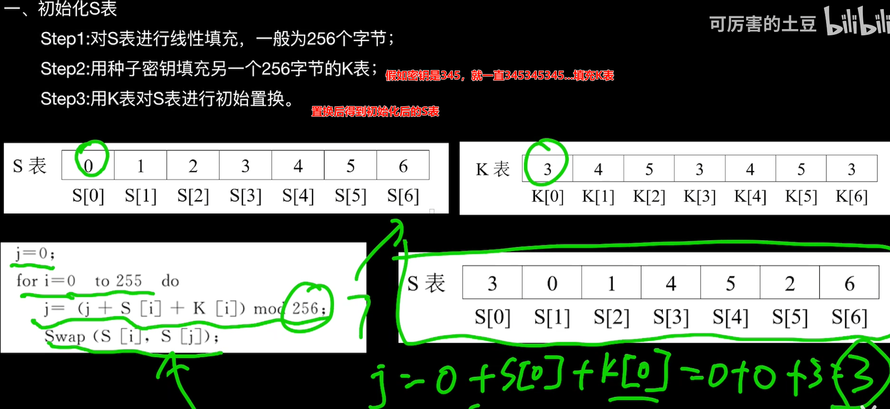

对称加密是一种可逆加密方式，一对一通信，其中使用相同的密钥（称为对称密钥）进行加密和解密。对称加密算法是可逆的，也就是说，使用加密过程的相同密钥可以将加密的数据还原为原始的明文数据。

对称加密分类：
1. 分块加密
分块加密将明文分成固定长度的块，每个块独立加密，加密后的结果与下一个块的加密结果相连。常见的分块加密算法有DES、3DES、AES等。
2. 流加密
流加密将明文转换为比特流，每个比特独立加密。常见的流加密算法有RC4、Salsa20等。

^
## **RC4:**
www.sojson.om/encrypt_rc4.html
<http://www.hiencode.com/rc4.html>
最好在网上找个python的RC4生成url编码的加密值，如：<https://www.cnblogs.com/seizer/p/17035716.html#:~:text=[CISCN2019>

1、通过密钥初始化S表254位

2、通过S表254位为给一个待加密的字节数据生成一个异或的数字，实现异或加密。
3、因为是异或，所以可以用同一个密钥解密。
```
key = list('gamelab@')
content = [0xB6, 0x42, 0xB7, 0xFC, 0xF0, 0xA2, 0x5E, 0xA9, 0x3D, 0x29, 0x36, 0x1F, 0x54, 0x29, 0x72, 0xA8, 0x63, 0x32,
           0xF2, 0x44, 0x8B, 0x85, 0xEC, 0x0D, 0xAD, 0x3F, 0x93, 0xA3, 0x92, 0x74, 0x81, 0x65, 0x69, 0xEC, 0xE4, 0x39,
           0x85, 0xA9, 0xCA, 0xAF, 0xB2, 0xC6]


# ciphertext_hex = "d8d2963e0d8ab8533d2a7fe296c529233924"
# ciphertext_hex += "6eba0d292d5752578359322c3a77892dfa7261b8"
# ciphertext_hex += "4f"
# 将十六进制字符串转换为字节序列
# ciphertext_bytes = bytes.fromhex(ciphertext_hex)
# content2 = ciphertext_hex


rc4number = 0x100  #256
s = [0] * rc4number
flag = ''


def rc4_init(s, key, rc4number): #初始化S表
    for i in range(rc4number): #S表255
        s[i] = i
    j = 0
    for i in range(rc4number):
        j = (j + s[i] + ord(key[i % len(key)])) % rc4number
        temp = s[i]
        s[i] = s[j]
        s[j] = temp


def rc4_endecode(s, content, rc4number):
    i = 0
    j = 0
    for k in range(len(content)):
        i = (i + 1) % rc4number
        j = (j + s[i]) % rc4number
        temp = s[i]
        s[i] = s[j]
        s[j] = temp
        t = (s[i] + s[j]) % rc4number
        content[k] = chr(content[k] ^ s[t])
    content = ''.join(content)
    print(content)


rc4_init(s, key, rc4number)
rc4_endecode(s, content, rc4number)
```


^
## **DES:**
早期的对称加密算法，已经不再推荐使用，因为它的密钥长度相对较短，容易受到暴力破解攻击，现在广泛使用的对称加密算法AES，被认为是安全可靠的加密标准。

^
## **AES:**
AES-128
原文+模式如(CBC、CBC、CFB)+填充+数据块+密钥key+偏移量iv+输出(16进制/Base64)

密钥key和偏移量iv一般都是16位
普通base64中一般不会出现+/号
对称加密算法中的base64可能会频繁出现/+号

应用：
https的数据包体。
weblogic的密码使用的此加密，解密需要有密钥。

^
加密模式：
AES-CBC
AES-GCM安全
ECB模式，可以不需要IV


^
冰蝎知道密钥在线解密AES数据包内容：
<http://tools.bugscaner.com/cryptoaes/>


^
## **XXTEA对称加密**

XXTEA加密算法是一种对称加密算法，它是TEA（Tiny Encryption Algorithm）算法的一种改进版本。以下是XXTEA的一些关键特点
   * **简单性**：XXTEA算法的实现非常简洁，典型的实现只需要几行代码。
   * **高效性**：加解密速度快，适合对大量数据进行处理。
   * **安全性**：相较于TEA和XTEA，XXTEA在安全性上有显著提升，目前尚未发现有效的攻击方法。
**应用场景**：XXTEA因其轻量、易实现、易跨平台的特性而被广泛应用于各个领域，例如腾讯QQ和微信中常用的加密算法就是基于XXTEA原理，降低加密轮次到16轮的TXTEA。
**密钥长度16**：一般16字节长度，key = b"1234567890abcdef"


