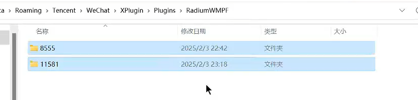

打开别人小程序的Devtools窗口：
方法很多，常配合小程序反编译，从代码中看那些变量被定义赋值，调试时直接看。
<https://blog.csdn.net/kinghzking/article/details/136562516>

项目：
<https://github.com/JaveleyQAQ/WeChatOpenDevTools-Python>
介绍
<https://www.bilibili.com/video/BV1VDNDezESi/?spm_id_from=333.337.search-card.all.click&vd_source=972491eeb83c0ed4c0015aef1be6c537>
```
下载低版本微信WeChatSetup-3.9.10.19.exe 
<https://pan.quark.cn/s/d9aab7a92d0e>
关闭自动更新

退出微信，并删除8555和11581文件（进程管理里右击微信里的程序打开文件所在目录即可找到）


pip3  install -r requirements.txt
小程序控制台
python311 main.py -all
python main.py -x
浏览器控制台
python main.py -c

打开微信即可
```
