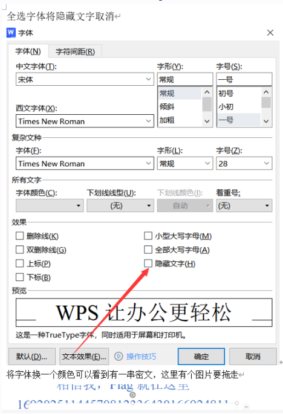

## **文档文件**
.word/.xls可能是和zip差不多的文件头，更改后缀可以解压看里面的xml等文件，flag可能在flag.txt也可能在.xml中。

.xls/.doc/.ppt文件头也可能：D0 CF 11 E0。一般.doc打不开就是.ppt。ppt不能改后缀为zip解压。

**文字隐藏**
点击文件-底部选项-显示-隐藏字符（no.1）
或
打开，选择，修改文字颜色为红色看到flag（可能无效）。

^
## **PDF**
Adobe Acrobat (pdf)，pdf使用wps，迅捷，万兴，是可以编辑的。移开图片可看隐藏。
文件头：255044462D312E

如果是多个图层，pdf转svg：<https://www.autotracer.org/zh.html>
svg再移除图层：<https://c.p2hp.com/more/svgeditor/#google_vignette>

^
## **wbStego4open**
wbStego4open可以把文件隐藏到PDF（BMP、TXT、HTML文件）中。也可以根据PDF提取文件。
可能有密钥。
<https://blog.csdn.net/qq_53079406/article/details/123783006>

^
## **破解文档密码**
支持pdf、word等
脚本：<https://fossies.org/linux/john/run/office2john.py>
软件：Accent OFFICE Password Recovery

^
kali里也可以
一般0000到9999的4位数字

^
Accent OFFICE Password Recovery选择字典或Brute-force蛮力，一般都是选择4位数字，能爆出来。