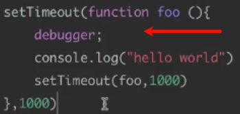
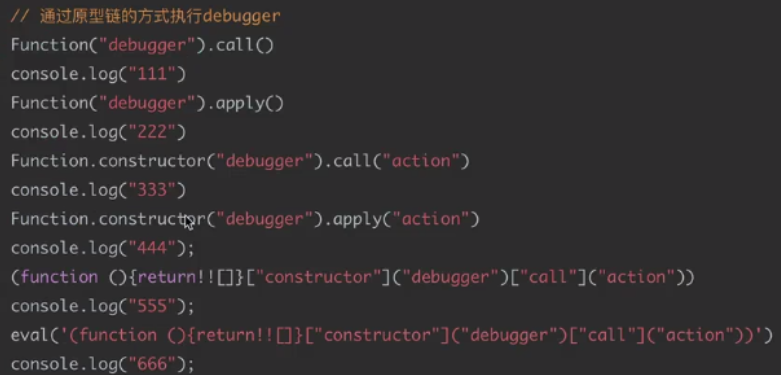
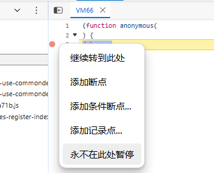
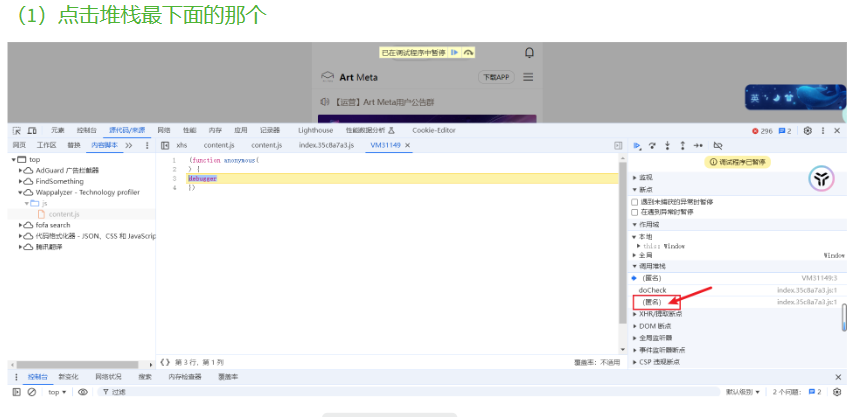
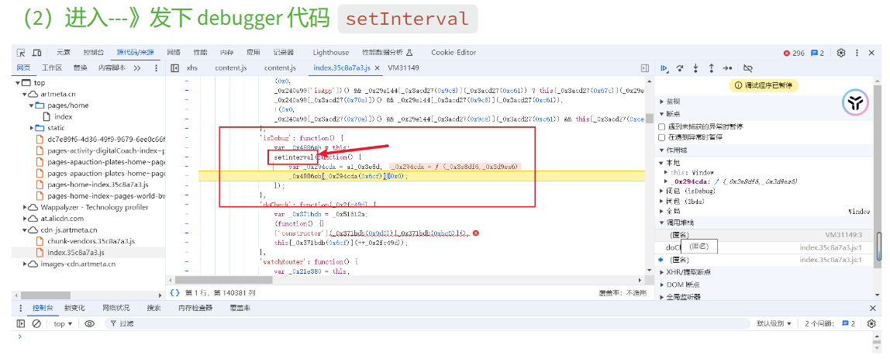
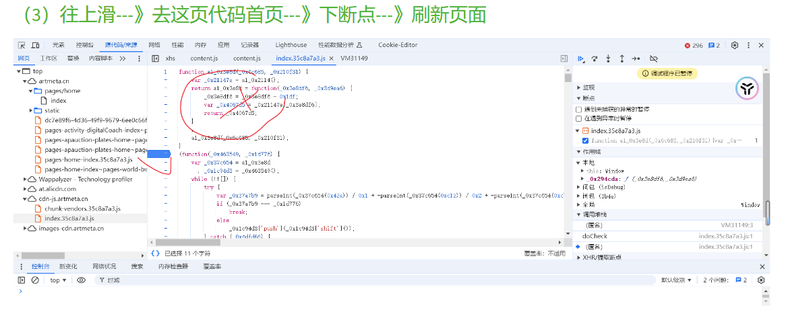
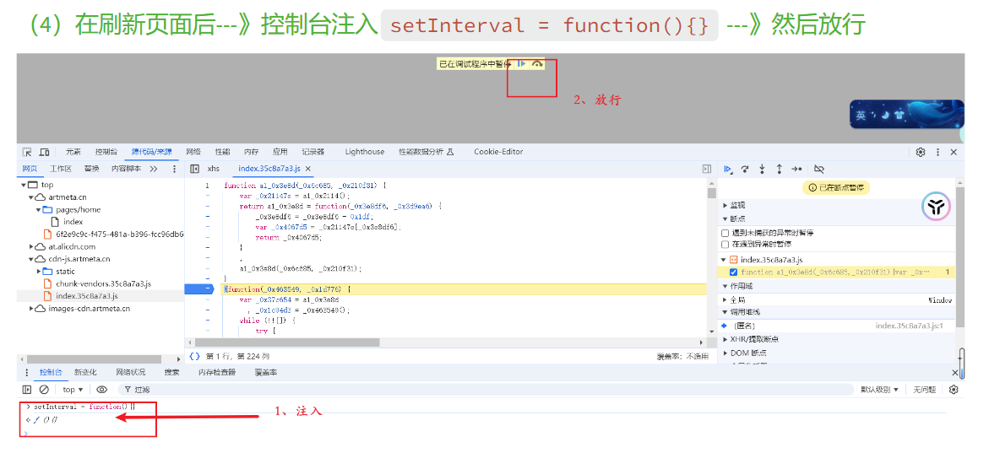
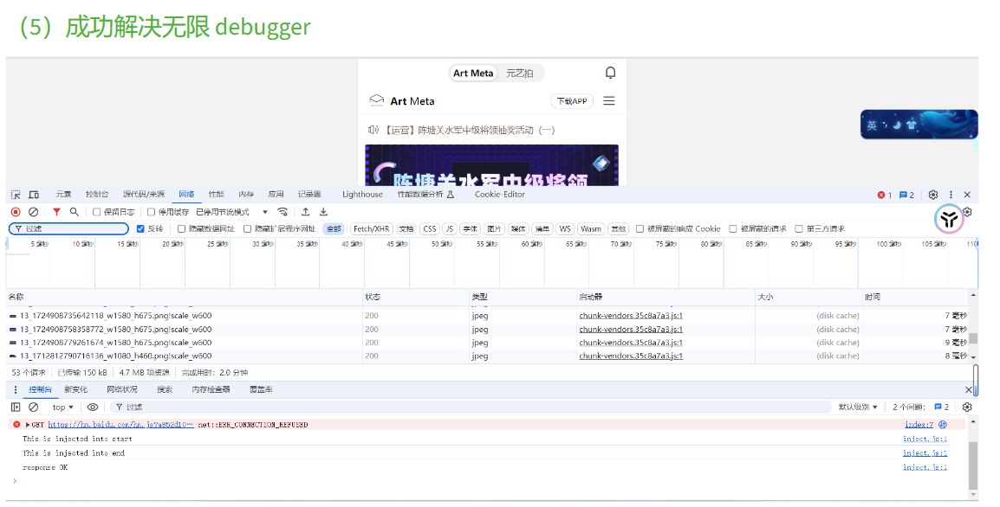

有些网站抓包，打开F12开发者模式抓包分析的时候，立即会出现无限debugger无限停顿 或 代码中存在很多debugger影响F12操作。

注意： 本文探究的所有情况都是无限debugger在加密逻辑之前。因为无限debugger在加密逻辑之后不用管

## **Debugger介绍**
无限debugger，还有一个非常靓丽的名字。叫debugger地狱

**最关键的一点: 无限debugger不可能无限，否则浏览器会卡死**

实现debugger的方案: Function，关键字，eval制作虚拟机

共分为三种模式

1. **不可混淆**

```jsx
debugger;
```

1. **\[可混淆]**

```jsx
eval("debugger;")
```

1. **\[可重度混淆]**

```jsx
Function("debugger").call()/apply()/bind()

xxx.constructor("debugger").call("action")

Function.constructor("debugger").call("action")

(function(){return !![];}["constructor"]("debugger")["call"]("action"))

eval('(function() {}["constructor"]("debugger")["call"]("action"));')
```

三种方式可能有交又和融合，迄今为止没有遇到过第四种情况


^
## **无限Debugger类型**

无限Debugger 只是很频繁的执行Debugger 而不是真正意义的无限
实现一个所谓的无限Debugger：
1、定时器构建类型
2、原型链构建类型
```jsx
function a(){debugger;}
setInterval(a,5000)
```




^
## **解决无限Debugger**

1. **重写setInterval方法 (业务代码和 setInterval 有关时)**

   ```jsx
   setInterval_back = setInterval
   setInterval = function(a, b){
     if (a.toString().indexOf('debugger')==-1){
   			return setInterval_back(a,b)
     }
     
   }
   ```

   但是会有一个问题 也就是hook的问题

2. **置空setInterval 方法(业务代码和 setInterval 无关时)**

   ```jsx
   setInterval= function(){}
   ```

3. **注入hook脚本**

   `从**Function层面解决Debugger**`

   代码1：

   ```jsx
   Function.prototype.constructor = function(){
       if (arguments==="debugger"){}
       else{
           return Function.prototype.constructor_bc.apply(this,arguments)
       }
   }
   ```

   代码2：

   ```jsx
   Function.prototype.__constructor_back = Function.prototype.constructor;
   Function.prototype.constructor = function() {
       if(arguments && typeof arguments[0]==='string'){
           //alert("new function: "+ arguments[0]);
           if("debugger" === arguments[0]){
               //arguments[0]="console.log(\\"anti debugger\\");";
               //arguments[0]=";";
               return
           }
       }
      return Function.prototype.__constructor_back.apply(this,arguments);
   }
   ```

4. **本地替换JS**
 
   1. 用 fiddler Auto response 删掉 debugger
   2. 浏览器开发者工具替换修改js（Sources面板 --> Overrides），删除代码中debugger

5. **手动过掉Debugger**

   1. 如果是关键字型的debugger 可以左边右键，选择永远不在此暂停。部分网站不行可能会卡死。
   2. 同理右键设置为条件断点-设置false


## **总结**

1. 如果是 Function 原理的 debugger，可以重写 函数构造器
2. 如果是关键字型的debugger 可以右键 never，设置为条件断点-设置false
3. 如果是eval型的构造器，可以重构 eval函数
4. 如果是定时器，并且 2失效了，可以重构定时器
5. 在以上方式都失效时，向上找堆栈，在进入无限debugger之前打上断点将触发无限debugger的函数置空(适用性最广)
案例：<https://artmeta.cn/>
F12后直接一直停在调试

发现是定时器类型的debugger

找到此函数的开头，或者while{}开头也行，打断点，刷新

函数重替换



