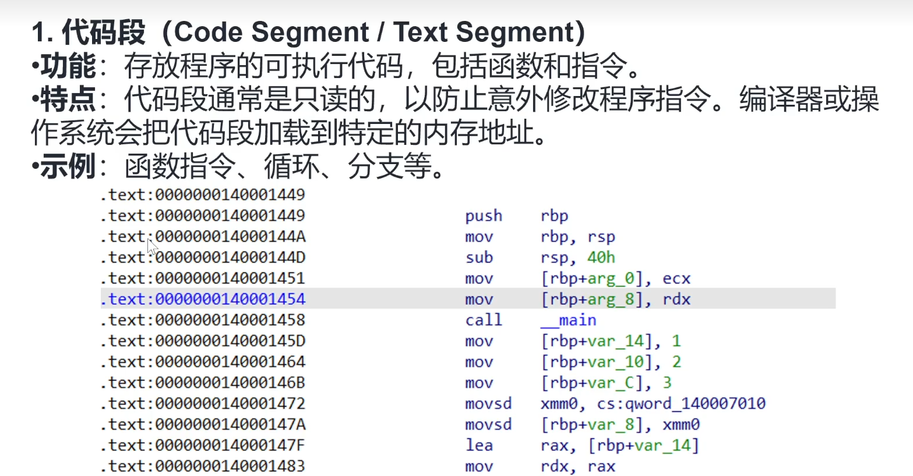
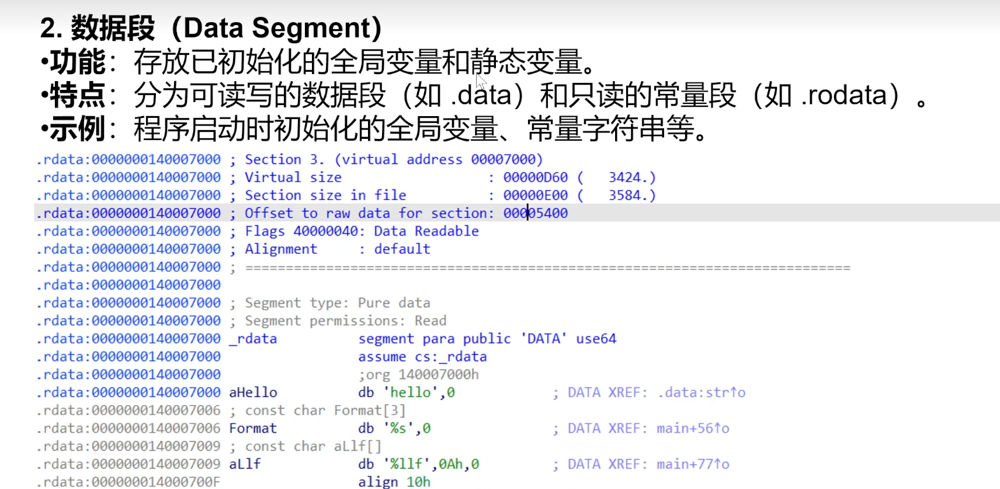
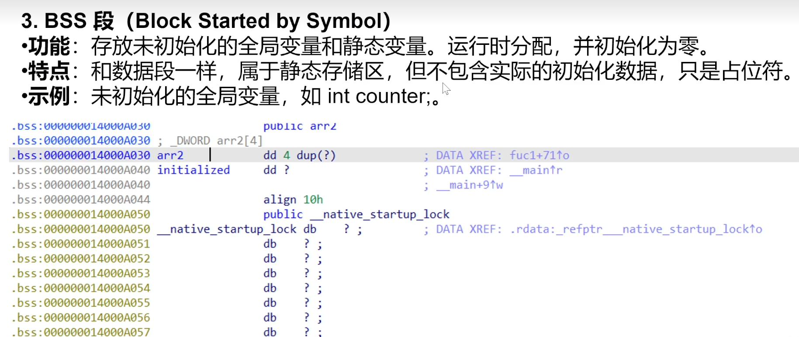
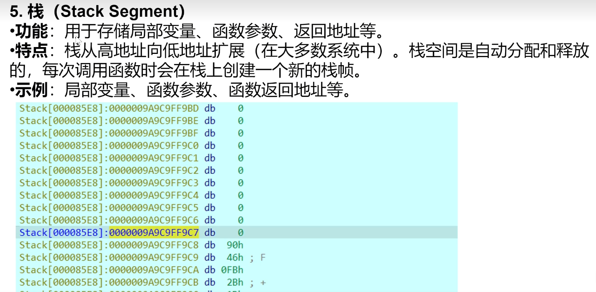

## **段和内存**
内存空间
```
高地址
┌─────────────────────────────┐
│ 内核空间 (kernel)           │ 用户态不可见
├─────────────────────────────┤
│ 栈 (stack)                  │ 向下增长，局部变量、返回地址
├┄┄┄┄┄┄┄┄┄┄┄┄┄┄┄┄┄┄┄┄┄┄┄┄┤
│ 文件映射区 (mmap)           │ 共享库、匿名映射、大块 malloc
├─────────────────────────────┤
│ 堆 (heap)                   │ 向上增长，brk/sbrk 或 malloc
├─────────────────────────────┤
│ .bss                        │ 未初始化全局/静态变量
├─────────────────────────────┤
│ .data / .data.rel.ro        │ 已初始化全局/静态变量
├─────────────────────────────┤
│ .rodata / .text             │ 只读数据、代码段
└─────────────────────────────┘
低地址

```
```
IDA静态调试：只能猜出 “栈帧长什么样”，看不到真正的堆和栈数据；
根据 push/pop、sub/add esp 等指令 推算 每个函数的栈帧布局
（局部变量、参数相对于 ebp/esp 的偏移）

IDA动态调试：调试跑起来后，才能 实时查看堆和栈的内存内容。
```


linux/Android的ELF文件的主要组成部分包括：
* ELF Header：文件头，描述文件的基本信息
* Program Header Table：程序头表LOAD，描述进程映像的布局
* Section Header Table：节区头表，描述文件的各个节区

| 节区名      | 描述                       |
| -------- | ------------------------ |
| .text    | 代码段，存放程序的指令   （F5伪代码，改指令等）           |
| .data    | 可写数据段，存放已初始化的全局变量和静态变量     |
| .rodata  | 只读数据段，存放只读数据             |
| .bss     | 未初始化数据段，存放未初始化的全局变量和静态变量 |
| .symtab  | 符号表，存放符号信息               |
| .strtab  | 字符串表，存放字符串数据             |
| .dynsym  | 动态符号表，存放动态链接需要的符号信息      |
| .dynamic | 动态链接信息，存放动态链接器需要的信息      |


`.init_array（防御）` → `main` → 退出流程 → **逆序** `.fini_array` → `_fini` → 进程消亡。


|            linker         |         启动动态链接的可执行文件（`app_process`、`dex2oat`、你自己的 ELF、so）时，内核把 **入口先交给 linker**，linker 做完重定位再把控制权交给 `.init` → `main`。       |                                                |                                                                                                    |
| :------------------ | :------------- | :--------------------------------------------- | :------------------------------------------------------------------------------------------------- |
| **LOAD**            | 程序头表（PT_LOAD） | 告诉内核“把这片文件区域 mmap 到进程地址空间”                     | 所有可运行代码/数据都归到 LOAD 段，用 `readelf -l` 可见   IDA视图默认前缀                                                         |
| **.plt**            | `.text` 附近     | “Procedure Linkage Table”——**动态链接的外包跳板**       | 第一次调用 libc 函数时先跳 `.plt`，由动态链接器把真实地址填进 `.got.plt`，下次直接走 `.got.plt` 不再进 linker；延迟绑定核心                |
| **.got.plt**        | 可写数据区   .data       | 保存**已解析完的动态库函数地址**                             | 与 `.plt` 配对，IDA 里常改这里做 PLT-hook                                                                    |
| **.eh\_frame**      | 只读数据区.rodata         | **异常处理与栈回溯的“地图”**                              | 存 DWARF 格式的 CFI（Call Frame Information），无论 `-g` 与否 gcc 都会生成；crash 时 libunwind/ debugger 靠它逐级还原寄存器  |
| **.eh\_frame\_hdr** | 紧邻上面           | 给运行时快速二分查找 `.eh_frame` 的索引                     | 异常抛出加速用                                                                                            |
| **.init\_array**    | 可写数据区          | **“构造函数表”**——进程**加载完毕但 main 未执行前**会顺序调用这里的函数指针 | 常见壳/反调试把代码藏这里，IDA 看 `init_array` 即可定位最早执行的逻辑                                                       |
| **extern**          | 符号表关键字         | 标记**本模块未定义、需动态链接器在运行时补地址**的符号                  | `nm -D` 看到 `U` 就是 extern                                                                           |
| **abs**             | 符号类型           | “absolute”——**地址在链接阶段已固定、与所在段无关**              |                                                                                                    
| **.eh\_frame\_hdr** | 只读数据 | **“.eh\_frame 的目录”**，运行时二分查找快速定位某 PC 对应的 FDE，**加速异常抛出**      | 栈回溯/反调试绕过：清空它可让 `libunwind` 失效；也可拿来做 PC→函数名快速映射 |
| **.fini\_array**    | 可写数据 | **“析构函数表”**——**进程正常退出（`exit`）或 `dlclose` 时**按**逆序**调用里面的函数指针 |   少见壳会把收尾逻辑（清痕迹、解挂钩子）藏这里；IDA 看 `.fini_array` 能找到 **main 返回后才执行的代码**                                    |


^
1、代码段
.text 
（F5伪代码，改指令等）

2、数据段
.data 可写数据区
.rdata  PE的只读
.rodata ELF的只读

数据段常见数据定义和伪指令
```
; 注释

`align 4` 会确保接下来的数据地址是4的倍数，`align 16`（或`align 10h`）会确保地址是16的倍数。

`db` 用于定义一个字节（byte）的数据 。arm用DCB

`dw` 用于定义一个字（word），即两个字节的数据

`dd` 用于定义一个双字（doubleword），即四个字节的数据

`dq` 用于定义一个四字（quadword），即八个字节的数据。arm用DCD

`dt` 用于定义十个字节的数据

`dt` 用于定义十个字节的数据

 `rb`、`rw`、`rd`、`rq`、`rt`、`ro`：
这些指令与`db`、`dw`、`dd`、`dq`、`dt`、`do`类似，但是它们在定义数据的同时，
还会在数据后面填充零，直到满足指定的大小。
例如，`rb 5` 会分配5个字节的空间，但是只初始化第一个字节，其余的四个字节会被填充为零。


offset begin = 取标号 begin 的地址值
offset begin 是汇编语言中的写法，通常用于获取标号（label）begin 的偏移地址（offset）。
这个偏移地址是相对于当前段（如代码段、数据段）起始地址的偏移量。

mov si, offset begin
这行代码会把 begin 标号处的偏移地址加载到寄存器 SI 中。

定义标号（名字:）可以独占一行，也可以和指令同行。
begin: mov ax, 1
```



数组末尾的0看情况是否带上


3、BBS段
bss是不占用.exe文件空间的，其内容由操作系统初始化0（清零）。

4、堆

5、栈



^
