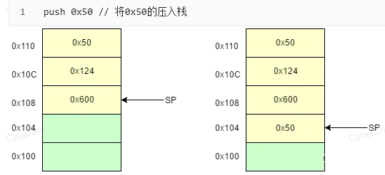

栈在内存中 高地址 往 低地址 生长。函数栈底在最上面，栈顶在最下面。
数据在内存中的存储方向是 低地址在前，高地址在后，跟多字节数据内部的大/小端无关。


## **函数调用**
<https://zhuanlan.zhihu.com/p/407496755>
<https://www.yuque.com/cyberangel/rg9gdm/gcz7x2>

```
call   x86的
BLX   ARM的"带返回的跨状态跳转"，是 ARM/Thumb 混合代码里链接不同指令集函数的唯一桥梁。

call add ;调用add函数，做两件事：
1、把“返回地址”压栈
当前 EIP/RIP 的下一条指令地址被自动 push [rsp-4/8] → rsp/rsp 减 4/8。
2、跳转到 add 符号处
把 add 的地址写进 EIP/RIP，CPU 开始执行被调函数。
执行完这两条硬件动作后，栈顶就是回来时要继续的地址，被调函数最后只要ret，
就把这个地址弹回 IP，程序就回到 call 的下一条指令。

push 入栈 每次esp=esp-4 (32位)，esp指向的是存储数据的低地址！
pop  出栈  每次esp=esp+4 (32位)，
pop ebp ;则ebp恢复成上一个函数的帧指针ebp (ebp被出栈赋值成旧栈底)


leave 等价于:
mov esp, ebp
pop ebp

ret 等价于:
pop eip ;把返回地址送 EIP，esp 再 +4
```

^
## **函数调用约定**
1.参数传参的入栈顺序和方式
2.在哪里平衡堆栈（调用返回后esp恢复成原来调用前的栈顶）

种类：stdcall、cdcel、fastcall、thiscall
```
void __stdcall add(int a,int b);
add(1,2);
汇编：
push 2
push 1
call add
```
函数约定不同的时候：
stdcall函数自己平衡参数堆栈，C函数默认调用约定。
thiscall调用方负责平衡 ，C++类的成员函数的调用约定。
cdecl调用方平衡堆栈(可变参数个数的函数就依赖于这个特性)，C++全局函数和静态成员函数的默认调用约定。
fastcall调用方负责平衡，会用寄存器传参，前几个→ecx/edx，其余push，速度更快。


## **模拟汇编**
 4 种最具代表性的调用方式（32-bit cdecl / stdcall，64-bit Win / SysV）的 完整最小可运行示例。
每段都包含
① 调用者（caller）把 1,2 准备好并 call add
② 被调者（callee）做 a+b 并返回结果到eax寄存器
③ 栈/寄存器前后对比，一眼看出“平衡”细节。
```
int add(int a, int b) {
    return a + b;
}

int main(void) {
    int r = add(1, 2);   /* r == 3 */
    return 0;            /* 0 是 main 的返回值，汇编里直接 ret 即可 */
}
```

^
#### 一、32-bit cdecl（Linux gcc -m32，Windows x86 默认）
```
; 文件：add_cdecl.asm
global  main
extern  add
section .text
; ---------- 调用者 ----------
main:
    push    ebp            ; 在当前栈帧的栈底push存储旧栈帧的栈底数据的低地址
    mov     ebp, esp    ; esp和ebp此时都为当前栈帧的栈底数据的低地址(数据是从低往高读)
    sub     esp, 4         ; 给局部变量int r 留 4 字节

    push    2              ; arg2
    push    1              ; arg1
    call    add            ;add是函数名，此时把下一命令的地址(返回地址)也push
   
    add     esp, 8         ; 调用者清栈-平衡，让esp回到push 2 push1前的栈顶。 

    mov     [ebp-4], eax   ; int r = eax
    xor     eax, eax       ; return 0
    leave                  ; mov esp,ebp / pop ebp
    ret

; ----------进入add函数初始化后的栈------------
地址存储的数据(数据是从低往高读)
[旧ebp]  旧旧ebp
[旧ebp-4] int r
[ebp+12]  arg2  (2)   ← 最先被 push，位于高地址
[ebp+8]   arg1  (1)
[ebp+4]   返回地址    ← call 指令自动压入
[ebp]  旧ebp      ← add函数序言 push ebp  和 mov  ebp, esp


; ---------- 被调者 ----------
global  add
add:
    push    ebp            ; 在当前栈帧的栈底push存储旧栈帧的栈底数据的低地址
    mov     ebp, esp    ; esp和ebp此时都为当前栈帧的栈底数据的低地址(数据是从低往高读)
    mov     eax, [ebp+8]   ; a
    add     eax, [ebp+12]  ; a+b
    leave                ; mov esp,ebp / pop ebp ;ebp被出栈赋值成旧栈底 , esp +4
    ret                   ; pop eip 把返回地址送 EIP, esp 再 +4
   ; 可以看到esp+8总共，esp还没有恢复到push 2和push 1前。但这里被调者不清栈，留给调用者恢复。
```
#### 二、32-bit stdcall（Windows API 风格）
```
; 文件：add_stdcall.asm
global  _main
extern  _add
section .text
; ---------- 调用者 ----------
_main:
    push    ebp
    mov     ebp, esp
    sub     esp, 4

    push    2
    push    1
    call    _add           ; 调用者不再 add esp,8

    mov     [ebp-4], eax
    xor     eax, eax
    leave
    ret

; ---------- 被调者 ----------
global  _add
_add:
    push    ebp
    mov     ebp, esp
    mov     eax, [ebp+8]
    add     eax, [ebp+12]
    leave
    ret     8  ; pop eip（把栈顶 4 字节弹给 EIP，ESP+4），被调者再额外把 ESP加上8，实现平衡。
```
#### 三、64-bit Windows x64（Microsoft ABI）
```
; 文件：add_win64.asm
global  main
extern  add
section .text
; ---------- 调用者 ----------
main:
    push    rbp
    mov     rbp, rsp
    sub     rsp, 32        ; 32 B shadow space + 对齐

    mov     ecx, 1         ; 1st
    mov     edx, 2         ; 2nd
    call    add

    mov     dword [rbp-4], eax   ; int r
    xor     eax, eax       ; return 0
    leave
    ret

; ---------- 被调者 ----------
global  add
add:
    push    rbp
    mov     rbp, rsp
    lea     eax, [rcx + rdx]     ; eax = a+b
    leave
    ret
```
#### 四、64-bit System V AMD64（Linux/macOS）
```
; 文件：add_sysv64.asm
global  main
extern  add
section .text
; ---------- 调用者 ----------
main:
    push    rbp
    mov     rbp, rsp
    sub     rsp, 16        ; 16 B 对齐

    mov     edi, 1         ; 1st → rdi
    mov     esi, 2         ; 2nd → rsi
    call    add

    mov     dword [rbp-4], eax
    mov     eax, 0
    leave
    ret

; ---------- 被调者 ----------
global  add
add:
    push    rbp
    mov     rbp, rsp
    lea     eax, [rdi + rsi]
    leave
    ret
```
^
速记口诀
```
32 位：push + cdecl 自己扫尾，stdcall 对方扫尾  
64 位：寄存器前 4/6 个，调用者预留 shadow/home 空间并自己回收
```