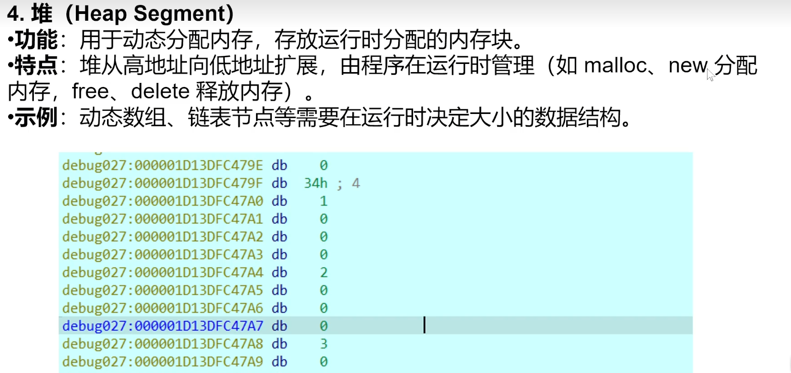
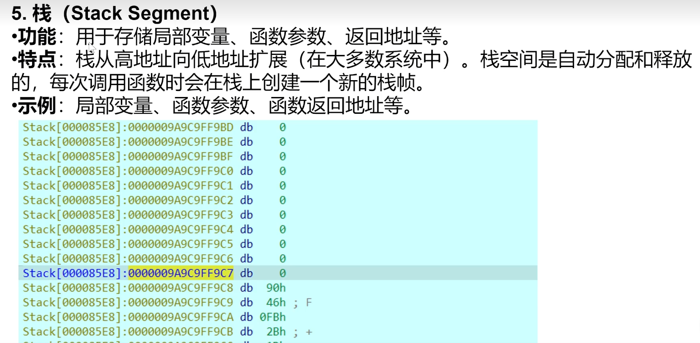

## **寄存器**
是cpu的组成成分，一种存储单元。

#### **通用寄存器：**
EAX,EBX,ECX,EDX,EBP,ESP,EDI,ESI

分类：
数据寄存器：EAX,EBX,ECX,EDX
指针寄存器：EBP,ESP
变址寄存器：EDI,ESI

作用：
EAX：32位累加器，是加法乘法指令的缺省寄存器。函数调用的返回值也放这里。
AX：x86，x64中EAX32位或RAX64位的低16位。
AL：累加寄存器的低8位。
EBX：基址寄存器，在内存寻址时存放基地址。
ECX：计数器，是重复前缀指令（REP）和LOOP指令的内定计数器。
EDX：数据寄存器，被用来放整数除法产生的余数。
EBP：扩展基址指针寄存器。函数开栈的栈底位置。
ESP：栈指针寄存器，指向栈区域的栈顶的位置，栈是一个存放即将会被用到的数据的地方。
EDI：目的变址寄存器。
ESI：源变址寄存器。
EIP：指令指针寄存器，EIP指向下一条将会被执行的指令。软件加壳用到。它用于存储下一条将要执行的指令的地址。因为EIP是硬件控制的，通常由处理器自动更新，用于指示程序的执行流。
如何修改EIP？[BJDCTF 2020]Easy 动态修改EIP的值为某个函数的地址实现强行执行某个函数。

#### **标志位寄存器：**
一个核心一个，多核多个。
功能：这个寄存器存储标志位的状态，标志cpu核心状态。
CF：进位标志，进位时置1，否则置0。
ZF：零标志位，运算结果为0时ZF置1，否则置0。
SF：符号位，结果为负时置1，否则置0。
OF：溢出标志，溢出时为1，否则置0。

^
## **汇编指令**
赋值 ：MOV指令
功能：将源操作数传送给目的操作数
```
MOV 目的操作数 源操作数
mov eax,0x10
```


在x86架构中，通常有两个栈：数据栈和调用栈
函数调用相关：
<https://www.bilibili.com/video/BV17M411T7Wq/?spm_id_from=333.337.search-card.all.click>

^
加/减  ：ADD/SUB指令
功能：将目的操作数加上源操作数结果存放在目的操作数中。
```
ADD 目的操作数 源操作数
SUB 目的操作数 源操作数
```

乘 ： MUL/IMUL指令
功能：根据源操作数的大小决定。源操作数为字节，则AL乘以源操作数，结果放在AX中。
如果源操作数是双字，AX存低位DX存高位。
```
MUL/IMUL 源操作数
```

除 ： DIV/IDIV指令
功能：根据源操作数的大小决定。源操作数为字节，则AX除以源操作数，商放在AL中，余数放在AH中。源操作数是双字，则AX除以源操作数，商放在AX中，余数放在DX中。
```
DIV/IDIV 源操作数
```

自增/自减 ： INC/DEC指令
功能：目的操作数++或--
```
INC 目的操作数
DEC 目的操作数
```

判断比较：CMP指令
功能：比较两个操作数，根据比较结果修改相关条件的标志位
主要和条件转移指令(j开头的)合用，判断语句。
```
CMP 操作数 操作数
je    
```

跳转：j开头指令


^
## **函数调用的区别**
函数调用约定：
1.参数入栈的顺序
2.在哪里平衡堆栈
种类：stdcall、cdcel、fastcall、thiscall


^
## **段和内存**
1、代码段
.text

2、数据段


3、BBS段

4、堆

5、栈
