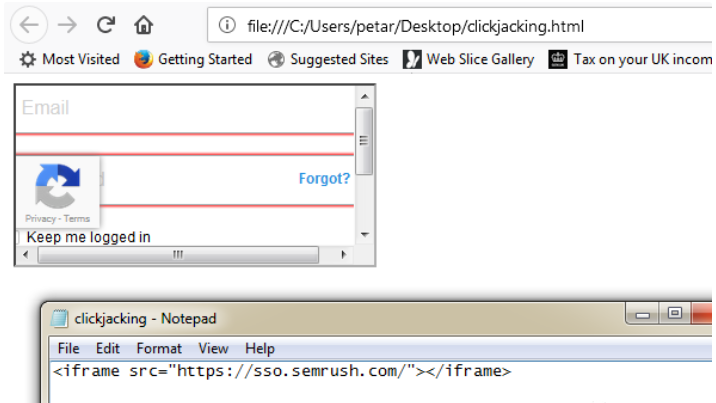

<https://cloud.tencent.com/developer/article/1516375>

点击劫持（Click Jacking）是一种视觉上的欺骗手段，攻击者通过使用一个透明的iframe，覆盖在一个网页上，然后诱使用户在该页面上进行操作，通过调整iframe页面的位置，可以使得伪造的页面恰好和iframe里受害页面里一些功能重合（按钮），以达到窃取用户信息或者劫持用户操作的目的。

Clickjacking是仅次于XSS和CSRF的前端漏洞，因为需要诱使用户交互，攻击成本高，所以不被重视，但危害不容小觑。

漏洞挖掘思路较为简单，观察业务系统中重要操作，返回包里是否有X-FRAME头或CSP头，若不存在则尝试使用iframe包含此链接，若框架内能正常显示链接的内容，则存在点解劫持风险。

主要有三种防御办法：

1）X-Frame-Options，建议设置为DENY；

2）Content-Security-Policy:frame-ancestors 'self'或‘none’，不适用于Safari和IE；

3）js层面：使用iframe的sandbox属性，判断当前页面是否被其他页面嵌套。

