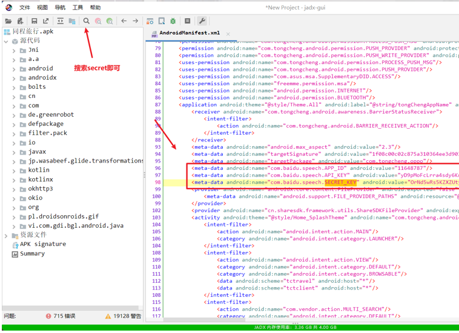

移动端安全总结：
https://mp.weixin.qq.com/s/qwLNAqtaUFT3JbhwNSON0g

^
## **APK的配置泄露**

^
## **APK的url跳转**
app的伪协议是 aaaa://

在APP里面 通过伪协议唤醒APP并打开指定URL是这样的
<aaaa://jump/core/web/jump?url=http://doamin.com>
由于对url参数未做校验 导致可在APP内置浏览器内跳转到任意域

^
## **APK的xss**

^
## **APK的sql本地注入**

