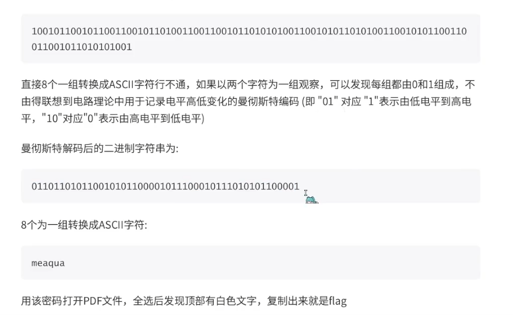

base16
base32
base64
ascii
rot13

^
## **base家族组合**
```
QW8obWdIWF5FKUFSQW5URihKXWZAJmx0OzYiLg==
先base64解码
Ao(mgHX^E)ARAnTF(J]f@&lt;6".

要把&It换成<（<的html编码为<）
再进行base85解码
flag{base_base_base}
```

^
## **类base64表映射题**
```
import base64

# dict字典为题目给出的非标准的base64表，标准的0对应A，1对应B
dict = {0: 'J', 1: 'K', 2: 'L', 3: 'M', 4: 'N', 5: 'O', 6: 'x', 7: 'y', 8: 'U', 9: 'V', 10: 'z', 11: 'A', 12: 'B',
        13: 'C', 14: 'D', 15: 'E', 16: 'F', 17: 'G', 18: 'H', 19: '7', 20: '8', 21: '9', 22: 'P', 23: 'Q', 24: 'I',
        25: 'a', 26: 'b', 27: 'c', 28: 'd', 29: 'e', 30: 'f', 31: 'g', 32: 'h', 33: 'i', 34: 'j', 35: 'k', 36: 'l',
        37: 'm', 38: 'W', 39: 'X', 40: 'Y', 41: 'Z', 42: '0', 43: '1', 44: '2', 45: '3', 46: '4', 47: '5', 48: '6',
        49: 'R', 50: 'S', 51: 'T', 52: 'n', 53: 'o', 54: 'p', 55: 'q', 56: 'r', 57: 's', 58: 't', 59: 'u', 60: 'v',
        61: 'w', 62: '+', 63: '/', 64: '='}

a = 'ABCDEFGHIJKLMNOPQRSTUVWXYZabcdefghijklmnopqrstuvwxyz0123456789+/'  # 标准表

c = 'FlZNfnF6Qol6e9w17WwQQoGYBQCgIkGTa9w3IQKw'

ds = ''  # 把dict转换成字符串方便处理
for i in range(65):
    ds += dict[i]

l = []
for i in range(len(c)):
    l.append(ds.index(c[i]))  # 无论换不换表，base64变换本身产生的6位二进制数对应的十进制数是不变的，这里就是找到密文c的每个字符在dict表中键值

# print(l)  #l中存的是索引值（下标数字）

m1 = ''
for ll in l:
    m1 += a[ll]  # 找到l中所存的每个数字在标准的base64加密表中所对应的字符

print("->" + m1)  # m1是标准base64表编码结果,可能就是flag了

m2 = base64.b64decode(m1)   # 有些题目可能还需要标准的base64解码一下。直接调用函数恢复出明文
print(m2)
```


^
## **ROT编码**
 ROT13（回转13位，rotate by 13 places，有时中间加了个连字符称作ROT-13）是一种简易的替换式密码。 
 ROT13 也是过去在古罗马开发的凯撒加密的一种变体。 
特点： 套用ROT13到一段文字上仅仅只需要检查字元字母顺序并取代它在13位之后的对应字母， 有需要超过时则重新绕回26英文字母开头即可。  A换成N、B换成O、依此类推到M换成Z，然后序列反转：N换成A、O换成B、最后Z换成M。

ROT-47：<https://www.qqxiuzi.cn/bianma/ROT5-13-18-47.php>
## **曼切斯特编码**
曼彻斯特编码


把信号值`5555555595555A65556AA696AA6666666955`转为二进制，根据01->1,10->0。可得到\
0101->11\
0110->10\
1010->00\
1001->01\
decode得到\
`11111111 11111111 01111111 11001011 11111000 00100110 00001010 10101010 10011111`\
bin->hex，对比ID并不重合，根据八位倒序传输协议将二进制每八位reverse，转hex即可\
flag：`FFFFFED31F645055F9`
```
txt = '5555555595555A65556AA696AA6666666955'
plain =''
for i in txt:
    plain += bin(int(i,16))[2:].zfill(4)

temp = ''
for i in range(0,len(plain),2):
    temp += plain[i+1]#巧妙根据01->1，10->0来简化操作

flag = ''
for i in range(0,len(temp),8):
    flag += hex(eval('0b'+temp[i:i+8][::-1]))[2:]

print(flag.upper())

````
曼彻斯特解码：


## **差分曼彻斯特**