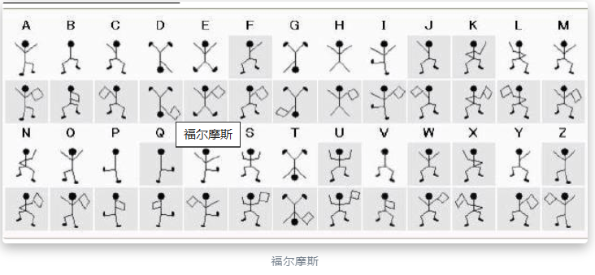
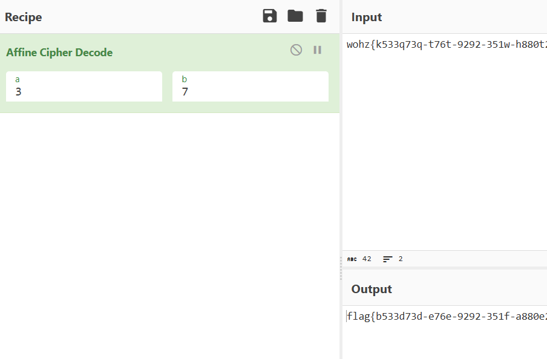
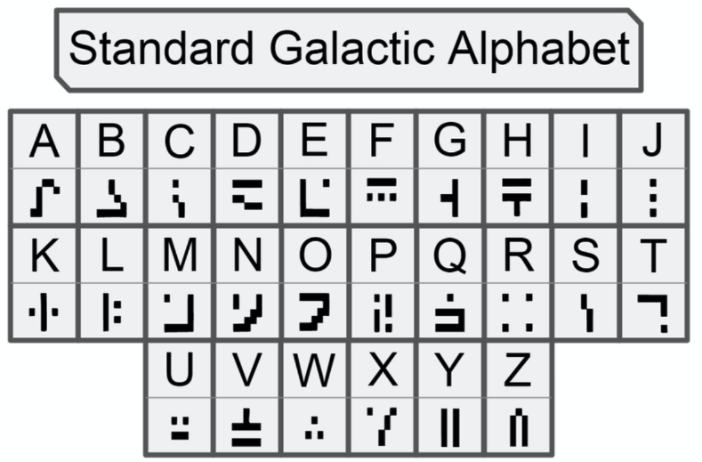
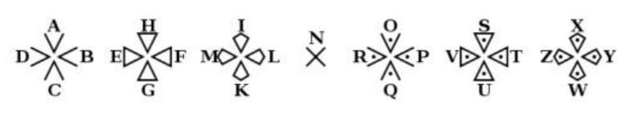

yCTF编码解码学习：<https://www.t00ls.com/articles-34578.html>
大全：<https://blog.csdn.net/weixin_44604541/article/details/109817480>
综合：<http://1o1o.xyz/ctfsoft.html>
<https://hello-ctf.com/HC_Crypto/Encode/>

杂项在线工具箱：<http://www.hiencode.com/>
各种变形编码，百度在线转换
神秘/凌乱/外星代码运行brainfuck解密：<https://bf.doleczek.pl/>

brianfuck:
```
++++++++++[>+++++++>++++++++++>+++>+<<<<-]
>++.>+.+++++++..+++.>++.<<+++++++++++++++.
>.+++.------.--------.>+.>.
```
jsfuck:
一键混淆JS代码网站：<https://tools.jb51.net/password/evalencode>
```
[!+[]+!+[]+!+[]+!+[]+!+[]]+[!+[]+!+[]]
```
Ook!：<https://www.splitbrain.org/services/ook>
佛论：<https://ctf.bugku.com/tool/todousharp>
佛曰：<http://hi.pcmoe.net/Buddha.html>

摩斯密码：记得小写  .- 

阴阳怪气：就这 不会吧

atbash埃特巴什码：只有字母abc全部倒替为zyx，flag{变成uozt{

音符♭♭♪♭=解密：<https://www.qqxiuzi.cn/bianma/wenbenjiami.php?s=yinyue>

社会核心价值观：<http://www.hiencode.com/cvencode.html>

0086   1562   2535   5174             中文电码<https://dianma.bmcx.com/>
 人      工     智     能
bnhn s wwy vffg vffg rrhy fhnv        五笔编码<http://www.zd9999.com/wb/search.asp>
也   要 从   娃   娃   抓   起

甲子数表：<https://baike.baidu.com/item/%E5%85%AD%E5%8D%81%E7%94%B2%E5%AD%90/2615886?fr=aladdin>

盲文：<https://www.qqxiuzi.cn/bianma/wenbenjiami.php?s=mangwen>
用python写一个，统计提取flag.txt中字符出现的频率，并按高到底排序。

表情ﾟωﾟﾉ= 为AAencode：<http://www.hiencode.com/aaencode.html>

EBCDIC编码：用010可看
福尔摩斯跳舞的小人密码：图形对应字符即可<https://zhidao.baidu.com/question/381009848.html>


伏羲64：<https://blog.csdn.net/HAI_WD/article/details/131606215>
一个卦对应6位010，以8位为2进制，转为10进制，在转ascii。

whitespace（ws）隐写：字符由空白点组成的，选中才能看清。复制在线解密：<https://blog.csdn.net/ce666666/article/details/122486249>

snow隐写：文件尾部0D 0A 或20 0A，字符由空白点组成的，选中才能看清，下载解密，可有密码也可无。
将空白点字符复制保存到1.txt
无密码直接snow.exe -C 1.txt ，有密加-p在中间
E:\myHVV\ctf\misc\snwdos32\snow.exe -p hero -C snow.txt
<https://blog.csdn.net/qq_51999772/article/details/122418926>
<https://blog.csdn.net/qq_53105813/article/details/127896201>
类似的零宽度字节隐写，特征：有unicode表情。见下面
零宽隐写：<https://yuanfux.github.io/zero-width-web/>
```
#‏‎​‎‎​‌‏​‌‎​‏‌​‍‏​‏‌​‌‎​‌‏​‍​‏​‍‌​‏​‍‍​‎‏​‏‎​‍‏​‍‎​‌‏‍​‎‎​‎​‍‌​‎‌​‎​‎‎​‍‌​‎​‌‎‌​‌‏‏​‌‎‍​‌‏‏​‌‏‌￥#% ￥#……%￥#//whereisthezipkey？？
```

ascii码转换：<https://www.asciim.cn/m/tools/convert_ascii_to_string.html>
base64转16进制，16进制可以是个文件：<https://www.toolhelper.cn/EncodeDecode/Base64EncodeDecode>
16进制转字符：<https://www.toolscat.com/decode/hex> 。也可以使用BerylEnigma工具HEX
二进制转字符：<https://coding.tools/cn/binary-to-text>
如果10进制串不是asii值，则先转换为16进制，再转asii字符。


^
utf-7用厨师：+j9k-+Zi8-+T2A-+doQ-flag+/xo-+AAo-+AAo-

^
仿射密码加密解密
如:y=ax+b，需要a和b。关键词Affine



^
标准银河字母

圣堂武士密码表



^
AAENCODE
```
ﾟωﾟﾉ= /｀ｍ´）ﾉ ~┻━┻   //*´∇｀*/ ['_']; o=(ﾟｰﾟ)  
```
^
## **敲击码**
有的字符存在，但看不到，要在vscode里，选中才能看到，看到的结果类似摩斯密码。敲击码。

```
..... ../... ./... ./... ../
  5,2     3,1    3,1    3,2
   W       L      L      M
```


^
## **unicode隐写**
在 Unicode 隐写术中，隐秘的信息被嵌入到文本中，通常是通过调整字符的一些特性或属性，如零宽度字符、空格、换行符等。这样的调整通常是微小的，足以使得嵌入的信息在正常文本中不被察觉，而只有了解隐写术的人才能提取或解码隐藏的信息。

一些常见的 Unicode 隐写技术包括：
1. **零宽度字符：** 使用零宽度字符（如零宽度空格、零宽度非断空格等）来嵌入信息，这些字符在显示时是不可见的，但它们确实占据了空间。特征：有unicode表情。
零宽度字符隐写生成和还原：<http://330k.github.io/misc_tools/unicode_steganography.html>
已经保存离线网页到本地了。
2. **变形字符：** 使用 Unicode 中形状相似但有微小差异的字符，如全角和半角字符、不同字母的形状变体等。
3. **控制字符：** 使用 Unicode 控制字符来调整文本的显示属性，如颜色、字体、大小等。

**unicode值比较：**
输入一个字符要比1337大。
<https://www.compart.com/en/unicode>找即可
如：万，𐄭。


^
繁体中文转unicode：<https://tool.chinaz.com/tools/unicode.aspx>
unicode按16进制转字符串：<https://www.bejson.com/convert/ox2str/>
得到的可能是base编码的字符串格式，再解码即可。


^
## **base64隐写**
<https://www.cnblogs.com/tolele/p/16271548.html>
base64.txt文件中格式：
```
RXQgYXV4IGJsYXNwaGVtZXMsCm==
Sidhdm91ZSBqZSBtYXVkaXMsCu==
VG91cyBjZXV4IHF1aSBzJ2FpbWVudCwK
UGxldXJlbnQgbGVzIHZpb2xvbnMgZGUgbWEgdmllLAp=
TGEgdmlvbGVuY2UgZGUgbWVzIGVudmllcywK
```
格式要求
```
# 读取Base64编码的数据，确保每行数据的长度是4的倍数（如果不足，用=补足），
# 然后将这些数据写入到另一个文件中。
# 为了确保Base64编码的完整性，或为了之后的解码过程做准备。

with open("base64.txt","r") as f:
    lines = f.readlines()
ls = []

for i in lines:
   k = i.strip('\n')
   r = k
   # print(r)
   if len(k)%4 != 0:
       for t in range(4-len(k)%4):
           r = r + "="
           # print(r)
   # print(len(r)%4)
   z = r + '\n'
   # print(z)
   ls.append(z)

with open("abase64.txt", "w") as f:
   for i in ls:
       f.writelines(i)
```
```
import base64

b64chars = 'ABCDEFGHIJKLMNOPQRSTUVWXYZabcdefghijklmnopqrstuvwxyz0123456789+/'

with open('./base64.txt', 'rb') as f:
    flag = ''
    bin_str = ''
    for line in f.readlines():
        stegb64 = str(line, "utf-8").strip("\n")
        rowb64 = str(base64.b64encode(base64.b64decode(stegb64)), "utf-8").strip("\n")
        offset = abs(b64chars.index(stegb64.replace('=', '')[-1]) - b64chars.index(rowb64.replace('=', '')[-1]))
        equalnum = stegb64.count('=')  # no equalnum no offset
        if equalnum:
            bin_str += bin(offset)[2:].zfill(equalnum * 2)
            # flag += chr(int(bin(offset)[2:].zfill(equalnum * 2), 2))
            # print(flag) 这样写得不出正确结果
        print([chr(int(bin_str[i:i + 8], 2)) for i in range(0, len(bin_str), 8)])

    # Convert the last line to a string
    last_line_str = ''.join([chr(int(bin_str[i:i + 8], 2)) for i in range(0, len(bin_str), 8)])
    print(last_line_str)
```


