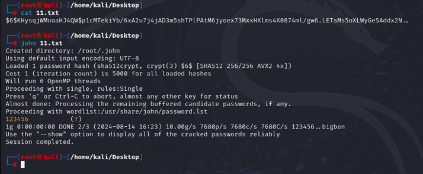
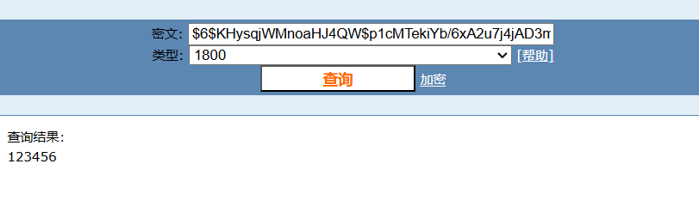

## **使用hashcat**

windows安装：<https://blog.csdn.net/Samuel677/article/details/118875875>
使用：<https://www.sqlsec.com/2019/10/hashcat.html>
通过 Hashcat 来手动跑字典，基本上使用 GPU 破解的话也是可以秒破解的。

功能：
用hashcat破译linux的root加密密码等
用hashcat破译mysql的用户加密密码等

#### **1、参数说明**
```
hashcat -a 0 -m 300 --force '8232A1298A49F710DBEE0B330C42EEC825D4190A' password.txt -O
```
-m指定了散列类型，-a 0表示使用字典攻击模式。


**-a 破解模式**
指定要使用的破解模式，其值参考后面对参数
```r
- [ Attack Modes ] 
  # | Mode
 ===+======
  0 | Straight                # 直接字典破解
  1 | Combination             # 组合破解
  3 | Brute-force             # 掩码暴力破解
  6 | Hybrid Wordlist + Mask  # 字典+掩码破解
  7 | Hybrid Mask + Wordlist  # 掩码+字典破解
```

**-m 破解 hash 类型**

指定要破解的 hash 类型，后面跟 hash 类型对应的数字，具体类型详见下表：
```
12   | PostgreSQL                                       | Database Server
131  | MSSQL (2000)                                     | Database Server
132  | MSSQL (2005)                                     | Database Server
1731 | MSSQL (2012, 2014)                               | Database Server
200  | MySQL323                                         | Database Server
300  | MySQL4.1/MySQL5                                  | Database Server
1000 md5
0 NTML  windows
```

**–force**

  忽略破解过程中的警告信息

**-O**

`--optimized-kernel-enable` 启用优化的内核（限制密码长度）

^
#### **2、破解Linux ssh**
```
查看加密方式和密文，只有root用户才能读取它
cat /etc/shadow

将第一行root的，复制到一个单独的文本文件中linux.txt，只包含散列值。
root:$6$zabn57RZxJ$IhXmb8VyUwlyUOEzmhsPdYqfHo7fyhR9YNV3Sw5mMMLd2WDluEojFBTy.QMcUgKJ78KV1U1zp30lIl0cKXoOr0:19667:0:99999:7:::

根据加密方式进行命令

linux sha512crypt $6$, SHA512 (Unix)加密方式：
hashcat -m 1800 sha512linux.txt p.txt

linux sha256crypt $5$, SHA256 (Unix)加密方式：
hashcat -m 7400 sha256linux.txt p.txt

linux下md5crypt, MD5 (Unix), Cisco-IOS $1$ (MD5)加密方式：
hashcat -m 500 linuxmd5.txt p.txt

linux下bcrypt $2\*$, Blowfish加密方式：
hashcat -m 3200 linuxmd5.txt p.txt
```

^
## **使用john爆破**
kali自带
```
echo "$6$KHysqjWMnoaHJ4QW$p1cMTekiYb/6xA2u7j4jAD3m5shTPlPAtM6jyoex73MxxHXlms4X0874ml/gw6.LETsMs5oXLWyGeSAddx2N.." > 11.txt

cat 11.txt

john 11.txt
```




^
## **使用cmd5在线**
简单的能：<https://www.cmd5.com/>
```
$6$KHysqjWMnoaHJ4QW$p1cMTekiYb/6xA2u7j4jAD3m5shTPlPAtM6jyoex73MxxHXlms4X0874ml/gw6.LETsMs5oXLWyGeSAddx2N..
```
