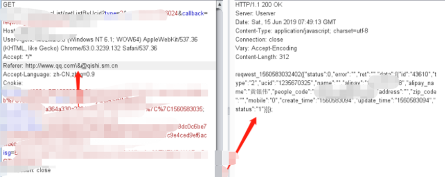

## **url重定向**
url形如：baidu.com/url=http://1.cn
此时跳转到1.cn，如果可以自定义拼接恶意url，则是重定向漏洞，可造成欺骗，钓鱼等。
场景：url变化的场景，来到登录页，登录成功后跳转，支付成功后回调跳转，第三方登录后跳转，功能设置的跳转等。
图片头像地址url可控。

如：<http://www.8899x.net/out.asp?url=http://baidu.com/>
搜索语法
```
inurl:"url=http://"
inurl:url=http://  site:edu.cn
inurl:redirect_uri  site:edu.cn
site:*.edu.cn inurl:url=http://
```
^
## **响应包304重定向**
修改响应包的304造成重定向。
^
## **xss的js脚本造成的重定向**
```
window.location = 'http://be.hkjcfootball.com/';

window.location = 'javascript:alert(1)';
```
^
## **重定向绕过**
## nuclei中的绕过技巧：
http://xxx.xxx.xxx/%0a/baidu.com
http://xxx.xxx.xxx/%5C%5Cbaidu.com/%252e%252e%252f

## 其它url跳转绕过技巧：
http://xxx.xxx.xxx/redirect.php?url=/www.baidu.com
http://xxx.xxx.xxx/redirect.php?url=//www.baidu.com
http://xxx.xxx.xxx/redirect.php?url=///www.baidu.com
http://xxx.xxx.xxx/redirect.php?url=http://www.baidu.com
http://xxx.xxx.xxx/redirect.php?url=http://www.baidu.com\www.evil.com
http://xxx.xxx.xxx/redirect.php?url=http://www.baidu.com
http://xxx.xxx.xxx/redirect.php?url=.evil.com(可能会跳到evil.com)
http://xxx.xxx.xxx/redirect.php?url=.evil(可能会跳到www.evil.com.evil)
### 期望跳转到www.baidu.com
```
http://www.test.com[@www.baidu.com/tou

可绕过众多防御
http://@www.realsee.com[@www.baidu.com/tou

http://baidu.com\test.com
```
同理绕refer



## 绕过URL跳转
https://www.cnblogs.com/-meditation-/articles/16243218.html

## java代码审计漏洞-URL跳转
https://www.cnblogs.com/-meditation-/articles/16243853.html