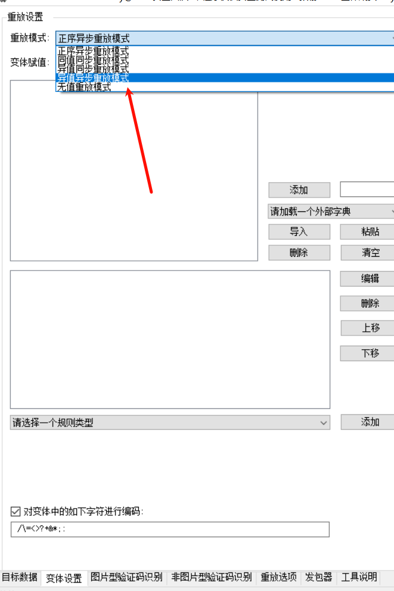
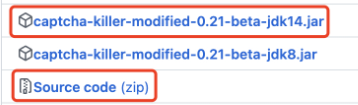
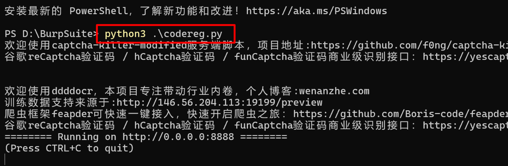
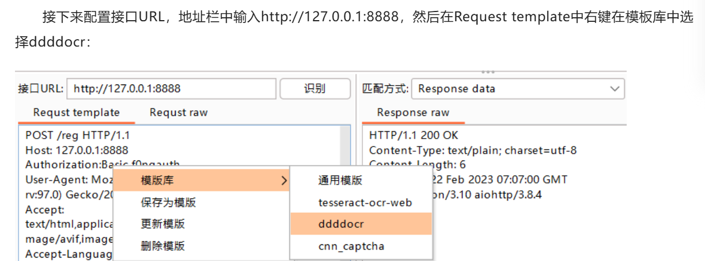
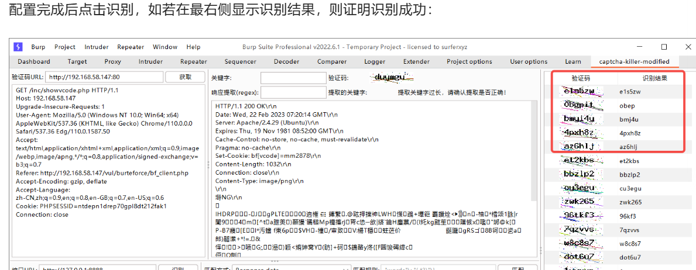
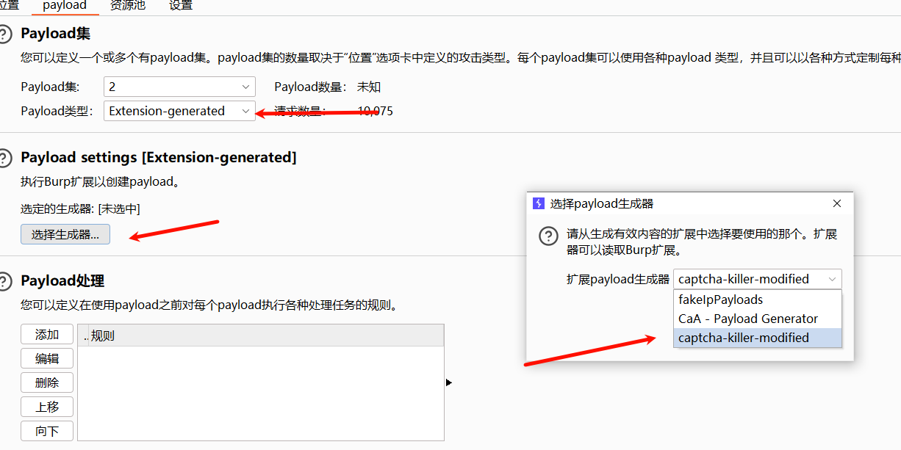
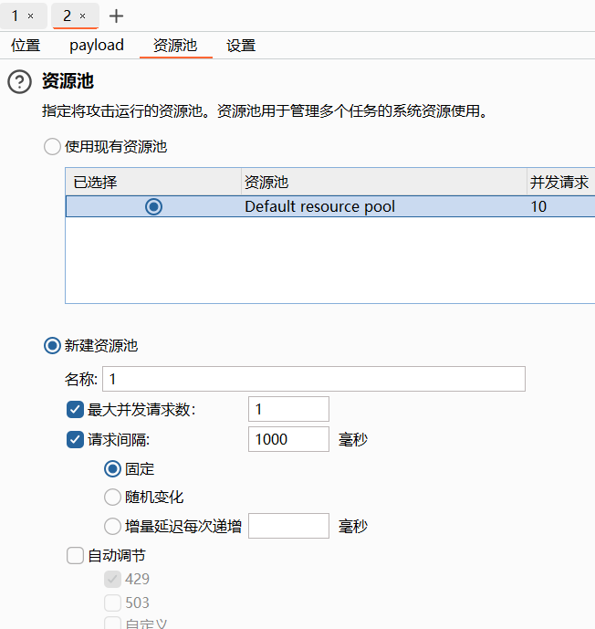

## **1. 伪验证码**
有可能抓包不放包，该验证码在测试器中一直生效。（逻辑漏洞:验证码复用，验证码可重复使用）

## **2. 图形验证码识别**
#### 1. Pkav Fuzzer 识别爆破软件。
可离线。注意在修改验证码识别长度，4位准确更好。
可以正则提取token爆破
```
POST /login.php HTTP/1.1
Host: 192.168.1.1

username=admin&password=§aa§&code=§YZM§
```
多个变量选择异值异步



^
#### 2. BP插件captcha-killer
离线也可以用！6位也随便识别
适配新版Burpsuite。下载两个
<https://github.com/f0ng/captcha-killer-modified>


^
教程：<https://www.cnblogs.com/4geek/p/17145385.html#!comments>
发送到插件，选择识别模块。
再配合测试器即可。

安装识别模块
```
pip311 install ddddocr aiohttp -i https\://pypi.tuna.tsinghua.edu.cn/simple/
python311 .\codereg.py  上面github下载的
```



识别成功，使用测试器即可。

可以慢一点
